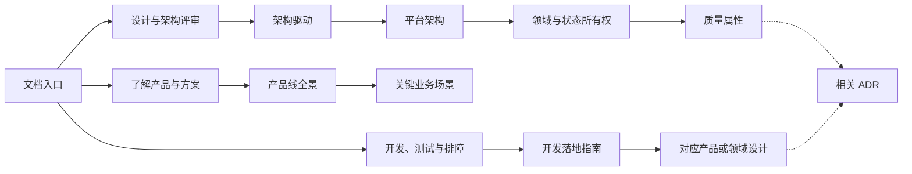

# 晓石 AI 产品线文档入口

本目录介绍晓石 AI 产品线的产品定位、核心功能、协作架构和当前实现。文档从产品组合进入平台边界，再按需要下钻到各产品与 Rune 领域设计；当前能力、正在落地的边界和迁移期能力使用明确状态区分。

平台级概念统一见[术语表](glossary.md)，具体字段和协议继续以对应产品设计与代码为准。

## 从这里开始

不需要按固定顺序读完全部文档，请根据当前任务选择入口。

| 目标 | 建议入口 | 继续阅读 |
| ---- | -------- | -------- |
| 快速了解整个产品线 | [产品线全景](product-line.md) | [关键业务场景](key-scenarios.md) |
| 讲解产品及其协作关系 | [产品线全景](product-line.md) | [平台架构](platform-architecture.md) |
| 设计或评审跨产品方案 | [架构驱动](architecture-drivers.md) | [平台架构](platform-architecture.md)、[领域架构](domain-architecture.md)、[质量属性](quality-attributes.md) |
| 开发或评审代码 | [开发落地指南](development-guide.md) | 对应产品/领域的 `requirements.md`、`design.md` 和相关 [ADR](architecture-decisions/README.md) |
| 排查端到端问题 | [关键业务场景](key-scenarios.md) | [质量属性](quality-attributes.md)、对应产品设计 |
| 下钻 Rune 控制面 | [Rune](rune/README.md) | [Rune 控制面架构](rune/architecture.md) |
| 查询产品和架构术语 | [术语表](glossary.md) | 对应产品或领域设计 |

## 产品与架构分层

### 产品与用户入口

| 产品或入口 | 文档 | 主要价值 | 状态 |
| ---------- | ---- | -------- | ---- |
| Console / BOSS | [产品线全景](product-line.md) | 面向租户、开发者和平台管理员组合产品能力 | 已实现，本文档集仅说明产品边界 |
| Moha | [moha](moha/README.md) | 版本化管理与分发 AI 资产 | 已实现 |
| Apps | [apps](apps/README.md) | 管理应用目录、版本与交付生命周期 | 正在落地，尚无正式提交基线 |
| Rune | [rune](rune/README.md) | 治理集群、算力和工作负载运行环境 | 已实现，旧 Instance 路径处于迁移期 |
| AIRouter | [airouter](airouter/README.md) | 统一、治理和计量模型调用 | 已实现 |

### 平台公共能力

| 能力 | 文档 | 主要价值 | 状态 |
| ---- | ---- | -------- | ---- |
| IAM | [iam](iam/README.md) | 统一身份、组织、权限和审计 | 已实现 |
| KMS | [kms](kms/README.md) | 提供数据密钥与信封加密能力 | 已实现的内部能力 |

### 应用内容与集群运行组件

| 组件 | 文档 | 主要职责 | 状态 |
| ---- | ---- | -------- | ---- |
| Plugins | [平台运行组件](platform-components.md#plugins) | 提供官方应用和系统 Chart、镜像及默认配置 | 已实现 |
| Installer | [平台运行组件](platform-components.md#installer) | 调谐 Installer Instance 并安装应用 | 已实现 |
| ClusterResourceQuota | [平台运行组件](platform-components.md#clusterresourcequota) | 执行跨 Namespace 配额 | 已实现 |
| kube-ssh | [平台运行组件](platform-components.md#kube-ssh) | 提供到 Pod 的受控 SSH、SFTP 和端口转发 | 已实现 |

状态含义：`已实现` 表示存在正式代码基线；`正在落地` 表示已有实现但尚未形成正式基线或未完成端到端迁移；`迁移期` 表示只用于兼容现有环境，不应成为新功能的默认入口。

## 产品级设计

IAM、Moha、Apps、AIRouter 和 KMS 使用统一结构：`README.md` 是产品入口，`requirements.md` 描述用户问题和产品要求，`design.md` 描述领域模型、API、数据流和实现约束。Rune 由一个产品入口、控制面架构和多个领域子目录组成。

| 产品 | 需求 | 设计 |
| ---- | ---- | ---- |
| IAM | [需求](iam/requirements.md) | [设计](iam/design.md) |
| Moha | [需求](moha/requirements.md) | [设计](moha/design.md) |
| Apps | [需求](apps/requirements.md) | [设计](apps/design.md) |
| Rune | [产品入口](rune/README.md) | [控制面架构](rune/architecture.md) |
| AIRouter | [需求](airouter/requirements.md) | [设计](airouter/design.md) |
| KMS | [需求](kms/requirements.md) | [设计](kms/design.md) |

## Rune 领域设计

| 领域 | 入口 | 主要内容 |
| ---- | ---- | -------- |
| 集群 | [cluster](rune/cluster/README.md) | 多集群纳管、连接和状态 |
| 租户 | [tenant](rune/tenant/README.md) | 租户启用和组织边界 |
| 工作空间 | [workspace](rune/workspace/README.md) | Namespace 与项目隔离 |
| 资源池 | [resourcepool](rune/resourcepool/README.md) | 节点和资源供应边界 |
| 配额 | [quota](rune/quota/README.md) | 资源使用上限与范围 |
| 资源规格 | [flavor](rune/flavor/README.md) | 用户可选择的业务规格 |
| 可观测性 | [observability](rune/observability/README.md) | 状态、指标、日志和告警 |
| 调度 | [scheduler](rune/scheduler/README.md) | 权益、队列和共享算力 |

### 迁移期与历史设计

- [Rune Product/Chart](rune/product/README.md)：Rune 直接管理产品发布的旧路径。
- [Rune Instance](rune/app/README.md)：Rune 旧 Helm Controller 管理实例的路径。

新实例默认边界为 Apps → Installer → Kubernetes；同一实例不得同时由 Rune 旧 Controller 和 Installer 管理。

## 按任务查阅

| 任务 | 必读文档 |
| ---- | -------- |
| 新增或修改 API | [领域架构](domain-architecture.md)、[开发落地指南](development-guide.md)、对应产品或领域设计 |
| 修改 Controller | [平台架构](platform-architecture.md)、[开发落地指南](development-guide.md)、目标组件设计 |
| 排查跨组件故障 | [关键业务场景](key-scenarios.md)、[质量属性](quality-attributes.md)、[可观测性设计](rune/observability/design.md) |
| 修改状态存储或同步方式 | [领域架构](domain-architecture.md)、[质量属性](quality-attributes.md)、[ADR](architecture-decisions/README.md) |
| 修改身份、组织或授权 | [IAM 设计](iam/design.md)、[领域架构](domain-architecture.md)、[关键业务场景](key-scenarios.md) |
| 接入 Moha | [Moha 设计](moha/design.md)、[关键业务场景](key-scenarios.md)、[ADR-0005](architecture-decisions/0005-asset-workload-boundary.md) |
| 接入 AIRouter | [AIRouter 设计](airouter/design.md)、[关键业务场景](key-scenarios.md)、[ADR-0004](architecture-decisions/0004-airouter-control-data-plane.md) |
| 接入数据密钥能力 | [KMS 设计](kms/design.md)、[平台架构](platform-architecture.md)、[质量属性](quality-attributes.md) |
| 修改应用目录或交付 | [Apps 设计](apps/design.md)、[平台运行组件](platform-components.md)、[关键业务场景](key-scenarios.md) |
| 修改集群配额或 SSH | [平台运行组件](platform-components.md)、[Rune 控制面架构](rune/architecture.md)、[质量属性](quality-attributes.md) |

## 文档维护规则

- 文档描述当前实现；正在落地、迁移期和提案必须显式标记，路线图放在独立提案中。
- 平台级文档说明稳定边界，字段和函数细节留在产品设计、领域设计或代码中。
- 一个概念只能有一个权威定义，其他文档通过链接引用。
- 修改组件职责、状态所有权、同步方式或关键链路时，必须同步检查平台架构、场景、质量属性和相关 ADR。
- Markdown 标题不使用数字编号，避免调整章节时维护编号。
