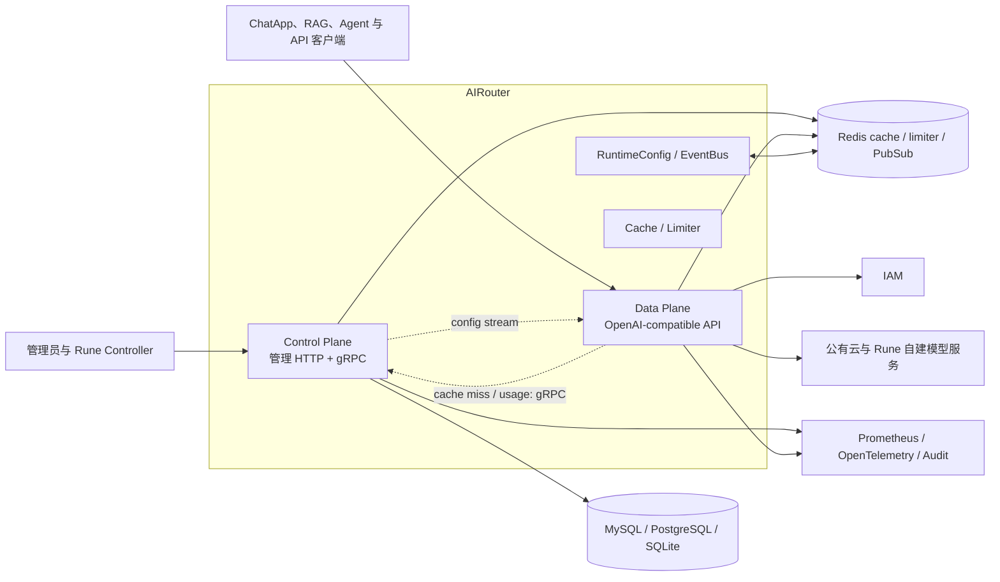
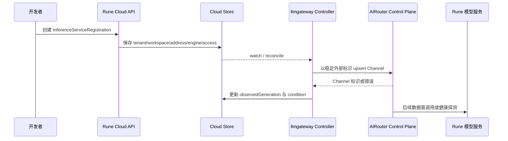

# AIRouter 设计

本文描述 AIRouter 当前的控制面、数据面、状态和 Rune 集成。实现基线为 AIRouter `c980658`。

## 运行结构

生产可分别运行 `airouter control` 与 `airouter data`；开发或小规模环境可使用 `airouter allinone`。Helm `cluster` 模式分别部署 Control 和 Data，允许独立副本数与 HPA。

## 控制面

Control Plane 负责低频、持久化和管理型能力：

- Channel、Token、用户、租户关系和访问策略管理。
- 审核词典与策略、RuntimeConfig、审计查询。
- usage、费率方案、余额或账务相关管理。
- Data Plane 注册、心跳、缓存未命中回源和配置推送。
- 持久状态写入 SQL，并更新 Redis cache/index。

一次管理操作通常按“校验领域规则 → 写数据库 → 更新/失效缓存 → 发布事件”执行。数据库提交和事件广播不是一个分布式事务，因此消费者需要 TTL、版本或回源机制修复丢失的通知。

## 数据面

Data Plane 承载推理热路径，禁止直接访问业务数据库。典型 Pipeline 为：

每个阶段都必须在错误和取消路径中执行配套清理。尤其是限流预占、上游响应已经开始、客户端断连以及 fallback 后的 usage，需要由 request-scoped 状态保证只结算一次。

## 缓存与配置传播

Data Plane 使用 Redis 的倒排索引和对象缓存解析可见 Channel 与 Token：先获得 public、tenant、private 的候选 ID，再批量读取对象详情。缓存未命中通过 gRPC 回源 Control Plane，并使用 singleflight 合并相同并发查询。

配置变化通过两层传播：

1. Control Plane 实例将事件发布到 Redis Pub/Sub，使其他 Control 副本观察变更。
2. 各 Control 实例通过 gRPC stream 向连接的 Data Plane 推送 settings、channel、token、lexicon 或 policy 更新。

Redis Pub/Sub 不提供持久消费保证，因此 Data Plane 重连、丢事件或长时间离线后需要通过全量加载、版本比较或 TTL 回源收敛，不能只依赖一次广播。

## 状态所有权

| 状态 | 权威来源 | 投影或缓存 |
| ---- | -------- | ---------- |
| Channel、Token、策略、用户映射和 RuntimeConfig | AIRouter Control Plane / SQL | Redis 与 Data Plane 本地运行配置 |
| 限流窗口与分布式计数 | AIRouter / Redis | Data Plane request-scoped 预占状态 |
| usage、audit 和 billing 记录 | AIRouter 持久化能力 | 异步队列或批量写缓冲 |
| Rune 推理服务注册期望 | Rune Cloud Store | AIRouter Channel |
| 自建模型服务健康与运行事实 | Rune / Kubernetes | Channel 可用性探测、熔断或错误统计 |
| 用户、组织与成员 | IAM（external/hybrid 模式） | AIRouter identity cache |

Redis cache 可重建，不得成为管理 API 的最终真相。Rune 删除服务注册后由 Controller 清理对应 Channel，但 AIRouter 中独立创建的 Channel 不属于 Rune 管理范围。

## Rune 注册链路

当前只有显式注册对象进入该链路，不能假设所有推理 Instance 自动生成 Channel。注册对象的 status 应区分：配置已保存、Channel 已同步、上游可连接和实际请求成功。

## 身份与访问范围

`pkg/identity` 抽象 Accessor 和 Manager，支持 internal、external 与 hybrid 模式。Channel 解析组合用户身份、所属 tenant、Token 权限与 Channel visibility：

- public Channel 对满足全局策略的主体可见。
- tenant Channel 只对对应 tenant 成员和允许的 Token 可见。
- private Channel 只对创建者或明确授权主体可见。

平台部署采用 external 或 hybrid 时，必须明确 IAM 查询失败是否允许回退。安全默认应失败关闭，不能把依赖错误转成 internal 匿名或更宽权限主体。

## 重试、流式和计费

- 请求尚未向客户端产生输出时，可以按策略对同一 Channel retry 或切换 fallback Channel。
- 已输出 SSE chunk 后，通常不能透明重放整个请求；错误应终止当前流并记录部分结果。
- TPM 在请求前按上限预占，在获得实际 usage 或失败后修正 Token 与 Channel 两个维度。
- usage 和 billing 使用 request ID/幂等键去重；一次逻辑请求的多个上游尝试需要区分尝试成本和客户结算。
- 客户端取消应传播到上游 HTTP 请求，并进入限流修正、审计与 usage 收尾路径。

## 代码落点

| 变更 | 主要位置 | 同步检查 |
| ---- | -------- | -------- |
| 管理用例与领域模型 | `internal/application`、`internal/domain` | SQL migration、cache 和事件 |
| Control/Data HTTP 与 gRPC | `internal/interfaces`、`api/proto` | 兼容性、TLS 和路由 |
| 缓存与限流 | `internal/cache`、`internal/limiter` | Redis Cluster、降级和指标 |
| 审核 | `internal/moderation` | 流式窗口、策略热更新和审计 |
| 上游协议 | `pkg/adaptor`、`pkg/canonical`、`pkg/dto` | 流式/非流式、usage 与错误转换 |
| 身份 | `pkg/identity`、`pkg/channelaccess` | IAM 故障、tenant/private 越权 |
| 计费与使用量 | `internal/billing`、`internal/domain/billing`、`usage` | 幂等、异步失败和对账 |
| 部署模式 | `cmd/airouter`、`deploy/airouter` | Control/Data 独立扩缩容和网络策略 |

## 当前限制与验证重点

- Control/Data 分离已经落地，但数据面的实际可用性仍依赖 Redis、gRPC 回源和缓存新鲜度，需要按命中/未命中分别定义 SLO。
- 配置传播跨 SQL、Redis Pub/Sub、gRPC stream 和本地状态，必须验证丢事件、重连和版本倒退。
- Rune 服务注册只覆盖显式 `InferenceServiceRegistration`，Instance 自动发现不属于当前基线。
- identity hybrid、限流本地降级和异步 billing 都可能在故障时改变安全或账务语义，应采用显式配置并进行故障注入测试。
