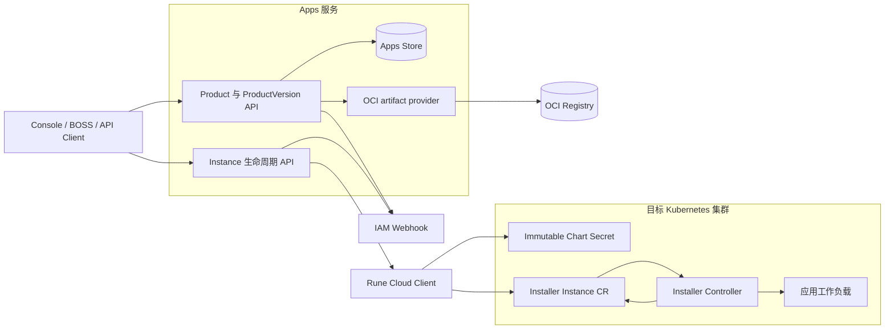

# Apps 设计

本文基于 `../apps` 当前工作树描述正在落地的独立 Apps 服务。该仓库在扫描时尚无 Git 提交，设计进入正式基线后应补充 commit 标识。

## 运行结构

## 状态所有权

| 状态 | 权威来源 | 说明 |
| ---- | -------- | ---- |
| Product、ProductVersion、发布状态 | Apps Store | 租户与 `system` 使用相同模型 |
| Chart artifact 与 digest | OCI Registry / Apps artifact metadata | 版本内容不可变 |
| Instance spec 与 status | 目标集群 Installer CR | Apps 不保存中央副本 |
| Chart 安装产生的资源 | Kubernetes API | Installer 负责创建、更新和清理 |
| Cluster 与 Workspace | Rune | Apps 每次请求重新解析目标范围 |
| 用户、组织与权限 | IAM | Apps 直接使用 IAM Webhook |

## 创建链路

1. Apps 验证身份、租户、ProductVersion、发布状态和 values。
2. Apps 通过 Rune 确认 Cluster 与 Workspace，并获得受限 Kubernetes 操作通道。
3. Apps 把 Chart bytes 写为同 Namespace 的不可变 Secret，名称包含内容摘要。
4. Apps 创建或更新 `apps.xiaoshiai.cn/v1` Installer Instance，并引用该 Secret。
5. Installer 校验 artifact、Namespace 和资源范围，渲染并安装工作负载。
6. Installer 把 phase、conditions、endpoints、states 和 managed resources 写入 CR status。
7. Apps 的查询和 Watch 直接投影该 CR，不维护第二份状态。

## 安全边界

- Apps 不获得目标 kubeconfig，只访问 Rune 提供的受限代理。
- Chart Secret 必须与 Instance 同 Namespace、不可变、类型正确并通过 digest 校验。
- Apps 不能借代理读取普通 Secret，也不能操作未授权 Workspace。
- Cluster-scoped 资源和跨 Namespace 资源最终由 Installer 安全策略限制。
- Instance status 中的资源引用还需结合 ownership label 或 ownerReference 验证，不能由调用方自行声明所有权。

## 与 Rune legacy 路径的关系

当前 Rune 代码仍保留旧 Product/Instance Store 与 Controller，同时也已引入 Installer API 类型和基于 CR 的 Instance 路径。迁移规则是：

- 新路径由 Apps 管理 Product 与 ProductVersion，由 Installer CR 管理 Instance。
- Rune 继续提供 Cluster、Workspace、Quota、Resource Graph 和受限 Kubernetes Proxy。
- 同一个安装只能有一个生命周期控制器。
- 迁移完成前，文档和 API 必须明确请求进入 legacy 还是 Apps 路径。
