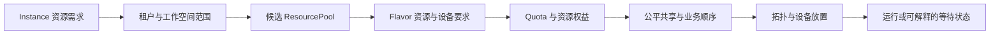

# 架构驱动：业务痛点、目标与约束

本文解释平台架构背后的问题和约束。它不定义产品路线，而是为当前组件边界和架构决策提供可追溯的原因。

## 业务背景

AI 平台需要同时服务模型开发者、应用开发者、租户管理员和平台管理员。用户希望以产品化方式使用模型、数据、镜像和异构算力，而不是直接处理每个集群、调度器、设备插件和模型供应商的差异。

平台覆盖两类相互关联但生命周期不同的对象：Moha 中可复用、可版本化的 AI 资产，以及 Rune 和 Kubernetes 中需要资源、调度和持续运维的工作负载。模型服务被部署后，还需要通过 AIRouter 以稳定协议对应用开放。

## 核心业务痛点

| 痛点                     | 直接影响                                                           | 当前架构回应                                                                                    |
| ------------------------ | ------------------------------------------------------------------ | ----------------------------------------------------------------------------------------------- |
| 模型、数据集和镜像分散   | 版本、来源、权限和复用关系难以统一                                 | Moha 以 Git、LFS 和 OCI 语义管理 AI 资产                                                        |
| 集群和加速设备异构       | 用户配置与底层资源实现强耦合                                       | Rune 以 Cluster、ResourcePool、Flavor 和 Quota 抽象算力                                         |
| 共享算力缺少合理分配闭环 | 稀缺资源空闲与任务排队并存，租户保障、公平共享和业务优先级难以兼顾 | Rune 已具备资源池、规格、配额和部分调度基础；资源权益、动态共享、协同启动与状态解释尚未完全闭环 |
| 工作负载交付方式不一致   | 创建、更新、删除和状态判断缺少统一模型                             | ProductChart 与 Instance 表达产品和期望状态，Controller 负责调谐                                |
| 多租户边界分散           | 身份、成员、权限和资源范围容易不一致                               | IAM 持有身份与组织关系，Rune 将租户和工作空间范围落实到资源                                     |
| 模型服务调用入口不统一   | 应用绑定供应商协议，难以治理限流和用量                             | AIRouter 统一协议、渠道、认证、限流、审核、路由和计量                                           |
| 多集群运行证据割裂       | 状态、事件、指标和日志难以关联                                     | Rune 聚合 Cloud 状态、Kubernetes 资源和集群观测后端                                             |
| 平台组件职责重叠         | 数据双写、故障归因和变更影响范围不清晰                             | 通过明确的状态所有权与同步链路保持组件自治                                                      |

### 共享算力调度问题

GPU、NPU、RDMA 和高性能存储昂贵且稀缺。平台不能只解决“把任务提交到 Kubernetes”，还必须回答“有限资源应该先分配给谁、如何避免闲置、资源不足时为什么等待”。这包含几组需要同时平衡的业务矛盾：

- **保障与利用率**：租户已获得的最低资源需要保障，但暂时不用的资源也不应长期闲置。
- **公平与业务重要性**：长期共享必须公平，关键在线服务又需要比普通实验任务更稳定地获得资源。
- **静态配额与动态供需**：Quota 能限制上限，但不能独立完成排队、临时借用、安全收回和等待顺序。
- **资源数量与可运行性**：设备数量足够不代表拓扑、NUMA、RDMA、缓存或节点条件满足。
- **单任务启动与整体吞吐**：分布式任务只启动部分副本既不能工作，还会占住其他任务可用的资源。
- **调度结果与用户理解**：用户需要知道是权益、集群容量、设备条件还是协同启动条件导致等待。

合理分配资源需要形成完整决策链，而不是把底层 Queue 或数字优先级直接交给普通用户：

当前实现已经具备 Instance、ResourcePool、Flavor、租户/工作空间配额、Volcano 配置接口、HyperNode API 以及 Kubernetes 资源和 Event 查询。尚未完全实现的是 tenant + ResourcePool 资源权益、后端 Queue 生命周期、空闲资源临时共享与安全收回、业务等级与中断策略、显式协同启动契约，以及中立且可行动的调度状态。它们是当前业务问题的未闭环部分，不能在蓝图中表述为已经交付。

## 用户和关键诉求

| 角色             | 主要诉求                                                       |
| ---------------- | -------------------------------------------------------------- |
| 模型与应用开发者 | 找到可信资产，以明确规格部署，并获得可调用端点和故障证据       |
| 租户管理员       | 管理成员、工作空间、配额、可访问资产和模型服务                 |
| 平台管理员       | 纳管集群与设备，配置资源池和规格，提高利用率并合理分配稀缺资源 |
| 自动化客户端     | 通过稳定 API 重复执行发布、部署、查询和模型调用                |
| 运维与支持人员   | 快速判断失败发生在入口、控制面、资产、网关还是目标集群         |

## 架构目标

- 使用统一产品模型交付训练、推理、开发环境等 AI 工作负载。
- 让身份、资产、算力、模型访问和运行事实各自拥有清晰权威来源。
- 使用声明式 API 与幂等 Controller 管理跨集群期望状态。
- 对用户隐藏基础设施差异，同时保留足够的状态和诊断证据。
- 在租户资源保障、公平共享和业务优先级之间建立可解释的资源分配机制，提高昂贵加速资源的有效利用率。
- 让自建模型与公有云模型通过一致的访问协议和治理链路提供服务。
- 允许各平台组件独立部署和扩缩容，不依赖跨数据库事务维持正确性。

## 关键约束

### 业务约束

- 所有资源操作必须具有明确的用户、租户、工作空间或平台范围。
- 用户看到的产品状态必须能够追溯到控制面对象和 Kubernetes 运行事实。
- AI 资产版本与工作负载部署是不同生命周期，不能合并为同一个状态对象。
- 临时共享不能突破租户最大资源范围，也不能破坏已承诺的最低保障；资源收回必须由显式、可审计的中断策略控制。

### 技术约束

- 被管环境以 Kubernetes 为主要运行基础设施，中心侧通过 kubeconfig 连接 Kubernetes API。
- Cloud API 和 Controller 是独立进程，各自维护多集群 client 和 cache。
- Cloud 对象主要存放在 etcd cache，入口层部分状态使用 MongoDB；运行资源由 Kubernetes 持有。
- AIRouter 数据面不直接读取业务数据库，高频请求依赖缓存和控制面接口。
- 组件之间不存在统一分布式事务，跨组件一致性依靠幂等调用、调谐和可重建投影。

## 成功判据

架构是否有效，不以组件数量衡量，而以以下结果判断：

- 开发人员能够指出每类状态的权威来源和唯一写入责任。
- 一个关键业务请求能够关联身份、资产、Cloud 对象、Kubernetes 资源和模型调用证据。
- 重试、进程重启或 Controller leader 切换不会制造重复业务对象或破坏期望状态。
- 租户无法通过直接构造请求越过工作空间、集群或资源范围。
- 外部组件故障能够被定位，并且不会被错误呈现为“资源不存在”或“操作成功”。
- 平台能够按租户和资源池解释保障量、已使用量、临时借用量和等待需求，并区分权益不足、集群不足和放置条件不满足。
- 当空闲资源与等待任务同时存在时，系统能够给出原因；分布式任务不会因只启动部分副本而长期占用无效资源。

## 不在本文范围

具体 API 字段、页面交互和 Controller 算法由产品或领域设计维护；跨产品关系和部署分层见[平台架构](platform-architecture.md)，Rune 内部运行拓扑见[Rune 控制面架构](rune/architecture.md)，可验证指标见[质量属性](quality-attributes.md)。
