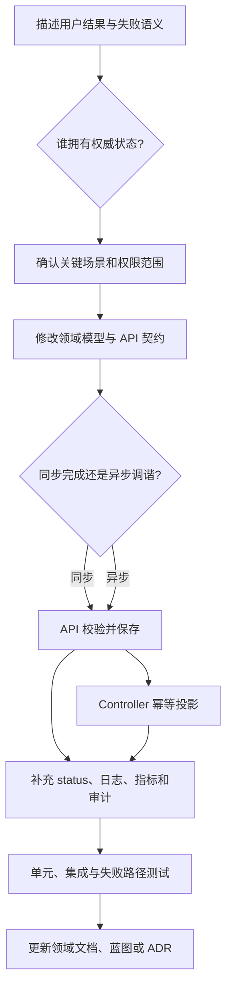

# 架构开发落地指南

本文是架构到代码的导航。它不替代各仓库的贡献规范；进入仓库后仍需阅读该仓库的 `AGENTS.md`、README 和领域设计。

## 仓库地图

| 仓库或组件     | 修改它的典型需求                                             | 不应放入其中的职责                    |
| -------------- | ------------------------------------------------------------ | ------------------------------------- |
| `rune`         | 集群、工作空间、算力治理、调度和运行观测聚合                 | 用户主数据、AI 资产内容、模型请求计量 |
| `apps`         | Product、ProductVersion、实例 API 与 Installer 状态投影      | 直接执行 Helm、集群容量治理            |
| `installer`    | Installer Instance 调谐、制品解析、Helm/Kustomize/Template   | 产品目录、身份和资源调度                |
| `plugins`      | 应用与系统 Chart、默认配置和发布内容                         | 应用运行状态                            |
| `clusterresourcequota` | 跨 Namespace 配额与 NodeSelector 范围执行            | 产品配额策略和模型请求限流              |
| `kube-ssh`     | SSH 到 Pod exec/portforward 的受控接入与审计                 | 平台登录认证和应用安装                  |
| `iam`          | 登录认证、组织成员、角色授权、审计接收                       | 工作负载配额和模型渠道                |
| `XiaoShi-Moha` | 模型、数据集、镜像、Space、Git/LFS/Registry                  | 集群容量和 Instance 运行状态          |
| `airouter`     | 渠道、Token、模型协议、审核、限流、路由、用量和计费          | 工作负载创建和 Kubernetes 调谐        |
| `kms`          | 数据密钥生成与解密                                           | 通用业务 Secret 管理                  |
| `docs`         | 跨组件蓝图、开发说明和产品文档                               | 不能替代代码中的契约与测试            |

## Rune 运行组件选择

| 变更问题                          | 主要位置                               | 判断原则                             |
| --------------------------------- | -------------------------------------- | ------------------------------------ |
| 统一路由、认证授权、License、审计 | `pkg/apiserver`                        | 请求进入平台时处理                   |
| 同步 Cloud CRUD、校验和查询       | `pkg/cloud/*/api.go` 及服务层          | 在请求响应周期完成                   |
| 外部资源创建、状态同步和清理      | `pkg/cloud/*/controller*.go`           | 需要重试和最终一致性                 |
| 多集群连接与资源 cache            | `pkg/cloud/cluster`、`pkg/cloud/cache` | 每个进程独立维护连接状态             |
| 集群内终端、WebSocket、服务代理   | `pkg/agent`                            | 必须靠近目标集群执行                 |
| 旧路径 Helm 渲染与 Instance 生命周期 | `pkg/cloud/instance`                | 仅维护迁移期 Rune 直接管理的实例     |
| AIRouter 服务注册                 | `pkg/cloud/llmgateway`                 | 将显式注册对象同步为渠道             |

跨仓库改动还应先阅读对应平台领域设计：[IAM](iam/design.md)、[Moha](moha/design.md)、[AIRouter](airouter/design.md)、[Apps](apps/design.md)、[KMS](kms/design.md)或[平台运行组件](platform-components.md)。这些文档定义平台边界；具体包、字段和命令继续以目标仓库源码为准。

不要因为 API 和 Controller 位于同一仓库，就让 API 直接执行不可快速完成或需要恢复的外部变更。

## 应用交付路径选择

| 需求 | 首选位置 |
| ---- | -------- |
| 产品目录、版本和面向用户的实例 API | `apps` |
| 官方应用与系统安装内容 | `plugins` |
| 安装 spec、制品解析、渲染和安装 status | `installer` |
| 集群、Workspace、资源池、规格、调度与代理 | `rune` |
| 跨 Namespace 配额执行 | `clusterresourcequota` |
| 面向 Pod 的 SSH 接入 | `kube-ssh` |

新实例路径为 Apps → Installer → Kubernetes。Rune 中直接渲染 Helm 的 Product/Instance 是迁移期能力；修改实例交付时必须先确认对象属于哪条路径，禁止两个 Controller 管理同一逻辑实例。

## 从需求到改动

需求开始前先回答：对象属于哪个租户和工作空间、唯一标识是什么、权威状态在哪里、成功何时成立、外部调用超时后如何恢复、删除由谁清理。

## API 开发规则

- 从认证上下文获取用户身份，服务端解析并验证资源范围。
- 创建或更新时先完成纯输入、权限和引用校验，再写期望状态。
- 异步操作返回“已受理”的对象与 status，不承诺外部资源已完成。
- 错误区分输入、权限、冲突、依赖不可用和内部错误。
- 列表接口落实租户过滤、分页和稳定排序；不能先读取全量再依赖前端过滤。
- 代理接口校验目标集群、Namespace、资源和允许的路径。

## Controller 开发规则

- reconcile 对同一对象重复执行必须安全。
- 只根据 spec、权威外部事实和稳定配置计算动作。
- 使用 generation/observedGeneration，避免旧观察覆盖新 spec。
- status condition 说明阶段、原因和可操作信息，但不包含凭据。
- 创建外部资源前采用稳定名称；调用超时后查询事实再重试。
- 删除通过 finalizer 清理外部资源；目标已不存在视为幂等成功。
- cache 未同步、集群不可达和对象不存在是三种不同结果。

## 跨组件集成规则

- 只调用对方 API，不直接依赖其数据库表或内部缓存格式。
- 明确认证方式、租户映射、超时、重试、幂等键和错误转换。
- 不在两个组件同时维护可独立修改的同一业务状态。
- Apps 持有产品与实例 API 视图，Installer Instance 持有安装期望和安装 status；Apps 不绕过 Installer 直接执行 Helm。
- Moha 资产使用稳定仓库和 revision 引用；内容下载不经过 Rune Cloud 内存中转。
- AIRouter 渠道由服务注册投影产生，但 Token、策略和 usage 保持 AIRouter 所有。
- 数据面请求不经过 Controller，也不因 Cloud Store 暂时不可用而直接读取其数据库。

## 验证矩阵

| 变更类型         | 最低验证范围                                  |
| ---------------- | --------------------------------------------- |
| API 字段或行为   | 单元测试、OpenAPI、权限与兼容性测试、领域文档 |
| Controller       | 幂等、重试、删除、generation 和外部失败测试   |
| 多租户查询       | 同租户、跨租户、管理员和直接对象访问测试      |
| 跨组件集成       | 正常、超时、重复请求、部分成功和恢复测试      |
| 代理或流式连接   | 认证、目标限制、断连、超时和资源释放测试      |
| 存储或状态所有权 | 数据迁移/兼容、恢复测试、蓝图与 ADR 评审      |

## 代码评审问题

- 这次变更是否改变了状态所有权或组件职责？
- 是否把同步 API 变成了隐含的长事务？
- 重试、重复 watch 和删除是否安全？
- 是否存在绕过租户、工作空间或 API Server 信任边界的路径？
- 外部服务失败时，用户和运维能否知道失败在哪一层？
- 新的缓存是否可以重建，是否会被误用为权威来源？
- 是否需要更新[平台架构](platform-architecture.md)、[Rune 控制面架构](rune/architecture.md)、[关键场景](key-scenarios.md)或新增 ADR？
