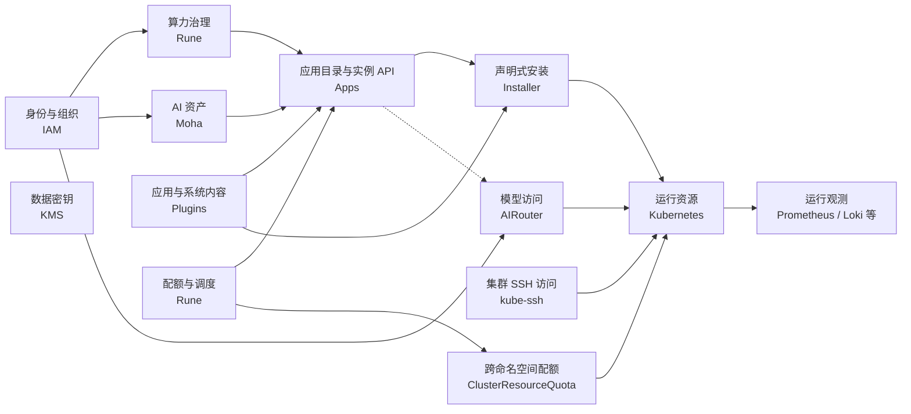
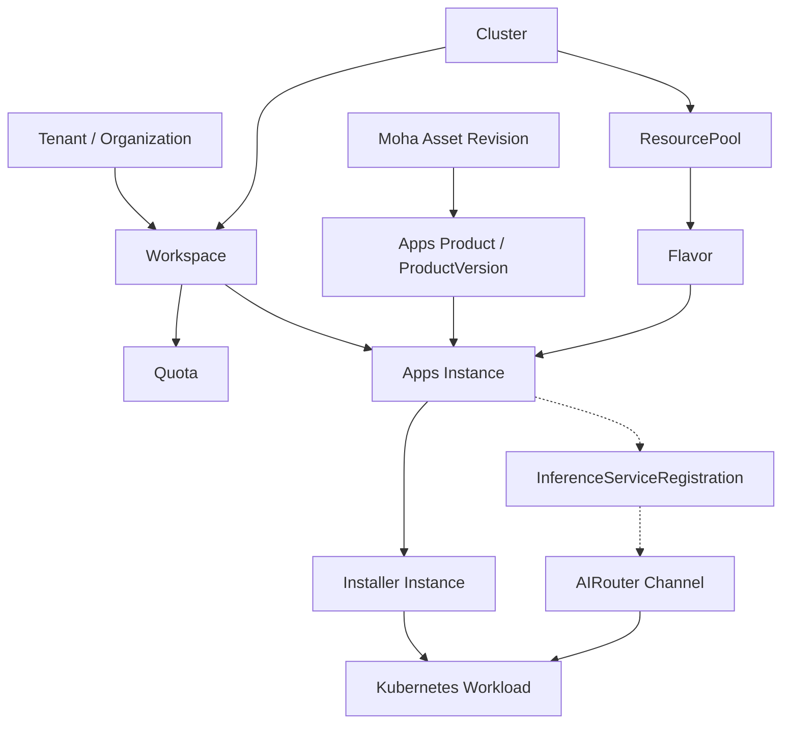

# 领域架构与业务边界

领域架构用于把用户语言映射到组件和代码边界。划分依据是业务能力、状态生命周期和一致性边界，而不是进程数量。

## 领域地图

## 领域职责

| 领域           | 核心对象                                        | 负责                                       | 不负责                                 |
| -------------- | ----------------------------------------------- | ------------------------------------------ | -------------------------------------- |
| 身份与组织     | User、Organization、Member、Role                | 登录身份、组织成员、角色和授权范围         | 工作负载资源配额和运行状态             |
| AI 资产        | Model、Dataset、Image、Space、Revision          | 资产版本、内容、可见性、成员和分发         | 集群容量与部署状态                     |
| 集群与资源治理 | Cluster、ResourcePool、NodeResource、Flavor     | 集群连接、资源供应边界和业务规格           | 用户身份和资产内容                     |
| 租户与工作空间 | Tenant Enablement、Workspace、Namespace         | 将组织边界落实到 Cloud 和集群范围          | IAM 中的原始组织成员关系               |
| 应用目录       | Product、ProductVersion、Instance               | 产品版本、参数校验、实例 API 与状态呈现     | 直接执行 Helm 或持有集群运行事实       |
| 应用安装       | Installer Instance、Artifact Secret             | 将版本化制品声明式安装到 Kubernetes        | 产品目录、租户身份和算力决策           |
| 应用与系统内容 | Application Chart、System Chart                 | 保存可安装内容及默认配置                   | 保存实例运行状态                       |
| 配额与调度     | Quota、Policy、Entitlement、Queue、CRQ 投影     | 限制资源使用并表达共享算力权益             | 模型请求 RPM/TPM 限流                  |
| 集群运维访问   | Access、SSH Session、Audit                      | 将标准 SSH 受控映射到 Pod exec/portforward | 平台登录身份和应用生命周期             |
| 模型访问       | Channel、Token、Policy、Usage、Billing          | 模型协议、路由、调用鉴权、审核、限流和计量 | 创建训练或推理工作负载                 |
| 数据密钥       | Plaintext Data Key、Encrypted Data Key          | 生成和解密信封加密所需的数据密钥           | 保存业务密文、Secret 或通用密钥对象    |
| 运行与观测     | Kubernetes resources、Event、Metric、Log、Alert | 保存运行事实和原始观测数据                 | 产品期望状态和租户成员治理             |

## 核心对象关系

虚线表示需要显式注册或同步的关系，不表示所有 Instance 都会自动产生推理注册。资产引用应包含足以定位版本的标识，不能只依赖会移动的展示名称。

## 状态所有权

| 状态                             | 权威来源         | 允许的投影或缓存                  |
| -------------------------------- | ---------------- | --------------------------------- |
| 用户、组织、成员与角色           | IAM              | 请求身份头、Rune 查询结果缓存     |
| 仓库版本、模型、数据集和镜像内容 | Moha             | 工作负载本地缓存、下载缓存        |
| Cluster、Workspace、Flavor 等治理 spec 与聚合 status | Rune Cloud Store | API/Controller 内存 cache |
| Product、ProductVersion 与应用实例视图 | Apps | Rune 查询结果、客户端缓存 |
| 安装期望与安装 status            | Installer Instance CR | Apps 实例状态投影 |
| 跨命名空间配额使用状态           | ClusterResourceQuota CR/status | Rune 配额视图 |
| SSH 访问授权与会话审计           | kube-ssh Access 与审计后端 | 临时会话缓存 |
| Pod、Deployment、Job 和 Event    | Kubernetes API   | Rune 与 Agent informer cache      |
| 渠道、Token、调用策略和用量      | AIRouter         | Redis 运行缓存、Rune 服务注册投影 |
| 业务密文、算法和加密数据密钥     | KMS 调用方       | KMS 请求内的短期处理               |
| 明文数据密钥                     | 不持久化         | KMS 与调用方的请求及短期内存       |
| 原始指标、日志和告警             | 集群观测后端     | Rune 查询与聚合响应               |

投影可以删除并重建，不得反向成为权威来源。跨领域更新失败时，应保留可重试的期望状态和明确错误，而不是通过第二份业务状态掩盖失败。

## 跨领域协作规则

- 通过稳定 API 或声明式对象协作，不直接读取其他组件数据库。
- 调用方传递对象标识和版本，被调用方负责解释自己的业务状态。
- 同步请求只确认本地受理和必要校验；外部资源完成情况由 status 表达。
- Controller 使用幂等键、generation 和 finalizer 处理重试、更新和删除。
- 身份范围在入口验证，领域服务仍需校验租户、工作空间和对象归属。
- 推理注册与 AIRouter 渠道是期望状态和投影关系，调用用量仍由 AIRouter 持有。
- Apps 创建的实例由 Installer 调谐；同一逻辑 Instance 不得同时交给 Rune 旧 Helm Controller 和 Installer 管理。

## 详细设计入口

平台公共领域见[IAM](iam/README.md)、[Moha](moha/README.md)、[AIRouter](airouter/README.md)、[Apps](apps/README.md)和[KMS](kms/README.md)，安装与集群扩展见[平台运行组件](platform-components.md)。Rune 领域细节见[集群](rune/cluster/README.md)、[租户](rune/tenant/README.md)、[工作空间](rune/workspace/README.md)、[资源池](rune/resourcepool/README.md)、[配额](rune/quota/README.md)、[规格](rune/flavor/README.md)、[可观测性](rune/observability/README.md)和[调度](rune/scheduler/README.md)。Rune 原有[产品](rune/product/README.md)和[应用](rune/app/README.md)能力属于迁移期旧路径。平台组件边界见[平台架构](platform-architecture.md)，Rune 内部实现见[Rune 控制面架构](rune/architecture.md)。
