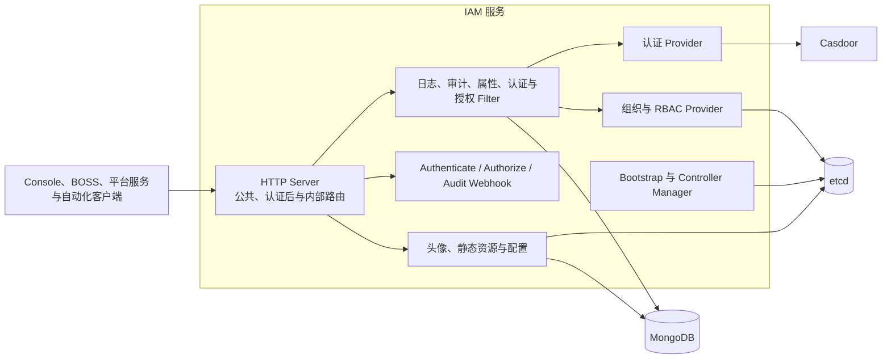
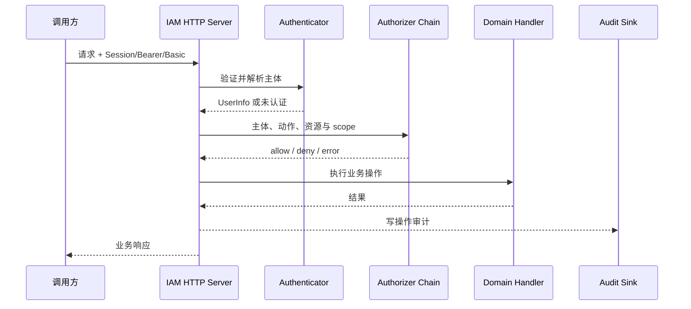

# IAM 设计

本文描述 IAM 当前运行结构、状态所有权和平台集成方式。实现基线为 IAM `91d158d`。

## 运行结构

`cmd/iam` 启动进程，`pkg/server.go` 装配依赖、Bootstrap、HTTP 路由和可选 pprof，`pkg/controller.go` 运行带 leader election 的 controller manager。外部平台不应依赖这些内部装配细节，但应理解认证、组织状态和审计并不位于同一个存储事务中。

## 请求边界

IAM 当前提供三类入口：

| 入口 | 典型调用方 | 约束 |
| ---- | ---------- | ---- |
| 公共或登录 API | 浏览器、Console | 只能放置明确允许匿名或 Session 建立所需的接口 |
| 认证后 REST API | 用户、管理端、自动化客户端 | 依次经过审计、属性提取、认证和授权 Filter |
| Internal API / Webhook | Rune、Moha、Apps、AIRouter 等平台服务 | 依赖服务身份和受控网络，不向非受信任客户端开放 |

典型受保护请求如下：

认证器链、授权器链和缓存由配置装配。授权链包含自定义策略、系统组和 RBAC；缓存只能减少重复计算，不能改变授权语义。

## 状态所有权

| 状态 | 权威来源 | 说明 |
| ---- | -------- | ---- |
| 登录身份、密码/MFA/API Key 与 Session | Casdoor Provider | IAM 封装登录和校验流程，不把下游业务服务变成身份目录 |
| 组织、成员、角色、用户组与 RBAC | IAM / etcd | `pkg/service` 定义 Provider，local 实现写入 etcd |
| 审计记录 | IAM / MongoDB | 默认 Audit Sink 持久化写操作；外部组件可通过 Webhook 提交 |
| 头像与用户配置 | IAM Provider | 当前主要由 etcd-backed 能力承载 |
| 静态资源 | IAM / MongoDB | 与身份主数据生命周期分离 |
| 下游身份缓存 | 各调用方 | 必须可失效、可重建，不得反向写回成为主数据 |

这些状态跨 Casdoor、etcd 和 MongoDB，不存在平台级原子事务。例如“成员更新成功但审计暂时写入失败”必须有显式处理策略，不能假设底层自动回滚。

## 与 Moha、Apps、Rune 和 AIRouter 的协作

### Rune

Rune API Server 在统一入口调用 IAM 认证授权，并将经过验证的身份头传给 Cloud API。Cloud API 只应信任受控入口来源；对租户和工作空间对象仍需验证组织映射与对象归属。Cloud 查询组织或成员失败时返回依赖错误，不等同于用户不属于组织。

### Moha

Moha 可以配置 remote organization/authorization provider，复用 IAM 的组织与权限信息；仓库自身的 revision、可见性、协作者、Git/LFS 和 Registry 内容仍由 Moha 持有。认证身份和资产授权是相邻边界，不应由 IAM 直接访问资产存储完成判断。

### Apps

Apps 通过 IAM Webhook 验证外部请求身份、动作和租户范围，再依据自身 Product、ProductVersion 和 Instance 归属执行领域校验。IAM 不读取 Apps Store、OCI artifact 或 Installer CR 来替 Apps 决定产品状态。

### AIRouter

AIRouter 的 identity 抽象支持 internal、external 和 hybrid 模式。平台集成环境应明确哪一侧是用户与租户权威来源；即使使用 IAM，AIRouter 自己的网关 Token、Channel 访问范围和 usage 仍属于 AIRouter。

## 失败与安全语义

| 情况 | 预期结果 |
| ---- | -------- |
| 凭据缺失或无效 | 401，记录认证方式和安全的失败原因 |
| 主体有效但动作不允许 | 403，保留资源属性与策略判定证据 |
| IAM/Casdoor/etcd 超时 | 依赖不可用错误，不伪装为 401、403 或空结果 |
| 审计 Sink 失败 | 按合规配置选择阻断或缓冲重试，并暴露告警 |
| 下游伪造身份头 | 在网络边界拒绝；服务端只信任配置的入口来源 |
| 成员或角色被收回 | 主状态立即生效，缓存按约定失效或在有界 TTL 后收敛 |

## 代码落点

| 变更 | IAM 主要位置 | 平台同步检查 |
| ---- | ------------ | ------------ |
| 登录、Session、MFA、身份源 | `pkg/authn`、`pkg/authn/provider/casdoor` | Console 登录流程、入口认证错误 |
| Authorizer 或 RBAC | `pkg/authz`、`pkg/service/local` | Moha/Apps/Rune/AIRouter 跨租户测试 |
| 组织和成员 API | `pkg/service/api`、`pkg/service/http` | Tenant 映射和缓存失效 |
| Webhook 契约 | `pkg/webhook` | API Server、Moha 与其他调用方 |
| 审计 | `pkg/audit` | 入口审计字段、保留与告警 |
| 路由或依赖装配 | `pkg/server.go` | 公开路由、internal 网络边界、Helm 配置 |

## 当前限制与验证重点

- IAM 能力较完整，但跨存储一致性不是事务性的，审计和主业务写入需要独立故障测试。
- internal 路由、Webhook 和 request-header 信任依赖部署约束，必须纳入安全验收，而不是只测 Handler。
- 历史需求/架构文档中的 Go 版本、运行组件和个别存储描述可能落后于当前代码，变更时应以 `README.md`、`pkg/server.go`、Options 和 Helm values 交叉验证。
- 下游采用 identity hybrid 模式时必须定义回退条件；IAM 不可用不应无条件回退到另一套可写身份，避免权限扩大。
