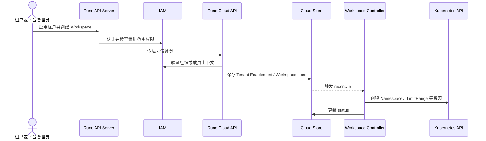
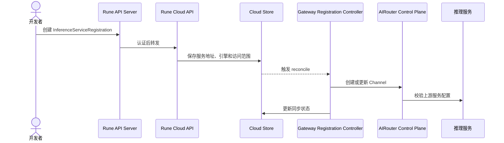

# 关键业务场景与端到端链路

本文从端到端结果出发说明组件协作。每条链路同时标记权威状态和主要失败证据，便于开发、测试和排障使用。

## 场景总览

| 场景                   | 主要组件                          | 最终结果                           |
| ---------------------- | --------------------------------- | ---------------------------------- |
| 租户启用与工作空间创建 | IAM、Rune、Kubernetes             | 组织成员获得受控的集群工作空间     |
| AI 资产发布与消费      | IAM、Moha、Apps、Rune、Installer  | 固定版本资产被工作负载安全消费     |
| Instance 创建与调谐    | Apps、Installer、Rune、Kubernetes | 产品期望状态落地为运行资源         |
| 共享算力分配与等待     | Rune、调度后端、Kubernetes        | 任务获得资源或得到可解释的等待原因 |
| 推理服务接入网关       | Rune、AIRouter、模型服务          | 推理端点成为受治理渠道             |
| 模型调用               | AIRouter、上游模型、观测后端      | 应用获得兼容响应并留下用量证据     |
| 敏感数据信封加密       | 平台调用方、KMS                   | 业务密文与可恢复的数据密钥分离保存 |
| 运行诊断               | Rune、Agent、Kubernetes、观测后端 | 用户获得状态、事件、指标或日志证据 |

## 租户启用与工作空间创建

IAM 是成员关系权威来源，Rune 保存租户在 Cloud 中的启用状态，Kubernetes 保存 Namespace 等运行事实。IAM 查询失败不能被解释为用户不是成员；集群连接失败应进入 Workspace status 并允许重试。

## AI 资产发布与工作负载消费

1. 发布者通过 Rune API Server 的 Moha 路由提交 Git、LFS 或 OCI 内容。
2. Moha 使用 IAM 判断组织、仓库和可见性权限，保存仓库元数据与内容。
3. Apps 的 ProductVersion 或 Instance 引用明确的资产及版本。
4. Apps 通过 Rune 校验工作空间上下文，将版本化安装期望提交给 Installer。
5. Kubernetes 工作负载从 Moha 获取模型、数据集或镜像。

资产上传成功不表示工作负载已经部署；Instance 就绪也不应改变 Moha 中资产版本。排障时依次检查仓库权限、版本是否存在、目标集群网络与凭据、容器或初始化任务事件。

## Instance 创建与调谐

新路径的确认点为：Apps 校验 ProductVersion 与租户上下文、创建 Installer Instance、Installer 观察 generation、解析不可变制品、完成 Helm/Kustomize/Template 渲染、Kubernetes 接受资源、Installer 回写 status、Apps 投影实例状态。同步创建响应只代表期望状态已受理，不代表 Pod 已运行。详见[Apps 设计](apps/design.md)和[平台运行组件](platform-components.md)。

Rune 基线仍保留直接管理 ProductChart 与 Instance 的旧 Helm 路径。迁移期间必须按实例来源选择唯一 Controller；不能让 Rune 旧 Instance Controller 与 Installer 同时管理同一发布。[Rune 控制面架构](rune/architecture.md)中的旧 Instance 时序用于解释现有实现，不代表新路径已经完全替换旧路径。

失败必须落在可定位阶段：输入和权限错误返回同步 API 错误；外部资源或调度失败写入 status、condition 和相关事件；重试不得创建第二个逻辑 Instance。

## 共享算力分配与等待

调度链路从 Instance 中的业务资源需求开始，而不是从底层 Queue 开始：

1. Rune 根据租户、工作空间和 Cluster 限定资源访问范围。
2. ResourcePool 限定候选节点和资源供应边界，Flavor 提供资源数量、设备类型及节点约束。
3. Quota 判断请求是否超过租户或工作空间上限；资源权益用于表达 tenant + ResourcePool 的保障与共享边界。
4. 调度后端在符合权益和策略的任务之间决定等待顺序，并检查设备、拓扑与协同启动条件。
5. 资源可用时 Kubernetes 绑定并启动 workload；不可用时，平台聚合 Queue、PodGroup、Pod 和 Event 形成等待原因。
6. 使用临时空闲资源的任务只能在显式允许中断时被安全收回，并留下原因和审计证据。

当前基线能够完成 ResourcePool、Flavor、Quota 约束和基础 Kubernetes 调度，并提供部分 Volcano 与 HyperNode 能力；资源权益、Queue 生命周期、临时共享/收回、协同启动契约和中立调度状态仍未完全闭环。因此测试和界面不能假定这些策略已生效，也不能把 Kubernetes `Pending` 统一解释为“集群资源不足”。

这条链路的验收至少需要区分：租户权益不足、工作空间配额不足、集群整体容量不足、目标资源池不足、设备或拓扑不匹配、协同启动条件未满足，以及调度后端异常。

## 推理服务接入 AI Gateway

当前基线要求显式创建 `InferenceServiceRegistration`。Instance 到注册对象的自动创建监听未启用。注册失败不应修改模型工作负载本身；删除注册对象时，Controller 负责清理对应渠道。

## 模型调用

1. 客户端携带 AIRouter Token 调用数据面入口。
2. 数据面解析身份和渠道，读取 Redis 中的运行配置。
3. 数据面执行访问控制、RPM/TPM 限流和请求内容审核。
4. 路由器选择自建或公有云上游，执行协议转换、重试或故障转移。
5. 流式或非流式响应经过响应审核并返回客户端。
6. 请求数、Token 用量、延迟、错误和账务记录由 AIRouter 采集。

这条高频链路不经过 Rune Cloud Controller。排障时应区分 Token/策略拒绝、限流、内容审核、渠道不可用、上游错误和客户端中断。

## 敏感数据信封加密

1. 受信任调用方通过受保护入口请求 KMS 生成 AES 或 SM4 数据密钥。
2. KMS 返回明文数据密钥和加密数据密钥，不保存二者。
3. 调用方仅在内存中使用明文数据密钥加密业务数据，并持久化业务密文、算法和加密数据密钥。
4. 需要解密时，调用方把加密数据密钥提交给 KMS，取得短期使用的明文数据密钥后在本地解密业务数据。

KMS 不接收业务明文，也不是业务密文的权威来源。当前实现依赖口令派生包装密钥，必须由可信入口、网络策略或服务身份保护；默认口令、固定 salt、密钥版本和轮换问题见[KMS 设计](kms/design.md)。

## 运行诊断

用户从 Rune 查询 Instance status、Kubernetes 资源和事件；指标、日志和告警通过 Kubernetes service proxy 或 Rune Agent 访问集群内后端。Rune 负责选择集群并实施权限边界，不复制原始观测数据作为权威来源。

一次诊断至少应能够关联：请求或 trace 标识、租户与工作空间、Cluster、Instance、Kubernetes 对象，以及涉及模型调用时的 AIRouter channel 和 usage 记录。

## 场景验收通则

- 成功结果与实际权威状态一致，不能只依据 HTTP 状态码判断异步操作完成。
- 每次跨组件调用都有超时、可识别错误和关联标识。
- 重放相同请求或重复 reconcile 不产生额外逻辑资源。
- 越权请求在访问外部资源前被拒绝，并生成必要审计记录。
- 组件不可用时返回明确的依赖错误，不把失败降格为空列表或不存在。
