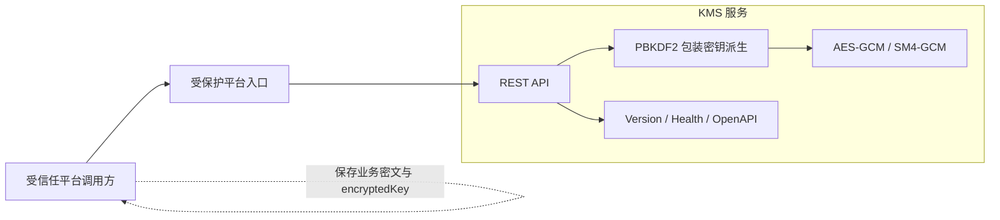

# KMS 设计

本文基于 KMS `62db853` 描述当前轻量实现及其安全边界。

## 运行结构

KMS 服务本身没有数据库。请求使用随机源生成数据密钥，使用口令派生的包装密钥加密该数据密钥，再把明文和加密结果返回调用方。

## API

| 接口 | 请求 | 响应 |
| ---- | ---- | ---- |
| `POST /v1/generate-data-key` | `password`、`algorithm` | Base64 `plaintextKey`、Base64 `encryptedKey` |
| `POST /v1/decrypt-data-key` | `encryptedKey`、`password`、`algorithm` | Base64 `plaintextKey` |

AES 使用 32 字节数据密钥，SM4 使用 16 字节数据密钥。GCM nonce 位于加密数据密钥字节前部，整体再编码为 Base64。

## 生成链路

1. API 解析请求并校验算法。
2. `crypto/rand` 生成随机数据密钥。
3. PBKDF2-SHA256 从口令派生 AES-256 或 SM4 包装密钥。
4. 使用随机 nonce 执行 GCM 加密。
5. 返回明文数据密钥和加密数据密钥。
6. 调用方使用明文密钥加密业务数据，只持久化业务密文、算法和加密数据密钥。

## 解密链路

1. API 解码 Base64 加密数据密钥。
2. 使用相同算法和口令派生包装密钥。
3. 从密文前部读取 nonce 并执行 GCM 认证解密。
4. 密码错误、密文损坏或认证失败时返回请求错误。
5. 成功时返回 Base64 明文数据密钥。

## 状态所有权

| 状态 | 权威来源 |
| ---- | -------- |
| 业务密文、算法和加密数据密钥 | 调用方 |
| 当前包装口令或主密钥配置 | KMS 部署配置的安全来源 |
| 明文数据密钥 | 只存在于生成/解密请求与调用方短期内存 |
| KMS API 健康和版本 | KMS 运行实例 |

## 安全边界

- 当前服务自身只配置日志和 CORS filter，没有独立的业务认证授权中间件，部署时必须由可信入口、网络策略或服务身份保护。
- 明文数据密钥通过 API 返回，只能在受保护传输通道和可信调用方内存中短期使用。
- 当前代码存在默认口令与固定 salt，仅适合作为当前轻量实现说明，不能视为受管主密钥方案。
- 生产化需要将主密钥材料移出代码和普通配置，增加版本、轮换、访问审计与恢复方案；需要更高保证时应接入云 KMS、Vault 或 HSM。
- `generate-data-key` 当前要求显式传入 `AES` 或 `SM4`，与字段注释中的默认算法表述不完全一致，调用方不能依赖空值默认行为。

## 部署与失败边界

KMS 以单一无状态服务运行，可通过 Helm 部署和水平扩展。随机源失败、算法错误或 GCM 认证失败必须直接返回错误。KMS 不可用只应影响新的数据密钥生成和解密，不应影响已经取得明文密钥后正在进行的本地业务加解密。

## 代码入口

| 主题 | 位置 |
| ---- | ---- |
| API、算法和加解密 | `pkg/kms.go` |
| HTTP 错误转换 | `base/api.go` |
| 服务命令 | `cmd/kms/main.go` |
| 部署 | `deploy/kms` |
