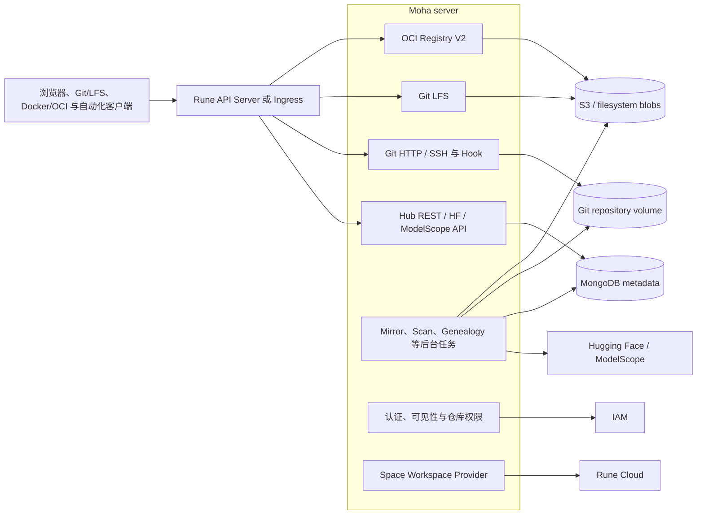
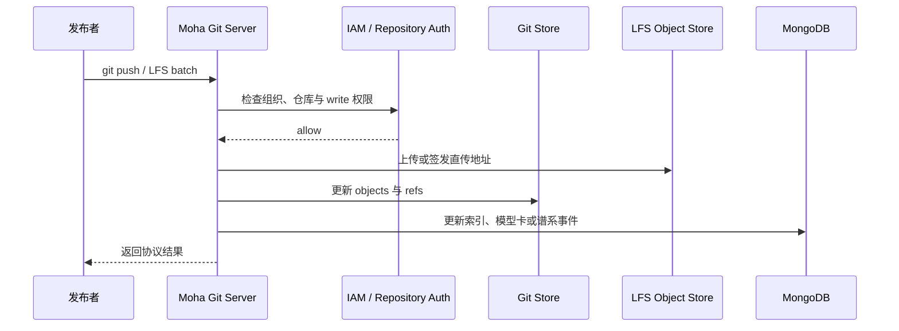

# Moha 设计

本文描述 Moha 当前的运行结构、存储边界和与 IAM、Rune 的协作。实现基线为 XiaoShi-Moha `a78306f`。

## 运行结构

Moha 当前以 `moha server` 单进程装配主要协议入口和后台任务；不同数据介质仍具有独立的故障与持久化边界。

统一入口必须保留 Git smart HTTP、LFS、Registry 和普通 REST 所需的路径、方法、认证头与流式行为。不能用只适合 JSON API 的超时和 body 限制覆盖所有协议。

## 核心模型

### Repository

仓库由 organization、type 和 repository name 定位，类型包括 `model`、`dataset`、`image` 和 `space`。模型、数据集与 Space 的内容历史主要由 Git 表达；镜像内容通过 OCI manifest、tag 和 blob 表达。

可见性包括：

| 可见性 | 读取范围 | 写入范围 |
| ------ | -------- | -------- |
| public | 按公开策略允许全平台或匿名读取 | 所有者、组织角色或显式仓库成员 |
| internal | 组织成员 | 所有者、组织角色或显式仓库成员 |
| private | 所有者与明确授权主体 | 所有者与明确授权主体 |

实际授权由请求身份、组织关系、仓库成员、角色绑定、资源类型和动作共同计算，不能只检查 `visibility` 字段。

### Revision 与 Digest

- Git branch/tag 是可变引用，commit 是稳定 revision。
- LFS object 通过 OID 与大小引用，内容位于对象存储或配置的后端。
- OCI tag 是可变引用，manifest/blob digest 是内容寻址标识。
- Rune Product/Instance 若要求可重现，应保存解析后的 commit 或 digest，而不是只保存展示名称。

### Space

Space 同时具有“代码资产”和“运行工作空间”两个生命周期。Moha 持有仓库与 Space 元数据，通过 workspace provider 调用 Rune 创建或维护运行环境；Rune 持有 Workspace、Namespace 和后续 Instance/Kubernetes 事实。

## 存储所有权

| 数据 | 权威来源 | 说明 |
| ---- | -------- | ---- |
| 仓库、镜像、成员、讨论、收藏、镜像任务等元数据 | MongoDB | 聚合 Store 为各类集合建立索引与访问接口 |
| Git refs、commit 与普通 Git objects | Git repository volume | 由 LocalGitStore 与 Git server 维护 |
| LFS objects | S3 或配置后端 | 可支持客户端直传 S3，元数据与内容提交不是数据库事务 |
| OCI manifests/blobs | Registry filesystem 或 S3 | 镜像元数据索引同时由 Moha 管理 |
| 用户、组织与全平台角色 | IAM（remote 模式） | 本地模式可用于独立部署，但平台集成时不得形成双权威 |
| Space 运行状态 | Rune / Kubernetes | Moha 只保存调用所需引用和可重试的投影状态 |

MongoDB、Git volume 和对象存储之间没有统一事务。创建、push、删除和镜像任务必须允许“元数据已写、内容未完成”等中间态被检测和修复。

## 关键链路

### Git 与 LFS 发布

Hook 和后台任务的元数据更新失败不能使已经写入的 commit 消失；系统需要通过待处理事件或重扫恢复索引。反过来，只有 LFS blob 上传成功而 ref 未提交时，应由清理策略处理孤儿对象。

### OCI push/pull

Registry token 或请求身份先经过镜像可见性和动作授权，再访问 manifest/blob 存储。推理或训练工作负载通常直接从 Registry 拉取镜像，Rune 只负责向 Pod 注入经授权的引用和必要凭据，不代理镜像内容。

### 来源镜像

Mirror worker 根据来源配置拉取 Hugging Face 或 ModelScope 内容，写入本地 Git/LFS 和元数据。任务需要记录来源 revision、目标 revision、进度和错误；重复调度使用稳定仓库键，避免并发创建重复资产。

### Space 与 Rune

Moha 的 Rune workspace provider 调用 Rune 创建或更新工作空间。调用成功表示 Rune 已受理或保存期望状态，不等于 Namespace、应用或端点已经 Ready；完成状态必须从 Rune status 获取。

## 部署与故障边界

Helm Chart 可配置 MongoDB、Git 持久卷、LFS/S3、Registry filesystem/S3 和镜像扫描服务。生产部署至少分别检查：

- Git volume 与 Registry filesystem 是否支持所选副本数和访问模式。
- S3 endpoint 是否同时可被 Moha、Git LFS 客户端和目标集群访问。
- MongoDB 与内容存储的备份恢复点是否协调。
- 大文件路径的 Ingress body、超时、缓冲和连接中断配置。
- 后台任务在多副本下是否通过 Mongo leader election 保证单活或幂等。

## 代码落点

| 变更 | 主要位置 | 同步检查 |
| ---- | -------- | -------- |
| 仓库、可见性、成员与 REST | `pkg/hub/repository*`、`repo-member*`、`authorization*` | IAM 组织映射、跨协议授权 |
| Git/LFS | `pkg/hub/git-*`、`pkg/git` | 对象存储、Hook、内容一致性 |
| Registry/镜像 | `pkg/hub/registry*`、`image*` | OCI 客户端、扫描、存储后端 |
| 外部来源镜像 | `pkg/hub/mirror*`、`hfapi.go`、`modelscope-api.go` | 幂等、来源 revision、任务恢复 |
| Space | `pkg/hub/workspace*` | Rune Workspace API 和异步 status |
| 服务装配 | `pkg/hub/hub.go`、`charts/moha` | 路由、存储、探针与持久卷 |

## 当前限制与验证重点

- 根 README 仍使用早期 ModelX 表述，不能覆盖当前 Moha 的完整能力；架构判断应以 `pkg/hub` 和 Chart 为准。
- 单进程集成多个协议和 worker，部署简单但故障和资源竞争需要用指标、限流及后台任务隔离来控制。
- 本地组织/授权与 remote IAM 两种路径同时存在；平台环境必须只指定一个身份权威，避免回退造成越权。
- Space 与 Rune、元数据与内容存储都采用最终一致性，需要对部分成功、删除重试和孤儿资源进行专项验收。
