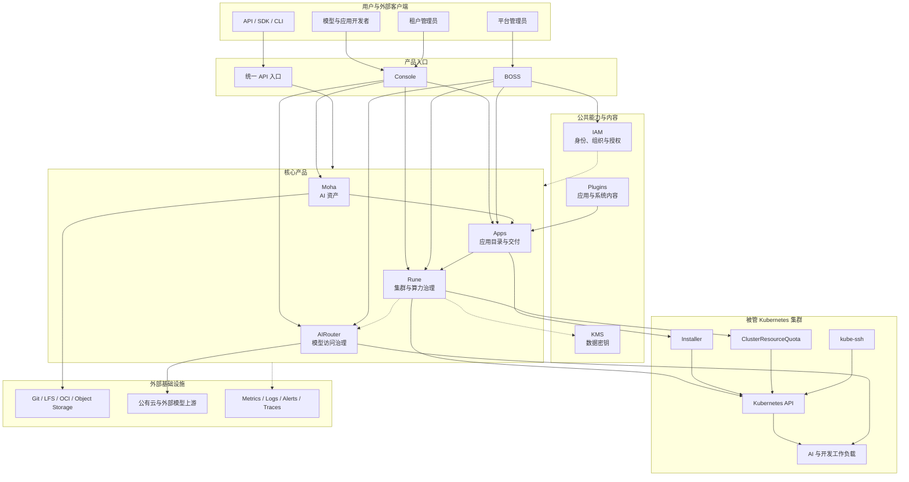
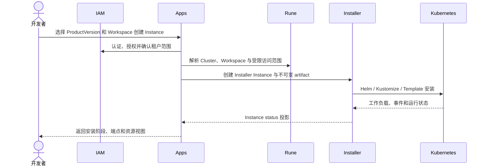
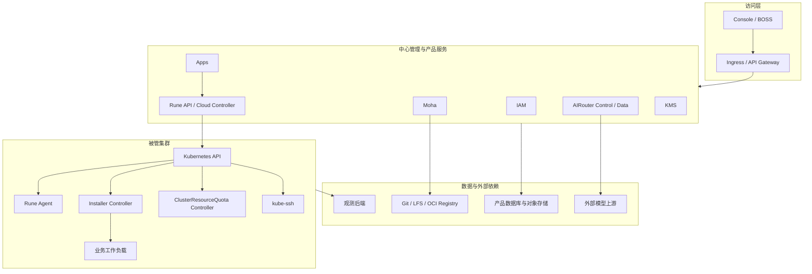

# 晓石 AI 平台架构

本文从整个平台视角说明产品、公共能力、集群组件和外部基础设施如何协作。它保持在 C4 System Landscape 和 System Context 层级，不展开 Rune、Apps 等产品的内部包或进程；产品价值和用户方案见[产品线全景](product-line.md)，Rune 内部结构见[Rune 控制面架构](rune/architecture.md)。

## 范围与状态

| 项目 | 说明 |
| ---- | ---- |
| 系统范围 | Console、BOSS、IAM、Moha、Apps、Rune、AIRouter、KMS 及必要的集群运行组件 |
| 运行环境 | 中心管理集群、被管 Kubernetes 集群、资产与观测基础设施、外部模型上游 |
| 当前边界 | IAM、Moha、Rune、AIRouter 及集群组件具有正式实现基线 |
| 正在落地 | Apps 当前工作树已有 Product、ProductVersion 和 Installer Instance API，但尚无正式提交基线 |
| 迁移边界 | Rune 旧 Product/Instance Controller 与 Apps/Installer 新路径并存，但不能管理同一实例 |

本文描述已实现边界及明确标记的迁移状态，不把未实现路线当作当前能力。

## 平台系统上下文

箭头表示主要调用、内容流或状态投影方向。虚线表示共享治理、注册或观测关系；详细协议和时序由产品设计与[关键业务场景](key-scenarios.md)维护。

## 产品和组件边界

| 产品或组件 | 核心职责 | 权威状态 | 不负责 |
| ---------- | -------- | -------- | ------ |
| Console / BOSS | 组织用户与管理员操作流程 | 不持有后端业务权威状态 | 复制产品数据库或绕过服务端授权 |
| IAM | 登录、组织、成员、角色、授权与审计 | 用户、组织、成员和授权关系 | 集群资源配额和工作负载状态 |
| Moha | 模型、数据集、镜像和 Space 的版本化管理与分发 | 仓库元数据、版本历史、LFS/OCI 内容 | 应用安装和集群容量 |
| Apps | Product、ProductVersion、实例 API 和安装状态呈现 | 产品目录与面向用户的实例视图 | 直接执行 Helm 或持有 kubeconfig |
| Rune | Cluster、Workspace、ResourcePool、Flavor、Quota、调度与运行诊断 | Cloud 治理对象和集群连接配置 | 产品目录、用户主数据和模型调用 usage |
| AIRouter | 模型协议、Channel、Token、路由、审核、限流、usage 和 billing | 渠道、策略、Token、用量与账务 | 创建训练或推理工作负载 |
| [KMS](kms/README.md) | 生成和解密数据密钥 | 当前不持久化通用业务密钥对象 | Secret 管理和业务密钥生命周期 |
| Plugins | 保存官方应用和系统组件内容 | Chart、镜像构建与来源配置 | Instance 运行状态 |
| Installer | 解析制品并声明式安装应用 | Installer Instance spec/status | 产品目录、身份和算力决策 |
| ClusterResourceQuota | 执行跨 Namespace 资源配额 | CRQ spec/status | 租户权益和产品配额策略 |
| kube-ssh | 将 SSH 映射为受控 Pod exec/portforward | Access 与会话审计 | Workspace、成员和应用生命周期 |
| Kubernetes | 承载工作负载和集群资源 | Kubernetes 资源与运行事实 | 产品目录和平台身份主数据 |

## 应用交付与算力协作

新路径中 Apps 持有产品目录与用户 API，Rune 持有集群和算力上下文，Installer 持有安装期望与状态，Kubernetes 持有运行事实。Rune 基线仍保留旧 ProductChart/Instance Helm Controller；迁移期间必须按实例来源选择唯一 Controller。

Installer、ClusterResourceQuota、kube-ssh 和 Plugins 的详细职责见[应用交付与集群运行组件](platform-components.md)。

## 平台部署分层

中心产品服务和被管集群具有独立故障边界。集群暂时离线不应影响其他集群；AIRouter 数据面不经过 Rune Controller；运行中的 Kubernetes 工作负载也不应因 Apps 暂时不可用而停止。

## 状态所有权规则

- 产品之间只通过稳定 API、协议或声明式对象协作，不直接读取彼此数据库。
- API 同步响应表示请求已校验并受理；外部安装、调度和注册结果通过 status 表达。
- 缓存和跨产品投影必须可删除重建，不能反向成为业务权威来源。
- 用户、组织与权限以 IAM 为准；AI 资产和版本以 Moha 为准。
- Apps 产品和版本以 Apps 为准；新安装状态以 Installer Instance CR 为准。
- 集群治理期望以 Rune 为准；Pod、Deployment、Job、Event 等运行事实以 Kubernetes 为准。
- 模型渠道、策略、Token 和 usage 以 AIRouter 为准。
- 业务密文和加密数据密钥由 KMS 调用方持有；KMS 只在请求期间处理明文数据密钥。

完整对象级划分见[领域架构](domain-architecture.md)，失败和恢复要求见[质量属性](quality-attributes.md)。

## 下钻入口

| 关注点 | 文档 |
| ------ | ---- |
| 产品价值、用户角色和典型方案 | [产品线全景](product-line.md) |
| 业务目标、约束与成功判据 | [架构驱动](architecture-drivers.md) |
| 跨产品运行时协作 | [关键业务场景](key-scenarios.md) |
| Rune 进程、存储、部署与多集群连接 | [Rune 控制面架构](rune/architecture.md) |
| Apps 产品与 Installer 边界 | [Apps 设计](apps/design.md) |
| Installer、CRQ、kube-ssh、Plugins | [平台运行组件](platform-components.md) |
| IAM、Moha、AIRouter 内部设计 | [IAM](iam/design.md)、[Moha](moha/design.md)、[AIRouter](airouter/design.md) |
| 数据密钥能力 | [KMS](kms/design.md) |
| 决策依据 | [架构决策记录](architecture-decisions/README.md) |
