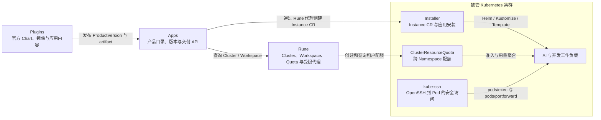

# 应用交付与集群运行组件

这些项目不是与 IAM、Moha、Rune、Apps、AIRouter 同层的用户产品，但它们是产品能力能够在 Kubernetes 集群中落地的关键组件。

## 组件地图

## Plugins

`plugins` 是官方应用与插件工厂，包含 system、inference、training、develop、app、external 和 experiment 等 Chart，以及配套镜像构建和离线打包脚本。

- 向 Apps 或兼容的产品发布流程提供可交付 Chart 和镜像。
- `system` 中包含 Installer、ClusterResourceQuota、kube-ssh 等平台组件的来源配置。
- 开发、训练和推理 Chart 是产品内容，不是新的控制面权威状态。
- Plugins 仓库保存源定义；发布后的 ProductVersion 和 artifact 由 Apps 管理。

## Installer

Installer 是部署在 Kubernetes 集群中的应用安装 Controller。它以 `apps.xiaoshiai.cn/v1 Instance` CR 为期望和状态边界，支持 Helm、Kustomize 和 Template。

主要职责：

- 从同 Namespace 不可变 Secret 或兼容 URL 获取 artifact，并校验 SHA-256。
- 执行 Namespace 强制、公共标签、extensions、暂停和 dashboard annotation 等 PostRender。
- 默认拒绝 cluster-scoped 与跨 Namespace 资源，只允许显式授权例外。
- 管理依赖、valuesFrom、安装、升级、暂停、恢复和删除。
- 从受管资源聚合 phase、conditions、endpoints、states、summary 和资源引用。

新路径由 Apps 创建 Installer CR，Rune 提供受限的集群访问通道；同一 CR 只能由 Installer Controller 执行安装，不能再由 Rune 旧 Helm Controller 重复管理。

## ClusterResourceQuota

ClusterResourceQuota 是 Kubernetes ResourceQuota 的跨 Namespace 扩展，也是 Rune 当前租户级配额的运行实现。

主要职责：

- 通过 Namespace selector 把一个配额应用到多个 Workspace Namespace。
- 聚合这些 Namespace 的资源使用量并执行配额准入。
- 扩展 `NodeSelector` scope，使配额可限定 GPU 型号或 ResourcePool 等节点条件。
- 保持对原生 Namespace ResourceQuota 的兼容。

Rune 负责面向用户管理租户、资源池与配额产品语义；ClusterResourceQuota Controller 负责在集群中执行，不成为租户或权益模型的第二权威来源。

## kube-ssh

kube-ssh 让标准 OpenSSH 客户端通过 Kubernetes 原生 API 访问 Pod，而不要求工作负载内运行 `sshd`。

主要职责：

- 认证用户并根据同 Namespace `Access` CR 选择和授权目标。
- 通过 `pods/exec` 提供 Shell、命令、PTY 和窗口调整。
- 通过 `pods/portforward` 与 helper 支持 SFTP、SCP 和端口转发。
- 生成结构化审计事件、Prometheus 指标和健康状态。

Plugins 中的开发环境 Chart 可以创建 kube-ssh `Access`，形成“Apps 安装开发环境 → Installer 创建工作负载 → kube-ssh 提供入口”的协作链路。kube-ssh 不拥有 Workspace、成员或应用生命周期。

## 实现基线

| 组件 | 扫描基线 | 仓库状态 |
| ---- | -------- | -------- |
| Plugins | `98ab445` | 已提交；工作树另有本地变更，本文不依赖该变更 |
| Installer | `36f0543` | 已提交、工作树干净 |
| ClusterResourceQuota | `039f3b5` | 已提交、工作树干净 |
| kube-ssh | `ee6ec77` | 已提交、工作树干净 |
