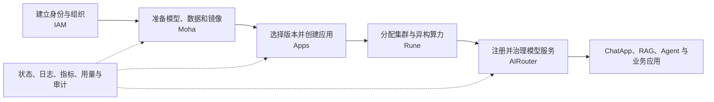

# 晓石 AI 产品线全景

晓石 AI 平台是一组围绕“AI 资产、算力、工作负载和模型服务”协同工作的产品，而不是一个单体系统。产品线让开发者能够从模型或数据资产出发，申请算力并运行训练、推理或开发环境，再把模型服务通过统一网关提供给应用；管理员则在同一租户边界下治理成员、集群、资源和调用成本。

本文先回答产品线有哪些产品、各自提供什么功能、如何组成用户方案。产品边界、状态所有权和部署分层见[平台架构](platform-architecture.md)。

## 产品线定位

产品线覆盖一条完整的 AI 交付链路：

这条链路中，每个产品只拥有自己的核心状态：IAM 拥有身份和组织，Moha 拥有资产和版本，Apps 拥有应用目录和版本，Rune 拥有集群、工作空间与资源治理，Installer CR 与 Kubernetes 拥有新应用交付路径的期望和运行事实，AIRouter 拥有模型访问策略和用量。用户看到的是一体化体验，底层仍保持清晰边界。

## 产品组合

| 产品或入口 | 产品定位 | 核心用户 | 主要功能 | 产出 |
| ---------- | -------- | -------- | -------- | ---- |
| Console | 租户与开发者统一工作台 | 模型开发者、应用开发者、租户管理员 | 组合资产、算力、应用、模型服务和可观测页面 | 面向任务的一体化操作体验 |
| BOSS | 平台运营与管理入口 | 平台管理员、运营人员 | 组织治理、集群与资源运营、系统配置和审计入口 | 全平台治理视图 |
| [IAM](iam/README.md) | 统一身份与访问管理 | 全体用户、平台服务 | 登录、组织、成员、角色、RBAC、Webhook、审计 | 可信身份与租户权限上下文 |
| [Moha](moha/README.md) | AI 资产中心 | 模型与数据开发者、资产管理员 | 模型、数据集、镜像、Space、Git/LFS/OCI、来源镜像 | 可版本化、可分发的 AI 资产 |
| [Apps](apps/README.md) | 应用目录与交付平台 | 应用发布者、开发者、平台管理员 | Product、ProductVersion、Chart artifact、Instance 生命周期 | 可发现、可版本化、可安装的应用 |
| [Rune](rune/README.md) | AI 算力与集群控制面 | 开发者、租户管理员、平台管理员 | 多集群、工作空间、资源池、规格、配额、调度与运行观测 | 可分配、可治理的 AI 运行环境 |
| [AIRouter](airouter/README.md) | 模型访问网关 | 应用开发者、模型服务管理员、运营人员 | OpenAI 兼容协议、Channel、Token、限流、审核、路由、usage 和 billing | 稳定、受治理的模型调用入口 |
| [KMS](kms/README.md) | 数据密钥基础能力 | 平台内部服务 | 生成和解密数据密钥，支持信封加密 | 由调用方保存的加密数据密钥 |

Console 和 BOSS 是体验入口，不复制后端业务状态；KMS 是内部平台能力，不等同于独立的用户工作台或通用 Secret 产品。

## 各产品核心功能

### Console 与 BOSS：统一体验入口

Console 面向租户和开发者组织资产、应用、算力、模型服务和运行观测；BOSS 面向平台管理员组织身份治理、产品运营、集群容量、安全和审计。二者通过后端产品 API 组合流程和页面，不复制 IAM、Moha、Apps、Rune 或 AIRouter 的权威状态。

### IAM：统一身份与组织

IAM 解决“谁在使用平台、属于哪个组织、能执行什么操作”。

- 支持登录、Session、Token/API Key、OIDC/OAuth 和可配置 MFA 流程。
- 管理组织、成员、用户组、系统角色与组织范围 RBAC。
- 通过 REST、内部 Client 和 Authenticate/Authorize/Audit Webhook 服务其他产品。
- 接收或保存审计记录，并提供头像、静态资源和用户配置等公共能力。

IAM 不决定用户能使用多少 GPU，也不管理模型仓库或模型调用额度。

### Moha：AI 资产中心

Moha 解决“模型、数据、镜像和应用代码是什么版本、来自哪里、谁能访问”。

- 以 Git 仓库管理模型、数据集和 Space 的版本历史。
- 以 Git LFS 与对象存储承载模型权重、数据集等大文件。
- 提供 OCI Registry 管理与分发容器镜像。
- 支持 public、internal、private 可见性和仓库协作权限。
- 支持外部模型站镜像、模型卡、谱系、讨论、收藏和镜像扫描等资产协作能力。
- Space 可以调用 Rune 获取运行工作空间，但资产与运行状态保持分离。

### Rune：算力与工作负载平台

Rune 解决“在哪个集群、以什么资源规格、如何持续运行 AI 工作负载”。

- 纳管多个 Kubernetes 集群，维护连接、资源与运行状态。
- 通过租户和 Workspace 将组织边界落实为 Namespace 与资源范围。
- 通过 ResourcePool、Flavor 和 Quota 把异构 CPU、GPU、NPU、存储与节点条件产品化。
- 为 Apps 提供 Cluster、Workspace、Resource Graph 和受限 Kubernetes Proxy；迁移完成前仍保留历史 Product/Instance 路径。
- 通过 Installer API 类型访问集群内 Instance CR，并聚合集群资源和状态。
- 聚合 Kubernetes 资源、事件、指标、日志、告警、终端和服务代理。
- 提供基础调度与共享算力能力；资源权益、动态借用/收回和协同启动仍在继续闭环。

### Apps：应用目录与交付

Apps 解决“平台有哪些应用和版本、如何把一个版本交付到指定 Workspace”。

- 管理租户作用域 Product、ProductVersion、分类、发布状态和 OCI Chart artifact。
- 通过 IAM Webhook 执行认证授权，通过 Rune 解析 Cluster 与 Workspace。
- 将 Chart 交付为同 Namespace 不可变 Secret，并创建 Installer Instance CR。
- 提供安装、升级、停止、恢复、扩缩容、重试、删除、Watch、端点和资源查询。
- 不保存第二份 Instance；目标集群中的 Installer CR 是新路径的期望和状态来源。

Apps 当前代码位于尚未形成提交基线的本地工作树，属于正在落地的独立产品边界。它不能与 Rune legacy Controller 同时管理同一个安装。

### AIRouter：统一模型访问

AIRouter 解决“应用如何用一个稳定协议安全、可控地调用不同模型服务”。

- 对自建模型和公有云模型提供 OpenAI 兼容接口。
- 管理 Channel、网关 Token、模型、上游凭据引用和访问范围。
- 执行 Token/Channel 双维度 RPM/TPM 限流。
- 执行输入与输出内容审核，支持流式响应检测。
- 按优先级、可见性和策略选择渠道，并支持安全的 retry/fallback。
- 记录请求、Token 用量、延迟、错误、审计与账务数据。
- Control Plane 和 Data Plane 独立部署与扩缩容，保护推理热路径。

### KMS：数据密钥能力

KMS 解决“内部服务如何获得用于信封加密的数据密钥，并在需要时恢复该密钥”。

- 生成 AES-256 或 SM4 随机数据密钥。
- 同时返回一次性明文数据密钥和由包装密钥保护的加密数据密钥。
- 由调用方保存业务密文、算法和加密数据密钥，KMS 不保存业务密钥对象。
- 提供无状态 REST、OpenAPI、版本和健康检查接口。

当前 KMS 是轻量内部能力，不等同于通用 Secret 管理或云 KMS/HSM；认证、主密钥保护、版本和轮换仍需结合部署与后续演进完善。

## 面向角色的产品体验

| 角色 | 主要任务 | 主要产品 |
| ---- | -------- | -------- |
| 模型开发者 | 查找或发布模型和数据，创建开发/训练环境，保存可复现版本 | Console、Moha、Apps、Rune、IAM |
| 推理服务开发者 | 选择模型、镜像和应用版本，部署推理 Instance，注册稳定服务入口 | Moha、Apps、Rune、AIRouter |
| 应用开发者 | 获取 Token，通过统一协议调用模型，查看错误和用量 | AIRouter、IAM、Console |
| 租户管理员 | 管理成员、工作空间、配额、私有资产和模型访问范围 | IAM、Moha、Rune、AIRouter |
| 平台管理员 | 纳管集群和设备，配置资源池与规格，治理安全、容量和成本 | BOSS、Rune、IAM、AIRouter |
| 运维与支持 | 关联入口、控制面、资产、集群、模型上游和调用证据 | Rune、Moha、AIRouter、IAM |

## 典型产品方案

### 从资产到自建模型 API

1. 用户通过 IAM 登录并进入所属组织。
2. 在 Moha 选择或发布固定 revision 的模型、数据集和镜像。
3. 在 Apps 选择 ProductVersion、Rune Workspace、Flavor 和配置，创建推理 Instance。
4. Apps 通过 Rune 代理创建 Installer CR，Installer 在目标 Kubernetes 集群调谐工作负载并聚合状态。
5. 用户显式创建推理服务注册，Rune 将其同步为 AIRouter Channel。
6. 应用使用 AIRouter Token 和 OpenAI 兼容 API 调用模型。
7. 平台分别从 IAM 审计、Rune/Kubernetes 状态、Moha revision 和 AIRouter usage 形成端到端证据。

### 统一使用公有云与自建模型

管理员在 AIRouter 中配置公有云 Channel，并将 Rune 部署的模型服务注册为自建 Channel。应用只依赖统一模型名和协议；AIRouter 根据访问范围、优先级与运行策略选择上游，同时执行限流、审核和计量。切换上游不要求所有业务应用分别修改供应商 SDK。

### 多租户共享异构算力

平台管理员在 Rune 纳管集群，按节点和设备建立 ResourcePool 与 Flavor；租户管理员获得集群使用范围、Workspace 和 Quota；开发者从产品规格创建 Instance。调度和状态聚合需要区分配额不足、资源池不足、设备/拓扑不匹配与调度器异常，不能把所有等待都显示为“资源不足”。

## 产品线框图

下图采用 C4 System Landscape 的思路：每个框表示一个产品、产品入口或外部运行系统，只展示产品级职责和关键协作，不在同一张图中混入进程、数据库表或代码模块。

```mermaid
flowchart TB
    subgraph Experience[体验与访问入口]
        direction LR
        Console["Console<br/>[产品入口]<br/>租户与开发者工作台"]
        Boss["BOSS<br/>[产品入口]<br/>平台运营与管理工作台"]
        APIClient["API / SDK / CLI<br/>[开放入口]<br/>自动化与业务集成"]
    end

    subgraph ProductLine[晓石 AI 产品线]
        direction TB

        subgraph CoreProducts[核心产品]
            direction LR
            Moha["Moha<br/>[AI 资产产品]<br/>模型、数据集、镜像与 Space"]
            Apps["Apps<br/>[应用交付产品]<br/>目录、版本、artifact 与 Instance"]
            Rune["Rune<br/>[算力与集群产品]<br/>集群、Workspace、配额与观测"]
            AIRouter["AIRouter<br/>[模型访问产品]<br/>协议、渠道、治理与计量"]
        end

        subgraph SharedProducts[共享产品与能力]
            direction LR
            IAM["IAM<br/>[身份产品]<br/>认证、组织、权限与审计"]
            KMS["KMS<br/>[安全能力]<br/>数据密钥与信封加密"]
            Plugins["Plugins<br/>[应用内容]<br/>官方 Chart、镜像与离线制品"]
        end
    end

    subgraph Runtime[外部运行与基础设施]
        direction TB
        Artifact["Git / LFS / OCI / Object Storage<br/>[资产内容基础设施]"]
        subgraph ClusterComponents[Kubernetes 集群运行组件]
            direction LR
            Installer["Installer<br/>[应用安装 Controller]<br/>Instance CR 与运行状态"]
            CRQ["ClusterResourceQuota<br/>[租户配额 Controller]<br/>跨 Namespace 配额"]
            KubeSSH["kube-ssh<br/>[访问网关]<br/>OpenSSH 到 Pod"]
            Kubernetes["Kubernetes 与异构算力<br/>[工作负载运行环境]"]
        end
        Upstream["公有云与外部模型服务<br/>[模型上游]"]
        Observe["Metrics / Logs / Alerts / Traces<br/>[观测基础设施]"]
    end

    Console -->|浏览和操作产品能力| Moha
    Console -->|浏览、安装和运维应用| Apps
    Console -->|选择 Workspace 与算力| Rune
    Console -->|管理和调用模型服务| AIRouter
    Boss -->|治理组织与成员| IAM
    Boss -->|治理产品目录与版本| Apps
    Boss -->|治理集群、算力与配额| Rune
    Boss -->|治理渠道、用量与账务| AIRouter
    APIClient -->|Git / LFS / OCI / REST| Moha
    APIClient -->|Product / Instance API| Apps
    APIClient -->|Cloud API| Rune
    APIClient -->|OpenAI-compatible API| AIRouter

    IAM -.->|统一身份、组织、授权与审计| Moha
    IAM -.->|认证、授权与租户范围| Apps
    IAM -.->|统一身份、组织、授权与审计| Rune
    IAM -.->|外部身份与租户上下文| AIRouter
    Rune -.->|暴露数据密钥 API| KMS

    Moha -->|固定 revision 与镜像引用| Apps
    Moha -.->|Space 工作空间请求| Rune
    Plugins -->|发布 Chart、镜像与产品内容| Apps
    Apps -->|查询 Cluster / Workspace 与使用受限代理| Rune
    Apps -->|创建 Installer Instance CR| Installer
    Rune -.->|推理服务注册为 Channel| AIRouter

    Moha -->|保存和分发资产内容| Artifact
    Apps -->|保存和读取 Chart artifact| Artifact
    Installer -->|Helm / Kustomize / Template| Kubernetes
    Rune -->|创建和管理租户配额| CRQ
    CRQ -->|跨 Namespace 准入与用量聚合| Kubernetes
    KubeSSH -->|pods/exec 与 pods/portforward| Kubernetes
    Plugins -.->|提供 kube-ssh、Installer 与 CRQ Chart| KubeSSH
    Plugins -.->|提供系统组件 Chart| Installer
    Plugins -.->|提供系统组件 Chart| CRQ
    Rune -->|查询和治理运行资源| Kubernetes
    AIRouter -->|调用自建模型服务| Kubernetes
    AIRouter -->|代理模型请求| Upstream
    IAM -.->|日志、指标与审计证据| Observe
    Moha -.->|日志、任务与资产证据| Observe
    Apps -.->|产品、交付与 Instance 证据| Observe
    Rune -.->|状态、事件、指标与日志| Observe
    AIRouter -.->|调用、延迟、用量与追踪| Observe

    classDef entry fill:#EAF2FF,stroke:#3267A8,stroke-width:1.5px,color:#172B4D;
    classDef core fill:#E8F7EF,stroke:#21845B,stroke-width:2px,color:#153B2C;
    classDef shared fill:#F3ECFF,stroke:#7755A6,stroke-width:1.5px,color:#38245A;
    classDef component fill:#FFF4E5,stroke:#B56A16,stroke-width:1.5px,color:#55320D;
    classDef infra fill:#F3F4F6,stroke:#68707C,stroke-width:1.5px,color:#252A31;
    class Console,Boss,APIClient entry;
    class Moha,Apps,Rune,AIRouter core;
    class IAM,KMS,Plugins shared;
    class Installer,CRQ,KubeSSH component;
    class Artifact,Kubernetes,Upstream,Observe infra;
```

图例：蓝色框是体验或开放入口，绿色框是核心产品，紫色框是共享产品、应用内容与安全能力，橙色框是集群运行组件，灰色框是外部运行基础设施；实线表示主要业务调用或内容流，虚线表示治理、注册、观测等支撑关系。所有关系按箭头方向阅读。

绘图约定参考 [C4 System Landscape](https://c4model.com/diagrams/system-landscape) 和 [C4 图示建议](https://c4model.com/diagrams/notation)：保持单一抽象层级，为框写明职责，为连线标明方向和含义。实现使用 [Mermaid Flowchart](https://mermaid.js.org/syntax/flowchart) 的 subgraph 与 `classDef`，因为 Mermaid 自带的 C4 语法目前仍标记为实验性。

产品之间只通过稳定 API、协议或声明式对象协作，不直接读取彼此数据库。需要查看状态所有权、运行组件和部署分层时，应继续阅读[平台架构](platform-architecture.md)，不把这些细节继续堆叠到产品线框图中。

## 当前产品现状

| 产品 | 当前已形成的能力 | 需要继续闭环的重点 |
| ---- | ---------------- | ------------------ |
| IAM | 独立服务、认证授权、组织 RBAC、Webhook、审计与公共配置 | 内部信任边界、跨存储故障语义、下游缓存失效 |
| Moha | Git/LFS/OCI、资产元数据与协作、来源镜像、Space 集成 | 多存储一致性、平台级文档、Space 删除与失败恢复 |
| Apps | Product、ProductVersion、OCI artifact 与 Installer CR 生命周期 API 已存在于本地工作树 | 建立正式提交基线，完成 Rune legacy 路径迁移与端到端部署验收 |
| Rune | 多集群、工作空间、资源治理、Installer CR API、观测与基础调度 | 新旧 Instance 边界收敛、资源权益、动态共享/收回和中立调度状态 |
| AIRouter | Control/Data 分离、多供应商、限流审核、usage/billing、可观测 | 身份映射、缓存重连、服务注册全生命周期、端到端 SLO |
| KMS | AES/SM4 数据密钥生成与解密、无状态 API 和 Helm 部署 | 入口认证、主密钥外置、版本轮换、独立审计和契约一致性 |
| Plugins / Installer / CRQ / kube-ssh | 已形成应用内容、安装、跨 Namespace 配额和受控 SSH 能力 | 与 Apps/Rune 的发布、升级、状态和安全策略形成统一验收 |
| Console / BOSS | 组合多个后端能力形成用户和运营入口 | 跨产品术语、状态和故障体验的一致性 |

“需要继续闭环”表示当前产品边界内尚需完善的能力，不能在界面、销售材料或验收用例中表述为已经完整交付。

## 如何继续阅读

- 想了解为什么形成这组产品：阅读[架构驱动](architecture-drivers.md)。
- 想了解产品边界、运行组件和部署：阅读[平台架构](platform-architecture.md)；下钻 Rune 时再读[Rune 控制面架构](rune/architecture.md)。
- 想了解产品间一次操作如何完成：阅读[关键业务场景](key-scenarios.md)。
- 想了解某个产品或平台能力：进入 [IAM](iam/README.md)、[Moha](moha/README.md)、[Apps](apps/README.md)、[Rune](rune/README.md)、[AIRouter](airouter/README.md)或[KMS](kms/README.md)。
- 想了解应用交付：进入 [Apps](apps/README.md) 和[平台运行组件](platform-components.md)。
- 想开发或评审变更：阅读[领域架构](domain-architecture.md)、[质量属性](quality-attributes.md)和[开发落地指南](development-guide.md)。
- 遇到 Product、Instance、Quota、Channel 等概念歧义：查阅[术语表](glossary.md)。
