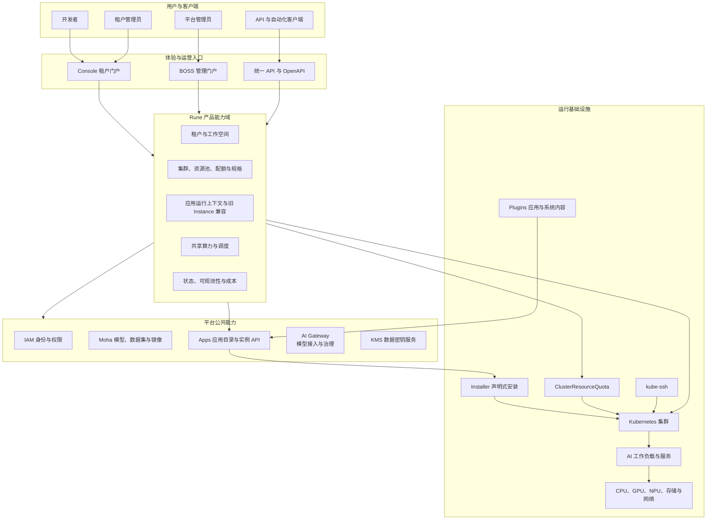
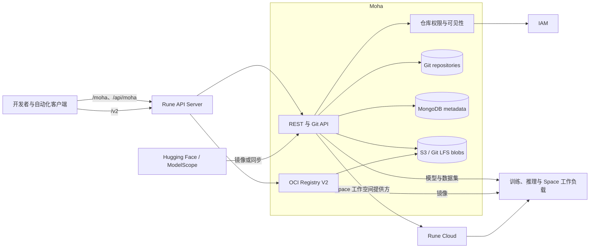
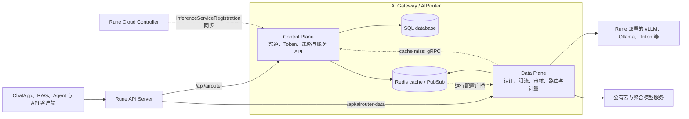
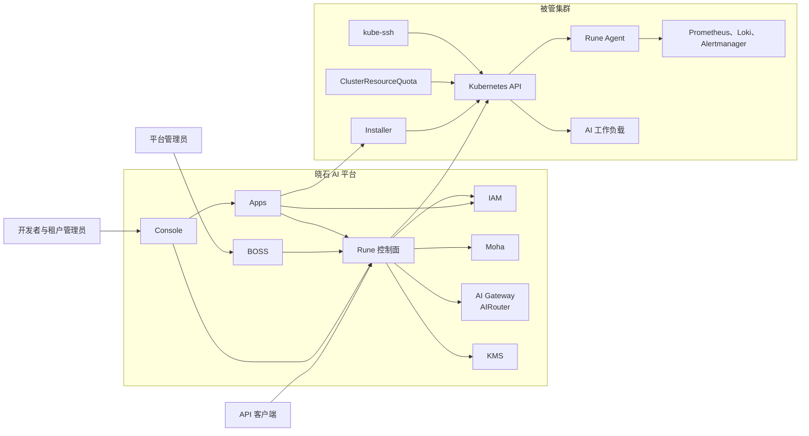
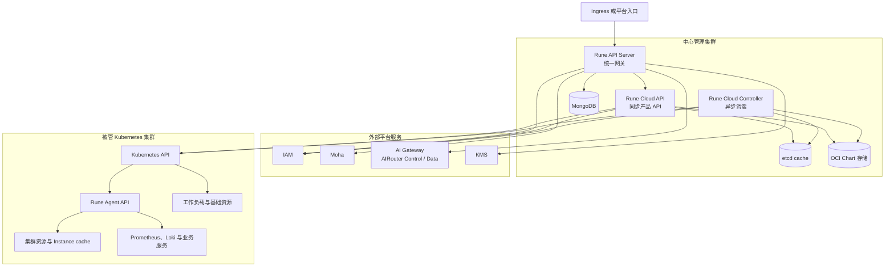
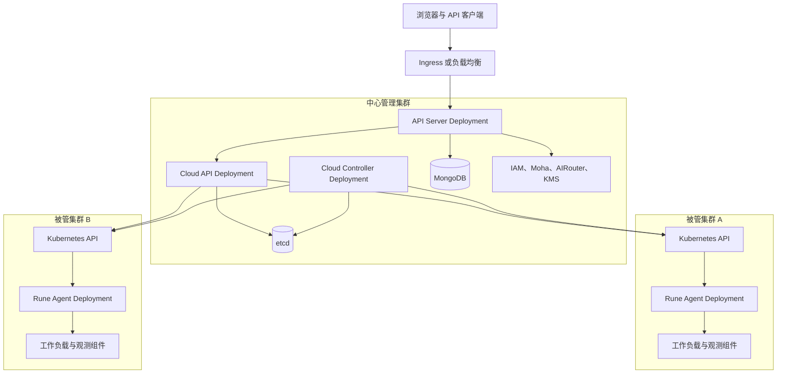
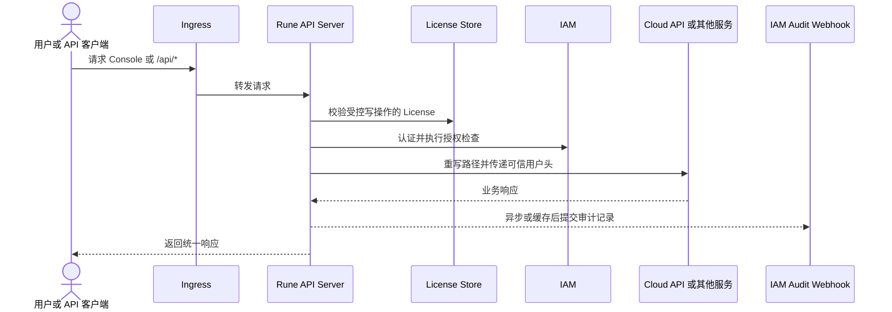
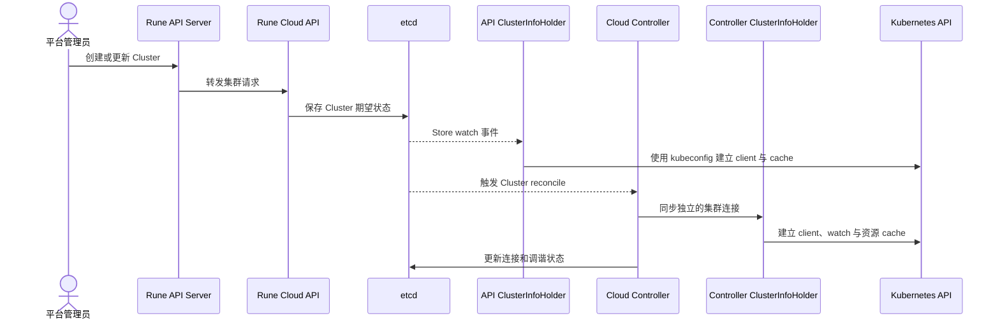
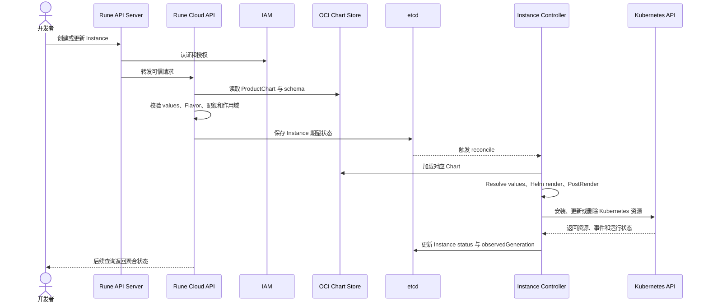
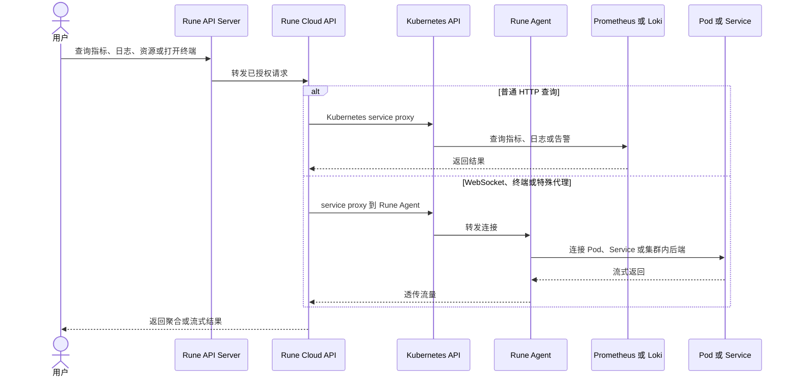

# Rune 控制面架构

本文面向架构、研发和运维人员，说明 Rune 控制面的运行组件、数据所有权、部署拓扑和关键链路。整个平台的产品边界与系统上下文见[平台架构](../platform-architecture.md)，产品定位、核心功能和用户方案见[产品线全景](../product-line.md)。本文保留必要的平台上下文摘要，但不作为产品线总入口。

建议从[文档阅读指南](../README.md)进入完整文档链路；设计动机见[架构驱动](../architecture-drivers.md)，跨产品业务过程见[关键业务场景](../key-scenarios.md)，代码变更规则见[开发落地指南](../development-guide.md)。

## 阅读说明

### 文档状态

| 项目       | 内容                                                             |
| ---------- | ---------------------------------------------------------------- |
| 文档性质   | Rune 控制面详细架构，不直接作为产品线或产品站总入口              |
| Rune 基线  | `87655be2fe7fd350376bdc15f5aa60548600c5df`                       |
| 关联基线   | IAM `91d158d`、Moha `a78306f`、AIRouter `c980658`、KMS `62db853`；Installer `36f0543`、ClusterResourceQuota `039f3b5`、kube-ssh `ee6ec77`、Plugins `98ab445` |
| Apps 状态  | `../apps` 当前工作树已有实现，但尚无正式 Git 提交基线，本文标记为“正在落地” |
| 文档站基线 | Docs 起始基线 `f6096db`；本文包含尚未提交的产品线架构整理       |
| 主要读者   | 产品经理、架构师、后端研发、前端研发、平台运维                   |
| 系统边界   | 平台架构作为外部上下文，Rune 控制面作为详细设计对象              |

文档内容以实现基线中的代码、部署模板和领域设计为准。对 Rune 展开到领域和运行组件，对平台关联组件展开到职责、数据边界、主要内部组件和与 Rune 的协作关系；更细的实现以各组件仓库为准。

图中的实线表示主要调用关系；虚线表示异步调谐或状态投影。每张图后均有文字说明，图不是唯一信息来源。

### 文档方法

本文使用轻量化的架构视图：

- 产品能力视图回答平台提供什么能力以及由谁使用。
- C4 System Context 视图回答 Rune 与用户、平台服务和基础设施的边界。
- C4 Container 视图回答 Rune 的运行组件、存储和主要依赖。
- Deployment 视图回答组件部署在哪里以及跨集群通信如何发生。
- Dynamic 视图通过端到端链路说明系统在运行时如何协作。

不展开代码级类图。易变化的包、函数和字段应由代码与领域设计文档维护。

## 架构原则和实现约束

### 产品原则

- 以 `ProductVersion + Instance + Flavor + Quota + ResourcePool` 形成统一入口，并由 Installer 消化具体 Chart/Kustomize/Template 安装细节。
- 支持平台管理员、租户管理员和普通用户在同一平台上完成多租户、多集群资源治理。
- 将 Kubernetes、Helm、调度器和设备插件等基础设施细节封装为稳定的产品能力。
- 允许 Console、BOSS、自动化客户端和外部平台服务通过一致的入口访问能力。
- 让用户能够理解工作负载的配置、资源范围、运行状态和故障原因。

### 质量原则

| 质量属性   | 架构要求                                                                         |
| ---------- | -------------------------------------------------------------------------------- |
| 多租户隔离 | 所有业务对象都具有明确的租户、集群或工作空间范围，服务端不信任前端传入的资源边界 |
| 一致性     | API 保存期望状态，Controller 以幂等调谐把状态投影到目标集群                      |
| 可用性     | 同步请求、后台调谐和集群内交互能力具有独立故障边界                               |
| 可扩展性   | 产品 API 不绑定单一调度器、设备插件、制品服务或可观测后端                        |
| 可观测性   | 平台能够从中心侧聚合 API、Controller、Kubernetes 资源、事件、指标和日志证据      |
| 安全性     | 统一入口执行 License、认证、授权和审计；集群凭据及代理能力只对受信任组件开放     |
| 可维护性   | 逻辑领域与运行组件明确映射，不以拆分微服务作为架构质量的默认前提                 |

### 实现约束

- Rune 使用同一代码仓库和主镜像构建 `apiserver`、Cloud API、Cloud Controller，Agent 使用独立二进制和镜像。
- Cloud API 和 Cloud Controller 都能根据保存的 kubeconfig 建立到被管 Kubernetes API 的 client 和 cache。
- 部分终端、WebSocket 和集群内服务访问通过 Kubernetes service proxy 转发到 Rune Agent。
- Cloud 业务对象主要存放在 etcd cache；API Server 创建 MongoDB-backed store 供 License 等入口层状态使用；Chart 由 OCI artifact provider 读取。
- Apps、IAM、Moha、AIRouter、KMS、Console 和 BOSS 是可独立部署的平台组件；Rune 通过统一入口、内部 API 和控制器与它们协作，但不接管其权威状态。
- 新应用路径由 Apps 创建 Installer Instance；Rune 旧 ProductChart/Instance Controller 在迁移期保留，但不得与 Installer 管理同一逻辑实例。

## 平台上下文摘要

晓石 AI 平台可以从用户体验、平台治理、AI 资产、算力控制和工作负载运行五个层面理解。Rune 横跨其中的接入、算力控制和运行编排，但不等于整个平台。

能力域职责如下：

| 能力域         | 核心对象或能力                              | 主要用户价值                             |
| -------------- | ------------------------------------------- | ---------------------------------------- |
| 租户与工作空间 | Tenant Enablement、Workspace、Namespace     | 隔离组织、项目和工作负载范围             |
| 集群与资源治理 | Cluster、ResourcePool、Quota、Flavor        | 纳管异构集群并把底层资源转换为可选择规格 |
| 应用目录与交付 | Product、ProductVersion、Instance、Installer | 从版本化应用创建、更新和管理工作负载     |
| 调度           | Policy、Entitlement、Queue 投影、拓扑与设备 | 保障共享算力权益、协同启动和设备放置     |
| 可观测与运营   | Status、Event、Metric、Log、Alert、Cost     | 解释运行状态、诊断故障和统计资源消耗     |

## 平台组件与协作边界

平台不是一个单体服务。Console 和 BOSS 组织用户体验，Apps 管理应用目录与交付 API，Rune 管理算力与工作负载运行上下文，IAM、Moha、AI Gateway 和 KMS 分别持有身份、AI 资产、模型访问和数据密钥能力。组件可以共享平台入口和租户语义，但必须保持状态所有权清晰。

| 组件                   | 核心职责                                                      | 权威状态                                     | 与 Rune 的主要关系                                                                                 |
| ---------------------- | ------------------------------------------------------------- | -------------------------------------------- | -------------------------------------------------------------------------------------------------- |
| Console / BOSS         | 面向租户和平台管理员组织页面、流程与运营入口                  | 不作为业务状态权威来源                       | 调用统一 API，组合 Rune 与其他平台组件能力                                                         |
| Apps                   | 应用目录、ProductVersion、实例 API 和安装状态呈现             | 产品目录与面向用户的实例视图                 | 查询 Rune 的运行上下文，创建并观察 Installer Instance                                                   |
| Rune                   | 多集群算力治理、调度、运行状态聚合及旧 Instance 路径兼容      | Cloud 治理对象、集群连接配置                 | 为 Apps 提供 Workspace/算力上下文；迁移期保留旧 Helm Controller                                          |
| Plugins                | 应用和系统组件的 Chart 与默认配置                             | 可发布的安装内容                             | 为 Apps/Installer 及平台系统组件提供内容                                                               |
| Installer              | 解析制品并通过 Helm、Kustomize 或 Template 声明式安装         | Installer Instance spec/status               | 接收 Apps 期望并调谐 Kubernetes                                                                        |
| ClusterResourceQuota   | 执行跨 Namespace、可带 NodeSelector 范围的资源配额            | CRQ spec/status                              | 承接 Rune 配额治理在集群中的执行投影                                                                   |
| kube-ssh               | 将标准 SSH 受控映射为 Pod exec/portforward 并记录审计         | Access 与会话审计                            | 提供集群运维访问，不参与应用生命周期                                                                   |
| IAM                    | 认证、授权、组织与成员治理、角色权限和审计接收                | 用户、组织、成员、角色和授权关系             | API Server 执行认证授权并提交审计；Cloud 查询租户和成员信息                                        |
| Moha                   | 模型、数据集、镜像和 Space 等 AI 资产的版本化管理与分发       | 仓库元数据、Git 历史、LFS 对象、OCI 镜像内容 | 由 API Server 暴露 Git/REST/Registry 路径；Rune 工作负载消费资产，Space 可使用 Rune 工作空间提供方 |
| AI Gateway（AIRouter） | 统一模型协议、渠道路由、Token、限流、审核、计量计费和上游代理 | 渠道与策略配置、Token、用量和账务数据        | Rune 注册推理服务为渠道；API Server 分别暴露控制面和数据面入口                                     |
| KMS                    | 为信封加密生成和解密数据密钥                                  | 当前实现不持久化业务密钥对象                 | API Server 暴露 KMS API，调用方持有加密后的数据密钥                                                |
| Kubernetes             | 承载工作负载、设备、网络、存储和集群内服务                    | Kubernetes 资源及运行状态                    | Rune 通过 Kubernetes API 调谐，Agent 提供集群本地查询与代理                                        |

### Apps 与集群运行组件

Apps 面向用户提供 Product、ProductVersion 和 Instance；Installer 面向集群执行安装并回写状态；Plugins 提供应用与系统安装内容。ClusterResourceQuota 和 kube-ssh 分别解决跨命名空间配额执行与受控 SSH 运维访问。详细边界见[Apps 设计](../apps/design.md)和[平台运行组件](../platform-components.md)。Apps 当前仍是未形成正式提交基线的工作树实现，因此本节描述目标边界和已经出现的代码结构，不表示迁移已经完成。

### IAM：统一身份与租户边界

IAM 是跨产品身份底座。它负责登录身份、组织（在 Rune 语义中对应租户）、成员关系、角色与资源范围授权。Rune API Server 在入口处完成认证和授权，并把受信任身份头传给后端；入口审计记录提交到 IAM audit webhook。Rune 不复制一套用户或成员表作为替代来源。

开发时要区分两类调用：面向外部请求的认证授权属于入口同步链路；Cloud API 或 Controller 查询组织、成员及租户启用信息属于业务协作链路。IAM 不可用时，两类链路的影响和降级方式并不相同。

IAM 的运行组件、存储划分、Webhook 信任边界和失败语义见[IAM 设计](../iam/design.md)。

### Moha：AI 资产中心

Moha 将模型、数据集、镜像和 Space 组织为带租户与可见性边界的资产。模型、数据集和 Space 使用 Git 仓库语义管理版本，Git LFS 与 S3 承载大文件；镜像通过 OCI/Docker Registry V2 协议分发；MongoDB 保存仓库元数据、索引和协作信息。Moha 还可以从 Hugging Face、ModelScope 等来源镜像资产，并使用 IAM 完成组织和仓库权限判断。

Moha 管理“资产是什么、有哪些版本、谁能访问”；Rune 管理“资产以什么资源规格部署到哪个集群并如何运行”。二者共享租户和工作空间上下文，但部署状态仍由 Rune 与 Kubernetes 持有，资产版本与内容仍由 Moha 持有。

Moha 的 Git/LFS/OCI 协议边界、内容存储和 Space 协作见[Moha 设计](../moha/design.md)。

### AI Gateway（AIRouter）：模型访问平面

AIRouter 为自建模型和公有云模型提供 OpenAI 兼容入口。控制面管理渠道、Token、用户、策略、审核、用量和计费配置；数据面处理高频推理请求，执行认证、RPM/TPM 限流、内容审核、路由、重试、流式转发和用量采集。数据面不直接访问业务数据库：优先读取 Redis 缓存，缓存未命中时通过 gRPC 查询控制面，配置变化通过 Redis Pub/Sub 下发。

Rune 中的 `InferenceServiceRegistration` 描述租户、工作空间、服务地址、引擎和访问级别，Controller 将显式创建的注册对象同步为 AIRouter 渠道。当前基线没有启用“监听所有 Instance 并自动创建注册对象”的控制器，因此不能把任意推理 Instance 都视为已自动接入网关。

AIRouter 的热路径、缓存传播、身份范围、流式请求和计费语义见[AIRouter 设计](../airouter/design.md)。

### KMS：数据密钥能力

当前 KMS 是轻量的数据密钥服务，提供 `generate-data-key` 和 `decrypt-data-key`，支持 AES-256 与 SM4-GCM，用于信封加密场景。它不等同于通用 Secret 存储：加密后的数据密钥由调用方保存，Rune API Server 只提供统一路由，不持有 KMS 内部业务状态。接口、安全边界和当前限制见[KMS 设计](../kms/design.md)。

## Rune 系统上下文

Rune 是平台核心控制面服务，但用户通常通过 Console、BOSS 或统一 API 访问它。API Server 同时把请求转发给其他平台服务，因此 Rune 的上下文边界大于 Cloud 资源域。

边界说明：

- Console 和 BOSS 是用户界面，不直接成为业务状态的权威来源。
- Apps 提供新应用目录和实例 API；Rune 提供统一入口、Cloud 治理 API 和跨集群连接信息。
- IAM 提供身份、组织、权限和审计接收能力；Rune 只消费其接口。
- Moha、AIRouter 和 KMS 通过 API Server 暴露统一路径；Moha 资产与 Space、AIRouter 推理服务注册还会进入 Rune Cloud 的业务协作链路。
- Kubernetes 是工作负载及运行资源状态的权威来源；Apps 保存产品与实例视图，Installer Instance 保存新路径的安装期望与状态，Rune 保存治理对象和聚合状态。

## Rune 运行架构

### 运行组件

| 运行组件              | 运行命令                | 主要职责                                                                                                   | 主要状态或依赖                                    |
| --------------------- | ----------------------- | ---------------------------------------------------------------------------------------------------------- | ------------------------------------------------- |
| Rune API Server       | `rune apiserver`        | 路径和 Host 路由、License、认证授权、审计、CORS、OpenAPI 合并、下游代理                                    | MongoDB、IAM webhook、服务路由配置                |
| Rune Cloud API        | `rune cloud api`        | 集群、租户、工作空间、Quota、Flavor、ResourcePool、调度和可观测 API；兼容旧 Product/Instance API             | etcd、IAM、OCI、AIRouter、Kubernetes client/cache |
| Rune Cloud Controller | `rune cloud controller` | Cluster、Tenant Enablement、Workspace、Flavor、NodeResource、ResourcePool、AI Gateway 注册及旧 Instance 调谐 | etcd、IAM、OCI、AIRouter、Kubernetes client/cache |
| Rune Agent API        | `rune-agent api`        | 集群内资源缓存、Instance 资源查询、终端、WebSocket 和服务代理                                              | 本集群 Kubernetes API、controller-runtime cache   |

Cloud API 内部也运行 ClusterInfo Controller，用于初始化和更新 API 进程自己的多集群 client。Cloud API 与 Cloud Controller 因此拥有独立的内存连接和 cache，不能把其中一个进程的就绪状态等同于另一个进程。

### 领域与运行组件映射

| 领域            | API Server                      | Cloud API                                    | Cloud Controller                                | Agent                            |
| --------------- | ------------------------------- | -------------------------------------------- | ----------------------------------------------- | -------------------------------- |
| 统一接入        | 路由、认证、授权、License、审计 | 接收可信请求头                               | 暴露健康接口                                    | 不直接暴露平台公网入口           |
| 集群            | 代理 Cloud API                  | 集群 CRUD、资源查询、内部 Kubernetes proxy   | 初始化连接、维护集群状态                        | 提供集群内代理和缓存             |
| 租户与工作空间  | 转发                            | CRUD、可见性和配额接口                       | Tenant Enablement、Namespace、LimitRange 调谐   | 查询对应 Namespace 资源          |
| 旧产品与 Instance | 转发                          | Chart schema 校验、values 处理、生命周期 API | 迁移期 Helm 渲染、安装更新删除、状态聚合       | 返回 Instance 资源树、终端和代理 |
| 资源治理        | 转发                            | ResourcePool、Quota、Flavor、Scheduler API   | 节点标签、资源发现、Flavor 和 ResourcePool 调谐 | 提供集群实时资源证据             |
| 可观测性        | 转发                            | 指标、日志、告警和诊断聚合                   | Instance 空闲监控等后台任务                     | 代理集群内可观测服务             |

### 数据和状态所有权

| 数据                                                               | 权威来源                                  | 主要写入者                                   | 说明                                                                                                         |
| ------------------------------------------------------------------ | ----------------------------------------- | -------------------------------------------- | ------------------------------------------------------------------------------------------------------------ |
| License 与入口层持久状态                                           | MongoDB                                   | API Server、配置管理流程                     | License filter 从 MongoDB-backed store 读取；代码另提供基于 store 的动态配置入口，但主命令未在本基线中调用它 |
| 审计记录                                                           | IAM audit webhook                         | API Server audit filter                      | webhook 未配置时使用空实现，不应把本地内存视为审计存储                                                       |
| Cluster、Workspace、Quota、Flavor 等 Cloud 治理对象                 | etcd cache                                | Cloud API 和 Cloud Controller                | API 写 spec，Controller 更新 status 或衍生对象                                                               |
| 旧 Product 与 Instance                                              | etcd cache                                | Rune Cloud API 与旧 Instance Controller      | 迁移期兼容路径，不与 Installer 管理同一实例                                                                  |
| Product、ProductVersion 与新实例视图                                | Apps                                      | Apps                                         | Apps 通过 IAM/Rune 校验上下文，并投影 Installer status                                                       |
| 新应用安装期望与状态                                                | Installer Instance CR                     | Apps、Installer Controller                   | spec 由 Apps 创建，status 由 Installer 更新                                                                   |
| 跨 Namespace 配额与使用状态                                         | ClusterResourceQuota CR/status            | Rune 投影、CRQ Controller                    | 集群执行事实以 CRQ status 与 Kubernetes 资源为准                                                             |
| Chart 与产品制品                                                   | OCI artifact storage                      | 产品发布流程                                 | Cloud API 和 Controller 均通过 provider 读取 Chart                                                           |
| 用户、租户成员和授权关系                                           | IAM                                       | IAM                                          | Rune 通过 internal client 查询或触发相关操作                                                                 |
| Kubernetes workload 与运行资源                                     | 被管集群 Kubernetes API                   | Cloud Controller、Chart/controller、集群组件 | Pod、Deployment、Job、Event、ResourceClaim 等运行事实以集群为准                                              |
| Instance 资源关系缓存                                              | Cloud 进程 cache 与 Agent cache           | informer/watch                               | 属于可重建投影，不是业务对象权威存储                                                                         |
| 指标、日志与告警                                                   | Prometheus、Loki 或兼容后端、Alertmanager | 集群观测组件                                 | Rune 负责查询、聚合和权限边界，不拥有原始时序或日志数据                                                      |
| 模型、数据集、镜像与 Space 资产                                    | Moha                                      | Moha 与资产发布流程                          | Git、LFS、OCI 内容及仓库元数据不写入 Rune Cloud Store                                                        |
| 模型渠道、Token、策略、审核、用量与账务                            | AIRouter                                  | AIRouter Control Plane 与 Data Plane         | Rune 只维护推理服务注册期望，并将其同步到渠道；推理请求不经过 Cloud Controller                               |
| 加密数据密钥                                                       | 调用方                                    | KMS 生成或解密，调用方保存密文               | 当前 KMS 不提供通用密钥对象持久化                                                                            |

## 部署拓扑

Rune 主 Chart 在中心管理集群中部署 API Server、Cloud API 和 Cloud Controller。Rune Agent Chart 部署在每个需要完整集群内交互能力的被管集群中。

连接模型具有以下含义：

- 中心侧到被管集群的基础通道是 kubeconfig 和 Kubernetes API，不是 Agent 主动回连。
- 非 WebSocket 服务代理可以直接使用 Kubernetes service proxy。
- WebSocket、终端等能力通过 Kubernetes API 的 service proxy 到 Agent，再由 Agent 访问集群内目标。
- Cloud API 与 Cloud Controller 都需要独立处理集群连接失败、cache 同步和重连。

## 关键运行链路

### 请求、鉴权和网关转发

公开路由可以跳过认证授权，但仍受全局路由和 License 规则约束。受保护路由由 API Server 提取资源属性、认证用户、执行授权并向后端传递身份头。Cloud API 使用 request-header authenticator 信任来自入口层的身份信息，因此部署时必须限制绕过 API Server 的非受信任访问。

### 集群纳管和连接初始化

Cloud API 和 Controller 各自维护 ClusterInfoHolder。连接信息变化会重建对应进程的 Kubernetes client；连接与 cache 未就绪时，上层 API 或调谐必须返回可解释错误，不能把空结果当作集群没有资源。

### Instance 创建和调谐（Rune 旧路径）

该时序描述当前 Rune 实现基线中的旧路径。新实例采用 Apps → Installer → Kubernetes，见[关键业务场景](../key-scenarios.md#instance-创建与调谐)。两条路径都要求 API 与 Controller 分离、reconcile 幂等并通过 finalizer 清理，但同一实例只能有一个安装 Controller。

### 观测、终端和服务代理

Rune 不复制原始指标和日志作为自己的权威数据。它负责选择正确集群、应用租户和工作空间权限、构造代理目标，并把底层结果转换为产品可理解的响应。

## 开发关注点

| 关注点                           | 原因                                                  | 开发约束                                                         |
| -------------------------------- | ----------------------------------------------------- | ---------------------------------------------------------------- |
| 中心侧保存多集群凭据             | 凭据泄露会扩大影响范围                                | 集群配置只对受信任组件开放，访问必须经过授权和审计               |
| API 与 Controller cache 状态不同 | 相同集群在不同进程中可能就绪状态不同                  | 分别判断连接和 cache 就绪状态，不以另一个进程的状态代替本地检查  |
| etcd 与 MongoDB 分别承载不同数据 | 跨存储操作没有统一事务                                | 按数据所有权组织写入，不创建依赖原子性的隐式双写                 |
| 外部服务参与主要链路             | IAM、Moha、AIRouter、OCI 或观测后端故障会影响对应请求 | 区分强依赖和可降级依赖，并为外部调用设置明确超时                 |
| Controller 可能重复执行          | 重试或 leader 切换会再次触发调谐                      | reconcile 保持幂等，正确使用 generation、finalizer 和对象幂等键  |
| Agent 与中心组件均能访问集群     | 职责重叠会导致状态冲突                                | Cloud Store 保存产品状态；Agent 只提供集群本地执行和可重建 cache |
| 架构图可能随实现漂移             | 文档会误导开发和排障                                  | 图中只保留稳定组件和关系，细节以实现基线和领域设计为准           |

## Rune 专用术语

平台通用的 Tenant、Workspace、Product、三种 Instance、Quota、Channel、spec/status 等定义见[产品线术语表](../glossary.md)。Rune 内部文档额外使用以下术语：

| 术语 | 含义 |
| ---- | ---- |
| Cloud API | Rune 中提供 Cluster、Workspace、算力治理和运行查询 API 的同步组件。 |
| Cloud Controller | 观察 Rune Cloud 对象并调谐 IAM、AIRouter 或 Kubernetes 外部状态的异步组件。 |
| Cloud Store | Rune 保存 Cloud 业务对象 spec 和聚合 status 的存储抽象，当前主要使用 etcd cache。 |
| Agent | 部署在被管集群内，提供本地 cache、终端、WebSocket 和服务代理的 Rune 组件。 |
| ClusterInfoHolder | Cloud API 或 Controller 进程中保存多集群 client 与 cache 的内存连接管理对象。 |

## 事实来源和详细设计

架构事实应优先从以下 Rune 路径验证：

| 主题                         | 主要来源                                                                                                                               |
| ---------------------------- | -------------------------------------------------------------------------------------------------------------------------------------- |
| 命令和运行角色               | `cmd/rune`、`cmd/rune-agent`、`deploy/rune`、`deploy/rune-agent`                                                                       |
| API Server 与路由            | `pkg/apiserver`                                                                                                                        |
| Cloud API 与 Controller 组装 | `pkg/cloud/api.go`、`pkg/cloud/controller.go`                                                                                          |
| 多集群连接和代理             | `pkg/cloud/cluster`、`pkg/cloud/client`                                                                                                |
| Agent API 与 cache           | `pkg/agent`、`pkg/cloud/cache`                                                                                                         |
| Instance 调谐                | `pkg/cloud/instance`                                                                                                                   |
| 新应用目录与交付             | [Apps 设计](../apps/design.md)、[平台运行组件](../platform-components.md)                                                             |
| 产品领域设计                 | [集群](cluster/design.md)、[租户](tenant/design.md)、[工作空间](workspace/design.md)、[产品](product/design.md)、[应用](app/design.md) |
| 资源治理设计                 | [资源池](resourcepool/design.md)、[配额](quota/design.md)、[规格](flavor/design.md)、[调度](scheduler/design.md)                       |
| 可观测设计                   | [可观测性](observability/design.md)                                                                                                    |
| 平台身份与授权               | [IAM 设计](../iam/design.md)、IAM `README.md`、`pkg/server.go`、`pkg/authn`、`pkg/authz`                                               |
| AI 资产中心                  | [Moha 设计](../moha/design.md)、Moha `pkg/hub`、`pkg/git`、`charts/moha`                                                              |
| AI Gateway                   | [AIRouter 设计](../airouter/design.md)、AIRouter `docs/guide/02-architecture.md`、`docs/guide/03-request-lifecycle.md`                 |
| 数据密钥服务                 | [KMS 设计](../kms/design.md)、KMS `pkg/kms.go`                                                                                         |

修改运行组件、存储所有权、跨集群通信或关键产品入口时，应同步评审本文对应的整体视图、局部视图和运行链路。
