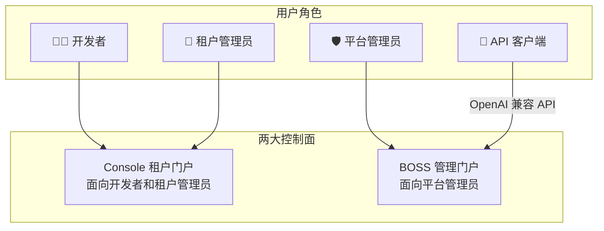
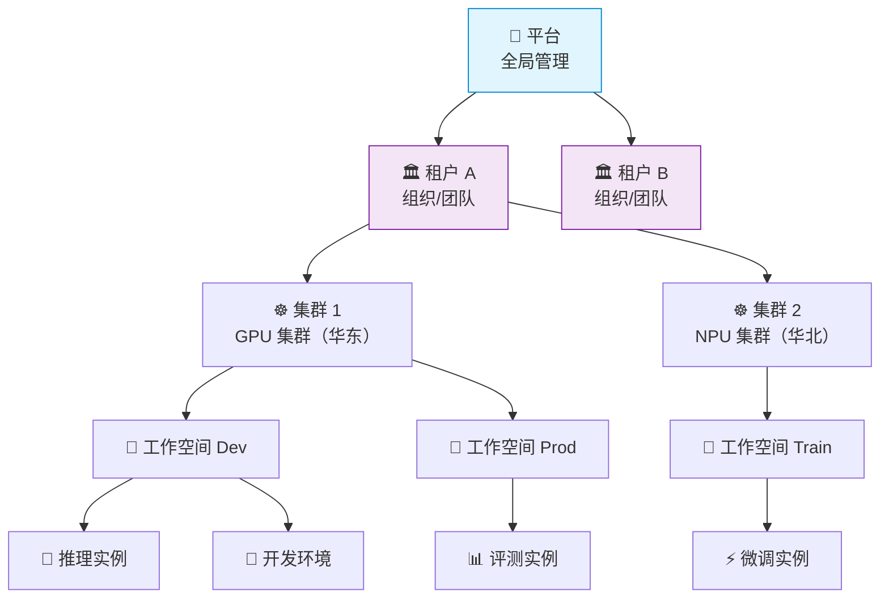
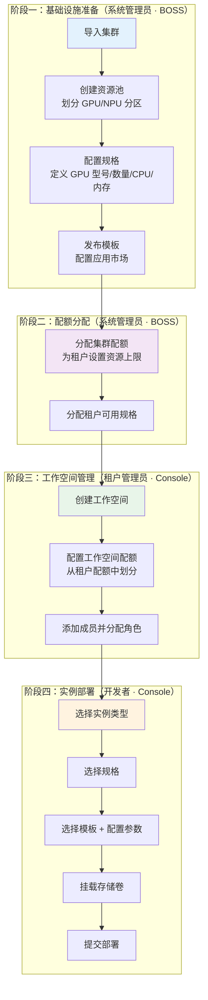
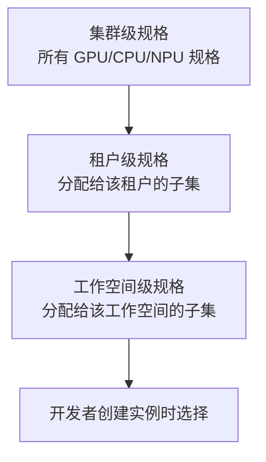
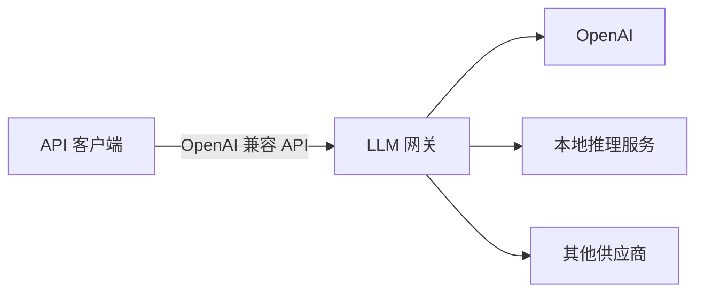
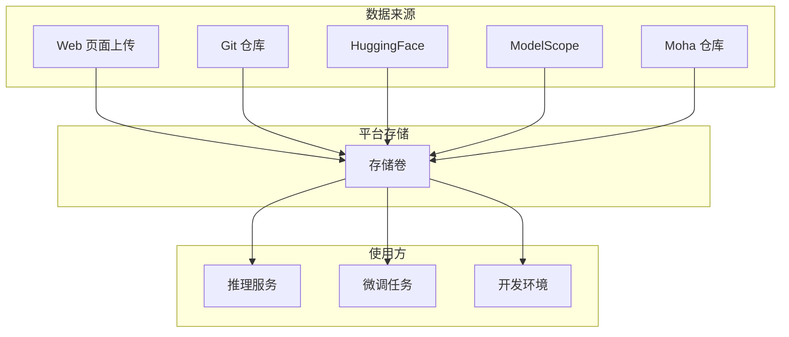

本文介绍晓石 AI 平台的核心概念和整体结构，帮助您快速理解平台的组织方式和功能划分。

---

## 平台整体结构

晓石 AI 平台是面向企业的 AI 全生命周期管理平台，提供推理部署、模型微调、开发环境、模型仓库、LLM 网关等完整能力。平台由三大子产品和两大控制面组成。

---

## 三大子产品

### Rune — AI 工作台

面向 ML 工程师和数据科学家，提供 AI 工作负载管理能力：

| 功能模块 | 说明 | 典型场景 |
|---------|------|---------|
| **推理服务** | 部署模型为在线 API，自动分配 GPU 资源 | 部署 LLaMA、ChatGLM 等大语言模型 |
| **微调服务** | 基于预训练模型提交 SFT/LoRA 微调任务 | 使用私有数据进行领域微调 |
| **开发环境** | 启动 JupyterLab / VS Code Server 远程开发环境 | 交互式调试模型、数据探索 |
| **应用管理** | 部署自定义 AI 应用（Web 演示、API 服务等） | 部署 Gradio/Streamlit 应用 |
| **实验管理** | 跟踪 ML 实验的参数、指标，对比不同实验 | 记录超参搜索结果，选出最优配置 |
| **评测管理** | 对模型进行系统化的基准评测 | 使用标准评测集评估模型性能 |
| **存储卷** | 持久化存储，可挂载到任意实例，内置文件管理器 | 存放模型权重、训练数据 |
| **应用市场** | 预置模板库，一键部署主流框架 | 快速部署 vLLM、TGI、LLaMA-Factory |

:::tip
所有工作负载类型共享统一的部署流程：**选择模板 → 配置参数 → 选择规格 → 提交部署**。
:::

### Moha — 模型中心

平台内置的 AI 资产仓库，提供企业级模型/数据集/镜像管理：

| 功能模块 | 说明 | 典型场景 |
|---------|------|---------|
| **模型管理** | Git 式版本控制，支持文件浏览、分支管理、PR | 管理企业私有模型版本迭代 |
| **数据集管理** | 数据集上传、版本管理、格式预览 | 管理训练和评测数据集 |
| **镜像仓库** | 容器镜像管理，支持安全扫描 | 管理自定义训练/推理容器镜像 |
| **Space** | 在线展示空间，托管 Gradio/Streamlit 应用 | 打造模型体验 Demo |
| **组织管理** | 以组织为单位管理仓库和成员 | 按团队划分模型资产所有权 |
| **镜像同步** | 从 HuggingFace/ModelScope 等自动同步 | 将公开模型同步到企业内网 |

### ChatApp — 对话体验

即开即用的大模型对话窗口，无需编写代码：

| 功能模块 | 说明 | 典型场景 |
|---------|------|---------|
| **AI 对话** | 选择模型与 API Key，进行流式对话 | 体验私有部署的大模型效果 |
| **对话调试** | 实时调整 Temperature/TopP/MaxTokens 等参数 | 开发者调优 Prompt 和参数 |
| **多模型对比** | 左右双栏并排对话，对比输出质量 | 评估不同模型的回答质量 |
| **Token 管理** | 管理 API 访问令牌，设置用量限制 | 控制 API 调用频率和范围 |

---

## 两大控制面

### Console — 租户门户

面向**租户管理员、开发者和普通成员**的日常工作界面。

| 模块 | 核心功能 | 目标用户 |
|------|---------|---------|
| **Rune** | 推理、微调、开发环境、应用、实验、评测、存储卷 | 开发者 |
| **Moha** | 模型、数据集、镜像、Space、组织管理 | 开发者/数据工程师 |
| **ChatApp** | AI 对话体验、参数调试、多模型对比 | 所有用户 |
| **个人中心** | 个人资料、安全设置、SSH Key、API Key、租户切换 | 所有用户 |

### BOSS — 管理门户

面向**平台管理员**的全局管理界面。

| 模块 | 核心功能 | 目标用户 |
|------|---------|---------|
| **账户中心** | 用户管理、租户管理、成员角色分配 | 平台管理员 |
| **Rune 管理** | 集群纳管、资源池、GPU/NPU 规格、模板/产品、应用市场 | 平台管理员 |
| **LLM 网关** | 渠道配置、API Key、内容审查、审计记录、服务注册 | 平台管理员 |
| **数据仓库** | 平台级模型/数据集/镜像/Space 管理、镜像同步 | 平台管理员 |
| **平台设置** | 系统成员、全局配置、动态仪表盘 | 平台管理员 |

:::warning
Console 和 BOSS 是两个独立的管理界面，用户无法直接在两者之间跳转。普通用户使用 Console，只有平台管理员可以访问 BOSS。
:::

---

## 资源层级模型

平台采用五级资源隔离模型：**平台 → 租户 → 集群 → 工作空间 → 实例**。

### 各层级说明

| 层级 | 管理者 | 说明 |
|------|--------|------|
| **平台** | 系统管理员 | 全局管理所有租户、集群和配置。通过 BOSS 管理门户操作 |
| **租户** | 租户管理员 | 业务隔离的顶层单元，对应一个组织或团队。不同租户之间数据完全隔离 |
| **集群** | 系统管理员 | 实际承载计算资源的基础设施，支持 GPU、NPU 等异构算力 |
| **工作空间** | 租户管理员 | 最小的资源隔离单元，开发者日常操作的核心容器 |
| **实例** | 开发者 | 各类 AI 工作负载的统称（推理、微调、开发环境、应用、实验、评测） |

---

## 资源配置流程

从集群纳管到开发者部署实例，涉及不同角色的协作配置：

### 规格（Flavor）三级继承

规格采用**集群 → 租户 → 工作空间**三级继承模型。系统管理员在集群上定义所有可用规格，然后分配给租户，租户管理员再将其中一部分分配给工作空间。

:::warning
资源配额也遵循相同的三级继承。工作空间配额不能超过租户配额，租户配额不能超过集群可用资源总量。
:::

---

## LLM 网关

LLM 网关是大语言模型的统一调用代理层，提供企业级的 API 管理能力。

**核心能力**：

| 能力 | 说明 |
|------|------|
| **统一接入** | 将多个 LLM 供应商封装为统一的 OpenAI 兼容 API |
| **渠道路由** | 根据模型名称自动匹配渠道，支持优先级和降级 |
| **API Key 管理** | 为不同用户/团队创建独立的 API Key，设置用量配额 |
| **内容审查** | 对请求和响应内容进行安全检查（关键词匹配、AI 审核等） |
| **审计日志** | 记录每次 API 调用的完整信息（Token 用量、耗时、渠道等） |
| **限速保护** | 按 API Key 或全局设置请求频率和 Token 用量限制 |

:::tip
平台内部署的推理服务可以通过「服务注册」接入 LLM 网关，统一通过网关 API 调用，无需直接暴露推理服务地址。
:::

---

## 存储体系

平台提供基于对象存储的持久化存储能力。

**存储卷使用流程**：
1. **创建**存储卷，指定名称和容量
2. **导入数据**：通过页面上传，或创建存储任务从 Git/HuggingFace/ModelScope 等来源同步
3. **挂载使用**：在部署实例时关联存储卷，实例启动后即可访问
4. **删除**：需先停止所有关联实例，再删除存储卷

:::warning
存储卷一旦挂载到运行中的实例，无法直接删除。需先停止或删除关联实例后才能操作。
:::

---

## 监控与日志

平台为实例、集群和网关提供全方位的运行监控。

### 实例级监控

| 能力 | 说明 |
|------|------|
| **运行指标** | GPU 利用率、显存使用、CPU、内存、网络 IO |
| **容器日志** | 标准输出/错误日志，支持关键词搜索和实时流 |
| **终端访问** | 直接进入容器的交互式命令行终端 |
| **监控面板** | 动态生成的可视化监控仪表盘 |

### 集群级监控

| 能力 | 说明 |
|------|------|
| **集群仪表盘** | 节点总览、资源使用率、调度情况 |
| **日志查询** | 集群范围的日志检索 |
| **资源监控** | GPU/NPU 池使用率、配额消耗趋势 |

### 网关运营数据

| 能力 | 说明 |
|------|------|
| **使用记录** | 每次 API 调用的 Token 用量、耗时、模型、渠道 |
| **审计记录** | 完整的请求/响应审计轨迹 |
| **运营面板** | 请求数趋势、Token 用量统计、渠道分布、错误率 |

---

## 下一步

- [术语表](./glossary) — 了解平台核心术语定义
- [角色与权限](../auth/roles) — 了解权限体系
- [快速上手](./quick-start) — 从零开始的操作指南
- [Console 概览](../console/) — 开始使用 Console 门户
