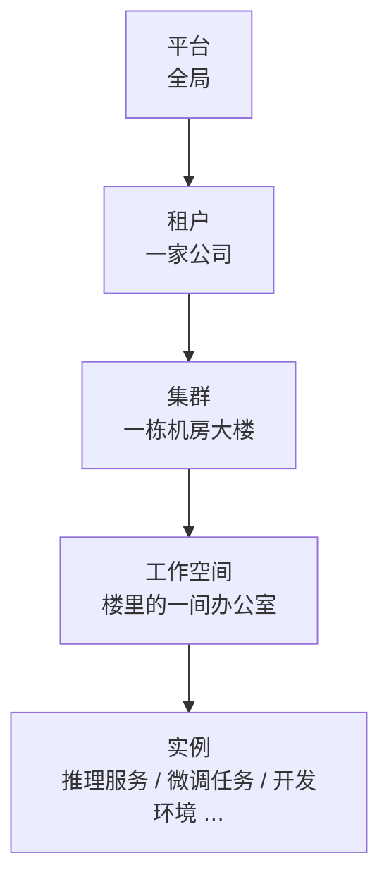

# 平台概念

你在页面上点一个按钮，这个动作要经过哪些环节才能真的把模型跑起来？这篇用白话把平台的骨架讲一遍。读完你能回答三个问题：**页面、后端、机器分别在哪一层**，**一次点击的请求怎么走**，**模型文件和数据存在哪**。

:::tip 一句话结论
平台分三层：**界面层**（你看到的网页）→ **平台服务层**（各司其职的后端服务）→ **底座层**（Kubernetes 集群和存储）。你只和界面层打交道，剩下两层由平台替你打理。
:::

## 三层结构

| 层 | 里面有什么 | 你能感知到什么 |
| --- | --- | --- |
| **界面层** | 智算平台、BOSS、魔哈 Hub、聚合网关，都是同一个网页应用的不同部分 | 你点菜单、填表单的地方 |
| **平台服务层** | 负责身份、集群与资源、模型资产、模型网关等多个后端服务 | 页面上的数据从哪来、按钮点了有没有生效 |
| **底座层** | Kubernetes 集群（放机器）、存储（放文件）、加速卡（GPU/NPU） | 你申请的算力够不够、模型文件在不在 |

## 界面层：先分清两个入口

| 入口 | 网址特征 | 谁用 |
| --- | --- | --- |
| **智算平台 / 聚合网关 / 魔哈 Hub** | 以 `/console` 开头 | 租户内的所有用户 |
| **BOSS** | 以 `/boss` 开头 | 只有平台管理员 |

同一个网页应用会根据网址前缀决定展示哪一套界面和菜单。普通用户只会用到 `/console` 这一套，看不到 BOSS 的菜单，这是正常的。

:::info 顶部「产品与服务」是什么
它不是第三套系统，而是 `/console` 内部在不同子产品之间切换的快捷入口：智算平台、魔哈 Hub、聚合网关。三者共用同一套登录状态和租户身份。
:::

## 一次点击的请求怎么走

你在页面上的每个动作，都会变成一次网络请求发给后端。平台不会把所有请求都送给同一个服务，而是**按网址路径前缀分给不同的服务**：

| 路径前缀 | 负责的服务 | 典型用途 |
| --- | --- | --- |
| `/api/iam` | 身份服务 | 登录、用户、租户、成员与角色、验证码、多因素认证、SSH 密钥 |
| `/api/cloud` | 算力控制服务 | 集群、工作空间、实例、规格、配额、调度、日志 |
| `/api/ai` | 指标服务 | 实例运行指标 |
| `/api/moha` | 魔哈 Hub 服务 | 模型、数据集、镜像、组织 |
| `/api/airouter/v1` | 大模型网关（管理面） | 令牌、调用日志、用量、网关设置 |
| `/api/license` | 授权服务 | 授权记录 |
| `/airouter-data/v1` | 大模型网关（数据面） | 真正发起模型对话 |

这些请求都发往你访问的同一个域名，由域名后面的统一入口按前缀转发。所以你不需要记住一堆不同的后端地址，只要打开一个网页就行。

:::tip 为什么单独有个 `/airouter-data`
管理面的接口靠浏览器登录状态鉴权，适合页面内部使用；而给程序调用模型需要的是一段独立的密钥（API 密钥），所以平台把「对话接口」单独放在 `/airouter-data` 下面，用密钥而不是登录状态来认证。两组接口的详细区别见 [API 概览](/reference/api-overview)。
:::

## 两个容易混淆的「网关」

| 名字 | 它是什么 | 在哪里体现 |
| --- | --- | --- |
| **平台入口**（统一反向代理） | 平台所有 API 的统一入口，负责把请求转发到对应后端服务 | 你在页面上的每个操作都会经过它 |
| **大模型网关** | 专门处理模型调用流量的网关，负责把对话请求路由到具体模型、限流、内容审查、记录用量 | 聚合网关、模型广场、API 密钥、调用分析 |

一句话区分：**平台入口转发「管理类」请求，大模型网关转发「模型推理类」请求**。两者不是同一个东西。

大模型网关还有几个你能直接用到的能力：

| 能力 | 你能看到的效果 |
| --- | --- |
| **统一接口** | 不论模型是平台内部署的，还是外部供应商提供的，都通过同一套接口调用 |
| **渠道路由** | 你用同一个模型名，网关自动挑一个可用的渠道 |
| **令牌限速** | 每个 API 密钥可以单独设置每分钟请求数和 Token 上限 |
| **内容审查** | 请求和回复会做安全检查，命中策略会被拦截 |
| **调用记录** | 每次调用都留下记录，能在「调用分析」里看到 |

## 资源层级：从平台到你的实例

平台用五级结构管理资源，从上到下逐级缩小：

```mermaid
graph TD
    P["平台<br/>全局"] --> T["租户<br/>一家公司"]
    T --> C["集群<br/>一栋机房大楼"]
    C --> W["工作空间<br/>楼里的一间办公室"]
    W --> I["实例<br/>推理服务 / 微调任务 / 开发环境 …"]
```

| 层级 | 白话解释 | 谁来管 |
| --- | --- | --- |
| **平台** | 整个平台，包含所有租户和集群 | 平台管理员，在 BOSS 里操作 |
| **租户** | 一家公司的独立空间，成员、资产、配额彼此隔离 | 租户管理员 |
| **集群** | 一栋机房大楼，里面是真实的机器和加速卡 | 平台管理员纳管 |
| **工作空间** | 大楼里的一间办公室，同事之间共享，是资源隔离的最小单位 | 租户管理员分配 |
| **实例** | 办公室里的一台台「机器」：推理服务、微调任务、开发环境、应用、实验、评测 | 开发者创建和维护 |

:::info 为什么操作前必须先选工作空间
几乎所有操作都要落在某个具体的工作空间里，因为配额、成员和资源都是按工作空间划分的。这就是为什么左侧菜单顶部一直摆着工作空间选择器。
:::

## 规格和配额：三级继承

**规格**（可以理解成「这台机器配几核 CPU、多少内存、几张加速卡」）和**配额**（这个月你能用多少）都遵循同一套三级继承：

| 层级 | 意思是 |
| --- | --- |
| 集群级 | 平台管理员在集群上定义所有可用规格，划定总算力 |
| 租户级 | 平台管理员把其中一部分分配给租户 |
| 工作空间级 | 租户管理员再把租户的额度分给各个工作空间 |

由此可以推出两条实用结论：

1. **工作空间能用的规格，只会小于或等于租户的额度**；租户的额度不会超过集群的总量。
2. 你在部署时看不到某个规格，通常不是页面出错，而是**当前工作空间的配额不够**。联系租户管理员调整配额即可。

## 数据放哪：模型和文件的三种来路

| 来路 | 适合什么 | 放进去之后 |
| --- | --- | --- |
| **文件存储（存储卷）** | 模型权重、数据集等大文件 | 部署实例时挂载它，实例重启或删除后文件仍在 |
| **魔哈 Hub** | 需要版本管理、多人共享的模型和数据集 | 有分支、版本、合并请求，可被部署直接引用 |
| **存储作业** | 想把外部来源的文件拉进来 | 从 Git 仓库、HuggingFace、ModelScope、魔哈 Hub 拉取，后台异步执行 |

三者的关系是：**存储卷是实例的硬盘，魔哈 Hub 是模型和数据的货架**。模型可以先在魔哈 Hub 管理版本，再挂到实例上运行；跑完微调产出的新模型，也可以再放回魔哈 Hub 或存储卷。

## 认证与权限

- 登录成功后，平台会记住你的身份，之后页面上的操作不需要反复输入密码。
- 每个租户内的角色只有三种：**admin（管理员）、developer（开发者）、member（成员）**。角色不同，界面上能看到的菜单和按钮不同。
- 界面上没有的按钮，通常不是加载失败，而是**你的角色没有这个权限**。

具体哪个角色能做什么，见[权限说明](/account/auth/roles)；界面上每个名词的白话解释，见[术语表](/guide/glossary)。

## 下一步

- [术语表](/guide/glossary) — 所有名词的白话解释与类比
- [权限说明](/account/auth/roles) — 三种角色分别能做什么
- [API 概览](/reference/api-overview) — 管理面与数据面接口的区别
- [快速开始](/guide/quick-start) — 回到动手环节
