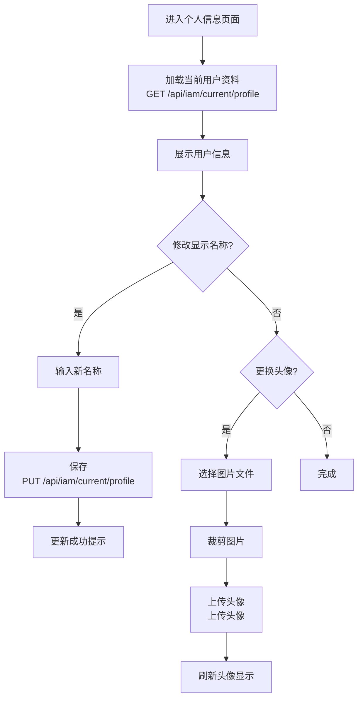

## 功能简介

个人信息页面是您管理账户基本资料的入口。在此页面中，您可以查看和编辑个人显示名称、头像等信息。部分字段（如用户名）在注册后不可修改，以确保账户标识的唯一性和一致性。

## 进入路径

右上角头像 → 个人中心 → **基本信息**

路径：`/iam/account/general`

## 页面概览

个人信息页面展示您的账户资料，分为**可编辑区域**和**只读信息**两部分。

---

---

## 编辑个人信息

### 修改显示名称

1. 在个人信息页面找到 **显示名称** 字段
2. 清除当前名称，输入新的显示名称
3. 点击 **保存** 按钮

| 验证规则 | 说明 |
|----------|------|
| 必填 | 显示名称不能为空 |
| 最小长度 | 至少 1 个字符 |

:::tip
显示名称会出现在对话、评论、协作等所有需要展示您身份的场景中。建议使用易于识别的名称。
:::

### 上传/更换头像

个人信息页面提供 **上传并裁剪头像**（上传并裁剪头像）组件，支持图片上传和裁剪：

#### 操作步骤

1. 点击头像区域或 **更换头像** 按钮
2. 在文件选择器中选择一张图片
3. 在裁剪器中调整裁剪区域（支持缩放和拖动）
4. 确认裁剪，图片将自动上传
5. 上传成功后头像即时更新

#### 头像要求

| 要求 | 限制 |
|------|------|
| 最大文件大小 | **3 MB** |
| 推荐格式 | JPG、PNG、GIF |
| 裁剪比例 | 1:1（正方形） |

:::warning
超过 3MB 的图片将无法上传。建议使用清晰的正方形图片以获得最佳显示效果。
:::

---

## 只读信息

以下字段仅供查看，不支持在此页面修改：

| 字段 | 说明 |
|------|------|
| **用户名** | 注册时设定的唯一标识符，不可更改。在登录、API 调用等场景中使用 |
| **用户 ID** | 系统自动分配的唯一 ID，格式为 UUID |
| **注册时间** | 账号创建的日期和时间 |
| **MFA 状态** | 多因素认证是否已启用（如需修改，请前往安全设置） |

---

## 页面交互流程

---
