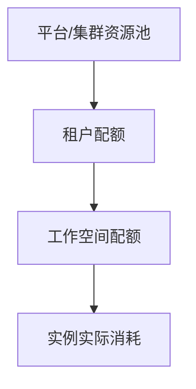

# 配额与策略

配额用于定义“谁最多能用多少资源”。在 Rune 中，配额不是单点配置，而是从平台到租户再到工作空间逐级下发。

## 配额层级

## 你会在哪些页面看到配额

| 页面 | 作用 |
| --- | --- |
| 租户配额页 | 查看当前租户在指定集群下的可用资源边界 |
| 工作空间配额页 | 在工作空间级别继续细分资源 |
| 实例创建页 | 根据当前工作空间配额判断某次部署是否允许 |

## 租户配额页

典型路径：`/rune/tenants/:tenant/quotas`

当前前端能力：

- 需要先选择 `region/cluster`
- 根据租户和区域拉取配额列表
- 支持使用 `QuotaFilterBar` 按规格维度筛选
- 展示配额字段集合，便于查看 limits、allocated、used 等数据

租户成员通常只能查看，不能直接在这一页改平台分给租户的总配额。

## 工作空间配额

工作空间配额位于工作空间详情页下，是租户管理员最常操作的一层：

- 查看工作空间已拥有的配额
- 新增工作空间配额
- 编辑已有配额
- 删除不再需要的配额

工作空间配额的创建和编辑依赖当前租户在该集群中的剩余额度，因此如果上级配额不足，创建会失败。

## 常见资源类型

| 类型 | 说明 |
| --- | --- |
| CPU | 计算核数 |
| 内存 | 运行内存 |
| GPU / vGPU | 显卡资源 |
| NPU / DCU / MLU | 异构加速器资源 |
| 存储 | 持久化容量 |

## 典型治理流程

1. 平台管理员在 Boss 中给租户分配总配额。
2. 租户管理员进入 Rune 查看当前租户在某个集群下的资源边界。
3. 再把资源分配到不同工作空间。
4. 工作空间中的实例在部署和扩容时消耗对应配额。

## 建议

- 先按团队或项目拆分工作空间，再分配配额，避免资源长期混用。
- GPU 资源建议按型号细分，减少高端卡被低优先级任务占满。
- 当实例部署失败时，优先检查是否是工作空间配额不足，而不只是看集群是否还有空闲资源。

> ⚠️ 注意: 配额页里看到“集群还有资源”并不代表当前工作空间就一定能部署，真正生效的是逐级分配后的可用额度。
