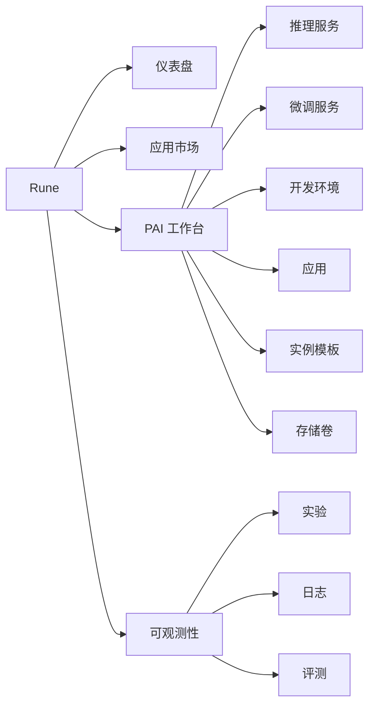
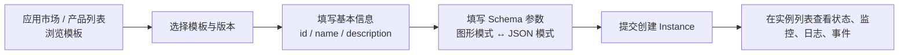

# Rune 控制台

Rune 控制台为 AI 工程师提供从部署、训练、调试到实验跟踪、评测与应用落地的全生命周期能力。所有工作负载共享同一套 **Instance（实例）** 数据模型和模板驱动部署机制。

## 统一 Instance 架构

推理、微调、开发环境、应用、实验、评测都是实例，通过 `category`（实例类型）区分：

| Category | 模块 | 说明 |
| --- | --- | --- |
| `inference` | 在线推理 | 部署模型推理服务，可注册到网关 |
| `tune` | 模型微调 | 提交微调训练任务 |
| `im` | 开发环境 | 交互式开发环境（Interactive Machine Learning） |
| `app` | 应用服务 | 通用应用部署，详情页额外提供 PVC 列表 |
| `experiment` | 实验管理 | 部署实验跟踪服务 |
| `evaluation` | 模型评测 | 部署评测服务 |

> ⚠️ 注意: 开发环境的类别标识是 `im`，不是 `devenv`。前端路由为 `.../ims`，产品列表类别为 `/rune/products/im`。

### 所有实例共享的能力

| 能力 | 说明 |
| --- | --- |
| 模板部署 | 基于产品模板的 JSON Schema 动态渲染表单 |
| 参数编辑 | 图形模式与 JSON 模式可互相切换 |
| 生命周期 | 创建、编辑、暂停/恢复、删除 |
| 扩缩容 | 详情页操作菜单中的 `ScaleAction`（按模板定义的副本数字段扩缩） |
| 状态管理 | 见 `InstanceStatusPhaseEnum`（12 个取值） |
| 监控面板 | 实例级监控 |
| 日志查看 | 实例级日志与 Pod 级日志 |
| K8s 事件 | Kubernetes 事件流 |
| Pod 管理 | Pod 列表与容器操作 |

## 导航结构

登录后左侧导航分为三组：

PAI 工作台与可观测性两个分组要求租户角色为 `ADMIN` 或 `DEVELOPER`。

## 上下文选择

顶部导航有两个选择器：

1. **区域 / 集群**：切换目标计算集群。
2. **工作空间**：切换具体工作空间，所有实例列表随之刷新。

> 💡 提示: 切换上下文后页面会重新加载对应资源。若当前集群下没有任何工作空间，前端会用 `WorkspaceGuard` 拦截并显示空态（租户管理员可看到跳转到工作空间列表的按钮）。

## 模板驱动部署模型

字段与流程细节见[创建工作负载](/rune/guide/workloads)。

## 实例详情通用能力

在任一类型的实例列表点击名称进入详情页，所有类型共享同一套详情骨架（`src/pages/rune/instances/components/detail-layout.tsx`）：

### 标签页

| 标签 | value | 内容 |
| --- | --- | --- |
| 概览 | `overview` | 基本信息卡片 + Pod 列表（应用类型额外有 PVC 列表） |
| 监控 | `monitoring` | 实例监控面板 |
| 日志 | `logging` | 实例日志 |
| 事件 | `events` | K8s 事件流 |

### 右上角「操作」菜单

| 菜单项 | 说明 |
| --- | --- |
| 编辑 | 进入实例编辑页 |
| 启动 / 停止 | 按 `values.global.paused` 切换暂停/恢复 |
| 扩缩容 | `ScaleAction`，按模板声明的副本数字段调整 |
| 类型专属项 | 由各模块追加，例如推理的「保存为模板」「网关配置」「解密模型」，微调的「保存为模板」 |
| 删除 | 二次确认后删除实例 |

## 功能模块总览

| 模块 | Category | 说明 |
| --- | --- | --- |
| [在线推理](./inference.md) | `inference` | 推理服务、网关注册 |
| [模型微调](./finetune.md) | `tune` | 微调训练任务 |
| [开发环境](./devenv.md) | `im` | SSH / Web 访问的交互式环境 |
| [应用服务](./app.md) | `app` | 通用应用与 PVC |
| [实验管理](./experiment.md) | `experiment` | 实验跟踪服务 |
| [模型评测](./evaluation.md) | `evaluation` | 评测服务 |
| [应用市场](./app-market.md) | — | 模板浏览与部署入口 |
| [存储管理](./storage.md) | — | 存储卷与导入任务 |
| [运行记录](./logging.md) | — | 日志查询 |
| [工作空间](./workspace.md) | — | 空间、成员、配额 |
| [配额管理](./quota.md) | — | 租户配额查看 |
| [规格管理](./flavor.md) | — | 算力规格查看 |
| [AI 诊断助手](./diagnostics.md) | — | 悬浮式智能诊断助手 |

## 快速开始

1. 在顶部选择目标集群和工作空间。
2. 进入应用市场或产品列表，选择模板。
3. 填写基本信息与 Schema 参数并提交。
4. 在对应实例列表查看状态，必要时进入详情的监控/日志/事件排查。

> 💡 提示: 所有实例类型操作方式一致，掌握推理服务的流程后，其他类型只需关注各自的特有字段与菜单项。
