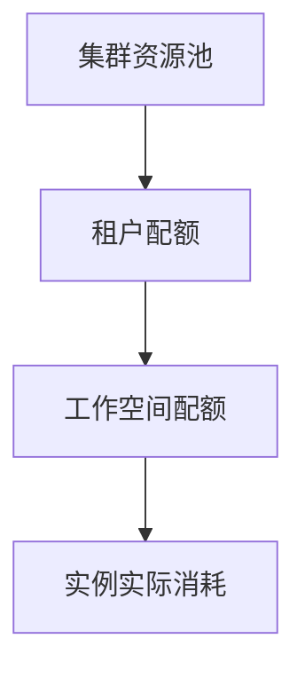

# 配额

配额定义「谁最多能用多少资源」。Rune 的配额从集群资源池下发到租户，再由租户分配到工作空间。

## 配额层级

## 你会在哪些页面看到配额

| 页面 | 路径 | 作用 |
| --- | --- | --- |
| 租户配额 | `/rune/tenants/:tenant/quotas` | 查看当前租户在指定集群下的配额 |
| 工作空间配额 | `.../workspaces/:workspace/quotas` | 在工作空间级别分配资源 |

## 租户配额页

该页面**依赖当前选中的区域/集群**：未选择集群时不会发起配额查询。

页面能力（`src/pages/rune/tenant/quotas/list.tsx`）：

- 使用 `QuotaFilterBar` 按规格维度筛选，候选项来自 `getTenantQuotaSelector`。
- 列表字段由 `useQuotaFields` 定义，共四列：

| 列 | 字段 | 说明 |
| --- | --- | --- |
| 类型 | `type` | 资源类型（CPU / GPU / vGPU / 内存等） |
| 型号 | `model` | 加速器型号（按 `vendor` 展示） |
| 资源池 | `resourcePool` | 所属资源池 |
| 配额 | `quota` | 使用量渲染（`QuotaResourcesUsage`） |

- 该页禁用搜索与工具栏，仅提供上述筛选条。

> ⚠️ 注意: 旧版本文档给出的「集群 / 已分配 / 已使用 / 配额上限 / 使用率」独立列，与当前 `useQuotaFields` 的四列不完全一致；用量相关的 allocated / used / limits 值均在使用量单元格内展示。

> ⚠️ 注意: 配额记录里 `limits` / `allocated` / `used` 等字段的确切含义以后端契约为准，前端未做约束，文档暂未确认。

## 工作空间配额

工作空间配额位于工作空间详情下，是租户管理员最常操作的一层，支持查看、创建、编辑与删除（路由 `.../quotas` 与 `.../quotas/:quota?action=edit`）。

> ⚠️ 注意: 工作空间配额表单的具体字段（如 Requests / Limits 的命名与校验）文档暂未确认，以实际表单为准。

工作空间配额来源于租户在该集群的可用额度，因此上级配额不足时创建会失败。

## 常见资源类型

| 类型 | 说明 |
| --- | --- |
| CPU | 计算核数 |
| 内存 | 运行内存 |
| GPU / vGPU | 显卡资源 |
| NPU / DCU / MLU | 异构加速器 |
| 存储 | 持久化容量 |

## 治理建议

- 先按团队或项目拆分工作空间，再分配配额。
- GPU 按型号细分，避免高端卡被低优先级任务占满。
- 部署失败时优先检查工作空间配额，而不只看集群是否还有空闲资源。

> ⚠️ 注意: 配额页显示「集群还有资源」并不代表当前工作空间一定能部署，真正生效的是逐级分配后的可用额度。

## 权限要求

查看租户配额对所有成员开放；工作空间配额的创建/编辑/删除由租户管理员或工作空间管理员执行。
