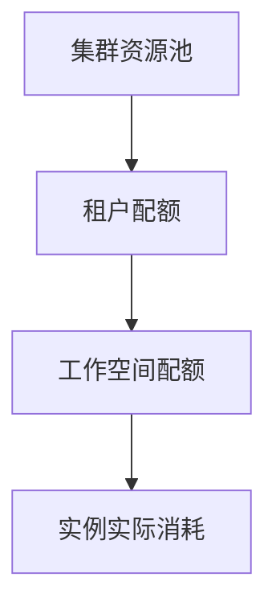

# 配额

配额回答的是「**这个月我能用多少额度**」。平台把集群里的资源按「资源池 → 租户 → 工作空间」一层层分下来，你创建实例时消耗的就是当前工作空间分到的那一份。额度用完了，就算集群里还有空闲机器，实例也建不出来。

:::tip 一句话理解配额
配额像手机套餐的「流量」：总量由上级分给你，用到 80% 就该留意，用到上限就会创建失败。
:::

## 配额的层级

上层不给你，下层就用不了。所以实例创建失败时，先看工作空间配额，不要只看集群有没有空闲资源。

## 开始之前
- 角色：查看配额需要**管理员**或**开发**；创建工作空间配额需要**租户管理员**。
- 区域：先在页面顶部**选好集群**。没有选集群时，不会去查询配额。

## 看租户配额
1. 顶部导航点击 **账户管理**。
2. 左侧 **账户管理** 分组里点击 **租户管理**，进入租户列表。
3. 点开你的租户，在左侧 **租户管理** 分组里点击 **配额**。

图里这张表按当前选中的集群统计：加速卡、存储、CPU、内存各占一行，**配额** 列显示「已用 / 总量」并在下面画进度条。上方的 **类型**（CPU / 磁盘 / 内存）用来只看某一类。

页面按当前选中的集群显示额度，各列含义：

| 列 | 说明 |
| --- | --- |
| 类型 | 资源大类，例如 CPU、内存、GPU、共享GPU |
| 型号 | 加速卡型号 |
| 资源池 | 这份额度来自哪个资源池 |
| 配额 | 每种资源的「已用 / 总量」和进度条；越接近上限，颜色越警示 |

列表上方还有一条按 **类型 → 型号** 的筛选条，用来只看某一类资源。

:::tip 进度条颜色
进度条表示占用比例：超过 80% 变黄色、超过 90% 变红色，提示你额度快用完了。
:::

## 看和调整工作空间配额
工作空间配额就是分给某个工作空间的那一份额度，也是租户管理员最常操作的一层。

1. **账户管理** → **租户管理** → 打开你的租户 → 左侧点击 **工作空间**。
2. 进入某个工作空间，点击 **配额** 页签，看到该工作空间的额度。
3. 如果是**租户管理员**，右上角会有 **创建配额** 按钮，行上还有编辑和删除。

### 创建一个工作空间配额
1. 点击 **创建配额**。
2. 在 **配额配置** 里填写：

   | 表单项 | 怎么填 | 说明 |
   | --- | --- | --- |
   | 资源池 | 选择资源池 | 这份额度从哪个池子里划出来 |
   | 资源 | 逐项添加：**分类** → **资源** → **型号** → **限制** | 每加一项点 **创建资源**；同一个资源不能重复添加 |
   | 限制 | 填数量 | 不能超过上级（租户）还能分配的量 |

3. 点击 **确定**。

:::warning 配额不足会创建失败
页面上显示「集群还有资源」，并不代表当前工作空间一定能部署。真正生效的是逐级分配后的可用额度。额度不够时，请找租户管理员调整工作空间配额。
:::

删除配额前请确认没有实例还在依赖它，删除后无法通过撤销找回。

## 常见资源类型
| 类型 | 说明 |
| --- | --- |
| CPU | 计算核心数 |
| 内存 | 运行内存 |
| GPU | 独立显卡 |
| 共享GPU | 按显存或算力切分共享的显卡 |
| 存储 | 持久化容量 |
| 临时存储 | 实例的临时盘 |
| 磁盘 | 磁盘资源 |

## 小贴士
- 先按团队或项目拆工作空间，再分配配额，账目更清楚。
- GPU 按型号细分，避免高端卡被低优先级任务占满。
- 实例创建失败时优先查工作空间配额，而不是只看集群是否还有空闲。

## 相关
- [规格](/rune/console/flavor)
- [工作空间](/rune/console/workspace)
