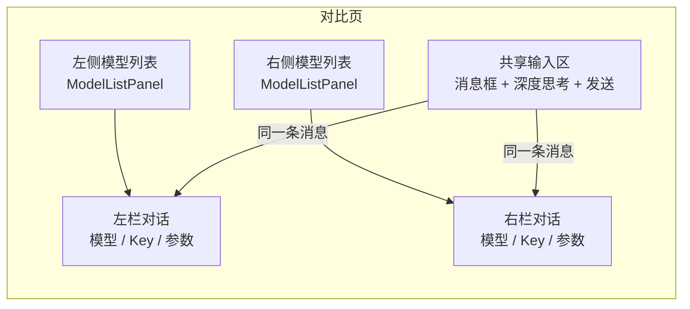

## 功能简介

模型对比（前端路由 `/chatapp/contrast`）提供**左右双栏**布局：输入一条消息，**同时**发送给两侧各自选定的模型，并行观察流式生成结果，用于模型选型、版本评估与参数对比。

> ⚠️ 注意: 对比页的真实路由是 `/chatapp/contrast`。不存在 `/chatapp/compare` 路由（`routes/paths.ts:71-85`）。

## 页面布局

页面由「左侧模型选择区 + 双栏对话区 + 共享输入区」组成（`contrast.tsx`）：



| 区域 | 说明 | 依据 |
|------|------|------|
| 左侧模型列表 | 320px 固定宽，`md` 起显示；上下两块列表分别对应「左侧模型」「右侧模型」 | `contrast.tsx:501-546` |
| 左/右对话栏 | 每栏含 API Key 选择、模型 `id`、参数弹窗、清空对话；在 `md` 以下改为上下堆叠 | `contrast.tsx:568-659` |
| 共享输入区 | 一个输入框 + 一个深度思考开关 + 发送/停止 | `contrast.tsx:663-676` |

## 独立与共享的配置

| 配置项 | 左栏 | 右栏 | 说明 |
|--------|------|------|------|
| 模型选择 | 独立 | 独立 | 可从各自的模型列表选择，允许相同或不同模型 |
| API Key | 独立 | 独立 | 默认都取当前账号的第一个可用 Key |
| 对话参数 | 独立 | 独立 | 通过各自顶部的参数弹窗设置 |
| 消息列表 | 独立 | 独立 | 两侧历史互不影响 |
| 加载 / 错误状态 | 独立 | 独立 | 一侧超时或报错不影响另一侧 |
| **深度思考** | **共享** | **共享** | 唯一的共享配置项 |

两侧参数默认值相同：`temperature`=0.7、`topP`=0.8、`maxTokens`=4096、`systemPrompt`=''、`stop`=''（`contrast.tsx:67-81`）。

## 发送与流式机制

点击发送（或按 Enter）后，前端对两侧各发起一次独立的 SSE 请求（`contrast.tsx:134-145,381-393`）：

```text
POST /airouter-data/v1/chat/completions
Authorization: Bearer {对应的 token}
X-Tenant / X-Workspace / X-Channel

{
  "messages": [...],
  "stream": true,
  "model": "<该侧模型 id>",
  "temperature": <该侧参数>,
  "max_tokens": <该侧参数>,
  "top_p": <该侧参数>,
  "reasoning_effort": "high" | "none",
  "stop": null | ["<内容>"]
}
```

| 行为 | 说明 |
|------|------|
| 并行发送 | 一条消息同时打到两侧，各自维护上下文 |
| 独立停止 | 每栏各有停止按钮，可单独中断；共享输入区的停止按钮会同时停止两侧 |
| 独立清空 | 每栏的「清空对话」只清空本侧消息 |
| 深度思考 | 两侧共用同一个开关，开启时两侧都提交 `reasoning_effort: "high"`，关闭时为 `"none"` |

## 使用场景

| 场景 | 做法 |
|------|------|
| 模型选型 | 两侧选择不同模型，使用相同参数与同一批业务问题，对比质量、速度与 Token 成本 |
| 版本评估 | 两侧选择同一模型的不同版本，复现典型场景 |
| 参数对比 | 两侧选同一模型，仅让一侧 Temperature 或 Top P 不同，观察输出差异 |

> 💡 提示: 对比时建议每次只改变一个变量（模型或参数），便于判断差异来源。

## 对比维度

| 维度 | 观察方式 |
|------|----------|
| 回复质量 | 对比两侧内容的准确性、完整性与相关性 |
| 响应速度 | 观察两侧流式生成的推进速度 |
| 推理能力 | 开启深度思考后对比两侧的推理过程与结论 |
| Token 效率 | 对比两侧回复底部的 Token 用量 |
| 指令遵循 | 使用相同 System Prompt，比较遵循程度 |

> ⚠️ 注意: 对比页的对话历史保存在前端内存中，**刷新页面即清空**。重要结果请及时截图或记录。
