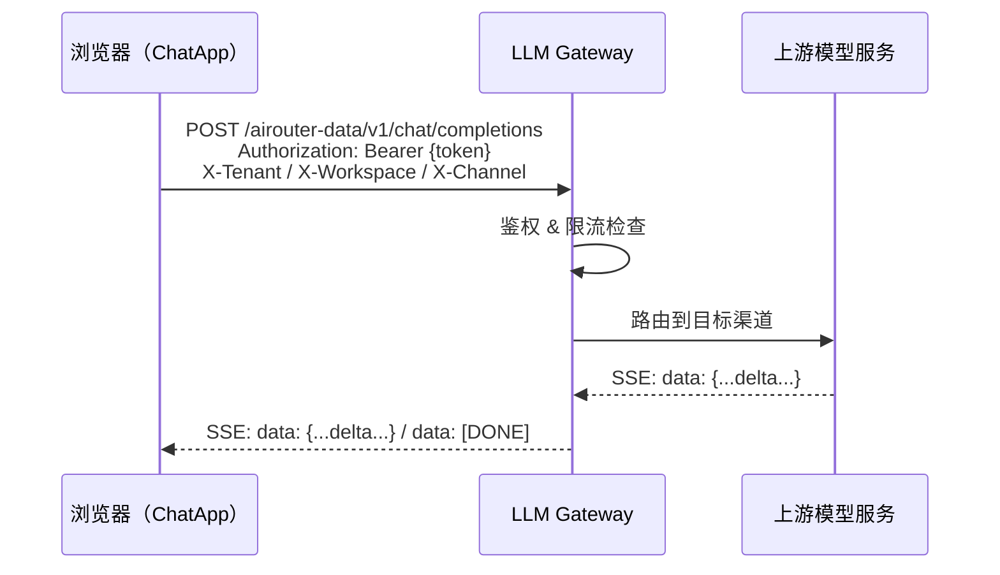

## 简介

ChatApp 是 Rune Console 内置的 **LLM Playground**（大模型体验台），为开发者和业务用户提供开箱即用的模型对话能力：选择模型与 API Key、调整推理参数、流式对话、双模型对比，并通过 API Key 将能力集成到外部应用。

ChatApp 的对话请求统一走 **LLM Gateway（AI Router）数据面**，端点为 OpenAI 兼容的 Chat Completions：

```text
POST {origin}/airouter-data/v1/chat/completions
```

前端路由前缀为 `/chatapp`，进入方式为顶部导航栏切换到 **ChatApp**。

## 顶部导航（5 项）

ChatApp 顶部只有 5 个导航项（`src/pages/chatapp/layout.tsx:24-50`）：

| 导航项 | 前端路由 | 说明 |
|--------|----------|------|
| **模型广场** | `/chatapp/marketplace` | 浏览当前可见的对话模型，查看模型卡片、渠道与价格，并提供 API 文档与「去体验」入口 |
| **模型体验** | `/chatapp/experience` | 单模型流式对话，含模型列表、消息列表、参数弹窗与模型信息面板 |
| **模型对比** | `/chatapp/contrast` | 左右双栏分别选择模型与参数，同一条消息同时发送给两侧 |
| **我的 Token** | `/chatapp/tokens` | 创建和管理 ChatApp API 访问令牌，配置 RPM/TPM 与 IP 白名单 |
| **调用分析** | `/chatapp/analysis` | 调用量、Token、费用与成功率的用量看板 |

> ⚠️ 注意: ChatApp **没有独立的「调试」页面**，也没有 `/chatapp/compare` 路由。「参数调试」能力是模型体验页顶部的参数弹窗（`ChatParamsPopover`）；对比页的路由是 `/chatapp/contrast`，Token 列表路由是 `/chatapp/tokens`。

## 核心概念

### OpenAI 兼容 API

所有对话请求通过 OpenAI 兼容的 Chat Completions 端点完成，请求体与 OpenAI 一致，支持流式（`stream: true`）与非流式。浏览器端发起请求时会携带以下请求头：

| 请求头 | 说明 |
|--------|------|
| `Authorization: Bearer {token}` | ChatApp Token（在 Token 管理中创建） |
| `X-Tenant` | 模型所属租户（非 ASCII 值会做 URL 编码） |
| `X-Workspace` | 模型所属工作空间（同上） |
| `X-Channel` | 模型所在渠道（同上） |

> 💡 提示: 前端页面本身使用 Cookie `user_session` 完成登录鉴权（`src/lib/axios.ts:21-28` 不会注入 `Authorization`）；上面这套 Bearer + `X-*` 请求头是**对话数据面**的调用方式。

### 模型可见性

模型按 `visibility` 分为三类，界面上显示为「公开 / 租户内 / 个人」：

| 可见性 | 界面文案 | 说明 |
|--------|----------|------|
| `public` | 公开 | 平台级通用模型 |
| `tenant` | 租户内 | 当前租户内可见 |
| `private` | 个人 | 当前工作空间/个人范围可见 |

模型列表按 **可见性 → 渠道 → 模型** 组织成树形列表（`model-list-panel.tsx:59-110`），不是 Tab 页签。

### LLM Gateway 能力

请求经 LLM Gateway 路由，网关提供渠道管理、按 RPM/TPM 限流、内容审核与审计日志等能力。

## 功能模块

| 模块 | 文档 | 说明 |
|------|------|------|
| 模型广场 | [模型广场](./marketplace.md) | 浏览模型、查看渠道与价格、复制模型 ID、查看 API 示例 |
| 模型体验 | [模型体验](./experience.md) | 流式对话、深度思考、Token 用量显示 |
| 参数调优 | [参数调优](./debug.md) | 体验页的参数弹窗：System Prompt / Top P / Temperature / Max Tokens / Stop |
| 多模型对比 | [模型对比](./compare.md) | 左右双栏独立配置，同一条消息并发发送 |
| Token 管理 | [Token 管理](./token.md) | 创建/编辑/删除令牌，RPM/TPM 限流与 IP 白名单 |
| 调用分析 | [调用分析](./usage-statistics.md) | 用量看板，默认今日、30 秒自动刷新 |

## 请求链路



## 快速开始

1. 顶部导航切换到 **ChatApp**，进入 **模型广场** 确认可见模型与渠道
2. 进入 **模型体验**，在左侧模型列表选择模型，在 Token/API Key 选择器中选择令牌
3. 需要调参时，点击顶部的**参数配置**图标打开参数弹窗
4. 输入问题按 **Enter** 发送，查看流式回复与 Token 用量
5. 需要横向比较时，进入 **模型对比** 双栏并发对话
6. 需要在应用中调用时，进入 **我的 Token** 创建访问密钥

> ⚠️ 注意: 模型列表为空时，说明当前租户/工作空间下没有可用模型渠道。渠道由平台管理员在 **BOSS → 网关 → 模型列表 / 模型元数据** 中维护。
