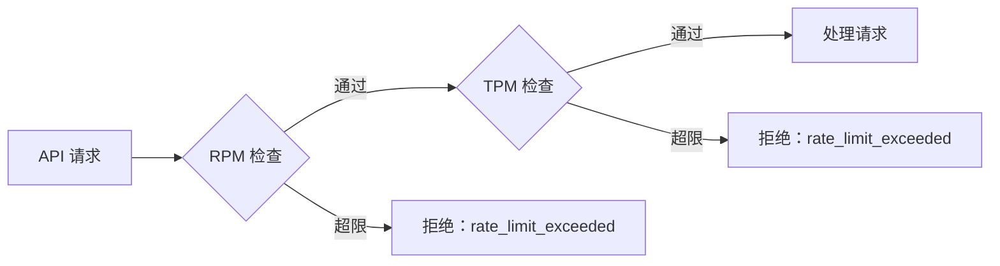

## 功能简介

API 密钥（Token 管理，前端路由 `/chatapp/tokens`）用于创建和管理 **ChatApp API 访问令牌**。令牌是调用对话数据面（`/airouter-data/v1/chat/completions`）的身份凭证，可独立配置 RPM/TPM 限流、IP 白名单与过期策略。

> ⚠️ 注意: ChatApp Token 与 IAM 的 [API Key](/account/iam/api-key) 是两套凭证。ChatApp Token 用于对话数据面；IAM API Key（AK/SK）用于平台管理面 API。

> ⚠️ 注意: 页面真实路由是 `/chatapp/tokens`，不存在 `/chatapp/token`（`routes/paths.ts:78-84`）。

## 页面结构

| 标签页 | 路由 | 说明 |
|--------|------|------|
| **API 密钥** | `/chatapp/tokens` | 令牌列表与创建/编辑/删除 |
| **请求日志** | `/chatapp/tokens/logs` | 调用日志 |

## Token 字段

令牌的数据结构（`src/types/apikey.ts`）：

| 字段 | 类型 | 说明 |
|------|------|------|
| `id` | number | 令牌唯一标识（系统生成） |
| `name` | string | 令牌名称（用户自定义，创建后不可修改） |
| `apiKey` | string | 令牌值 |
| `account` | string | 创建者账户 |
| `belongTo` | string | 归属信息 |
| `expiresAt` | number/string | 过期时间 |
| `rateLimitRPM` | number | 每分钟最大请求数 |
| `rateLimitTPM` | number | 每分钟最大 Token 数（单位 K，1K = 1000 Token） |
| `allowedIPs` | string[] | IP 白名单 |
| `createdAt` / `updatedAt` | string | 创建/更新时间 |
| `status` | string | `active` / `expired`，由前端按 `expiresAt` 计算 |

## 列表列

| 列 | 说明 |
|----|------|
| **名称** | 点击进入详情页 |
| **API 密钥** | 脱敏展示（前 6 位 + `************`），带复制按钮 |
| **RPM** | 每分钟请求数；为 `0` 或空时显示为「无限制」 |
| **TPM(K)** | 每分钟 Token 数，单位 K；为 `0` 或空时显示为「无限制」 |
| **访问IP白名单** | 已配置的白名单；为空或含 `*` 视为不限制 |
| **过期时间** | `expiresAt` 为空或 1970 时显示「永不过期」 |

## 创建 Token

在 `/chatapp/tokens` 点击创建按钮打开表单（`tokens/components/form.tsx`）。

### 表单字段与校验

| 字段 | 默认值 | 校验 | 说明 |
|------|--------|------|------|
| **名称**（`name`） | `''` | 必填 | 编辑时为禁用状态（不可改） |
| **RPM**（`rateLimitRPM`） | 空 | 数字，0 ~ 10000 | 空或 `0` 表示不限制 |
| **TPM(K)**（`rateLimitTPM`） | 空 | 数字，0 ~ 100000 | 空或 `0` 表示不限制 |
| **访问IP白名单**（`allowedIPs`） | `'*'` | 每行/逗号一个 IP 或 CIDR | 默认为 `*`，表示所有 IP |
| **永不过期**（`noExpires`） | `true` | — | 关闭后必须填写过期时间 |
| **过期时间**（`expiresAt`） | — | 关闭「永不过期」时必填 | |

> 💡 提示: `allowedIPs` 默认值为 `'*'`，`noExpires` 默认值为 `true`（`form.tsx:132-138`）。

### 提交时的处理

| 输入 | 提交值 |
|------|--------|
| RPM / TPM 为 `0` 或留空 | 不提交该字段（视为不限制，`form.tsx:162-172`） |
| 白名单留空 | 提交 `["*"]`（`form.tsx:173-178`） |
| 开启「永不过期」 | `expiresAt` 不提交（`undefined`） |
| 关闭「永不过期」 | `expiresAt` 转为 Unix 秒 |

### IP 白名单格式

| 格式 | 示例 |
|------|------|
| 单个 IPv4 | `192.168.1.100` |
| CIDR 网段 | `10.0.0.0/24`（掩码 0~32） |
| 通配符 | `*`（所有 IP） |

校验规则：四段 0~255 数字；不允许前导零（如 `01`）；CIDR 掩码 0~32；多值可用英文逗号或换行分隔。

## 编辑与删除

- **编辑**：名称不可修改；RPM/TPM/白名单/过期设置可修改。
- **删除**：删除后使用该令牌的请求会立即失败，操作不可撤销。

## Token 详情

详情页（`/chatapp/tokens/:id`）展示配置信息，并提供**调用历史**。日志字段（`tokens/request-logs.tsx`、`services/api-key.ts:200-237`）：

| 字段 | 说明 |
|------|------|
| `timestamp` | 请求发生时间（来自 `occurredAt`） |
| `model` | 调用的模型 |
| `provider` | 提供方 |
| `channelId` / `channelName` | 渠道 |
| `tenantId` / `tenantName` | 租户 |
| `workspace` | 工作空间 |
| `requestId` | 请求追踪 ID |
| `latencyMillis` | 延迟（毫秒） |
| `status` | `success` 或 `blocked`（由 `result` 映射） |
| `promptTokens` / `completionTokens` / `totalTokens` | Token 用量 |

> 💡 提示: `blocked` 记录通常表示请求被限流或内容审核拦截。

## 速率限制

| 维度 | 字段 | 取值范围 | 空值含义 |
|------|------|----------|----------|
| RPM | `rateLimitRPM` | 0 ~ 10000 | 不限制 |
| TPM(K) | `rateLimitTPM` | 0 ~ 100000 | 不限制 |



> ⚠️ 注意: 令牌级限流与渠道级限流相互独立。即使令牌未触发限流，渠道仍可能限流。

## 过期策略

- 开启「永不过期」：`expiresAt` 不提交，令牌长期有效。
- 关闭「永不过期」：指定具体过期时间。
- 前端状态：当前时间 < `expiresAt` 为 `active`，否则为 `expired`；已过期令牌无法调用。

## API 端点（管理面）

| 操作 | 方法与路径 |
|------|-----------|
| 列表（个人） | `GET /api/airouter/v1/me/tokens` |
| 创建（个人） | `POST /api/airouter/v1/me/tokens` |
| 按 ID 查询 | `GET /api/airouter/v1/tokens/by-id/{id}` |
| 按 ID 更新 | `PUT /api/airouter/v1/tokens/by-id/{id}` |
| 按 ID 删除 | `DELETE /api/airouter/v1/tokens/by-id/{id}` |
| 用量日志 | `GET /api/airouter/v1/me/tokens/{token}/usage-logs` |

## 调用示例（数据面）

```bash
curl -X POST https://your-domain/airouter-data/v1/chat/completions \
  -H "Authorization: Bearer YOUR_CHATAPP_TOKEN" \
  -H "Content-Type: application/json" \
  -H "Accept: text/event-stream" \
  -H "X-Tenant: your-tenant" \
  -H "X-Workspace: your-workspace" \
  -H "X-Channel: your-channel" \
  -d '{
    "model": "your-model-name",
    "messages": [{"role": "user", "content": "你好"}],
    "stream": true,
    "temperature": 0.7,
    "max_tokens": 4096,
    "top_p": 0.8,
    "reasoning_effort": "none",
    "stop": null
  }'
```

## 安全建议

| 建议 | 说明 |
|------|------|
| 一应用一令牌 | 为不同应用/环境创建独立令牌，避免共享 |
| 配置白名单 | 限制令牌仅能从指定 IP/CIDR 调用（默认 `*` 不限制） |
| 设置过期时间 | 非必要不要长期使用永不过期令牌 |
| 设置合理限流 | 按实际需求配置 RPM/TPM |
| 定期轮换与清理 | 定期更换并删除不再使用的令牌 |

> ⚠️ 注意: 界面中令牌值始终以脱敏形式展示（前 6 位 + `************`），但列表与详情页的复制按钮会复制**完整令牌值**。请仅在可信环境中点击复制，并妥善存储，避免泄露。
