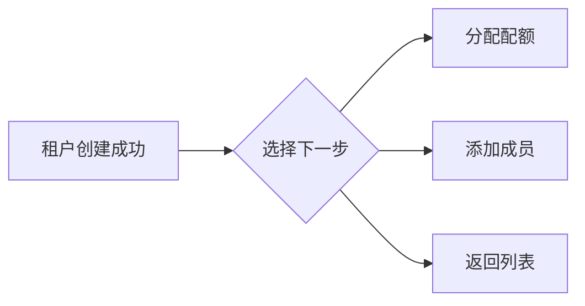

## 功能简介

租户（Tenant）是平台的**组织隔离单元**，是资源分配、权限管理和计费核算的基础边界。每个租户拥有独立的成员体系、资源配额和工作空间。管理员通过 BOSS 的租户管理模块完成：**创建租户**、**编辑信息**、**启用 / 禁用**、**配置镜像推送**以及**管理成员**。

## 进入路径

BOSS → 账户中心 → **租户管理**

控制台路由：`/iam/tenants`

## 租户列表

列定义见 `src/pages/boss/iam/tenants/list.tsx:65-106`。

| 列 | 字段名 | 展示方式 | 说明 |
|----|--------|----------|------|
| **名称** | `name` | 头像 + 租户名（链接）+ 租户 ID | 点击名称进入租户概览页，名称下方灰色小字为 `id` |
| **邮箱** | `email` | 文本 | 管理联系邮箱 |
| **成员数** | `userCount` | 整数 | 当前租户成员总数 |
| **状态** | `enabled` | 标签（启用 / 禁用） | 启用为绿色、禁用为红色 |
| **创建时间** | `creationTimestamp` | 格式化时间 | 租户创建时间 |

行内操作：

| 操作 | 说明 |
|------|------|
| **启用 / 禁用** | 切换按钮，带二次确认对话框（见下节） |
| **编辑** | 跳转到编辑页 `/iam/tenants/:tenant?action=edit` |

> ⚠️ 注意: 租户列表**没有删除入口**。`src/services/tenant.ts` 中存在 `deleteTenant` 接口，但控制台 UI 未暴露该操作。

---

## 创建租户

控制台路由：`/iam/tenants?action=create`。

1. 在租户列表右上角点击**新建租户**。
2. 填写基本信息。
3. 点击**确认**提交（`POST /api/iam/tenants`）。

表单字段与校验（`src/pages/boss/iam/tenants/components/form.tsx:49-63`）：

| 字段 | 字段名 | 类型 | 必填 | 校验 | 说明 |
|------|--------|------|------|------|------|
| **名称** | `name` | 文本 | ✅ | 非空 | 租户显示名称 |
| **租户 ID** | `id` | IdField | ✅ | 非空；格式由 `validateId` 校验 | 唯一标识；**创建时可改，编辑时禁用** |
| **邮箱** | `email` | 文本 | ✅ | 非空 + 邮箱格式 | 管理联系邮箱 |
| **手机号** | `phone` | 文本 | ✅ | 非空 + 正则 `\d{6,16}` | 管理联系电话 |
| **描述** | `description` | 多行文本（4 行） | — | 无 | 补充描述 |

`name` 与 `id` 由同一个 `IdField` 组件渲染（`src/business/components/id-field`）：输入 `name` 时会按规则自动生成 `id`，也可通过 `id` 旁的编辑按钮在弹出的浮层中手动指定；未手动指定时，`id` 随 `name` 变化而重算。

> ⚠️ 注意: **头像上传只在编辑页出现**。创建表单不渲染头像控件（`form.tsx:156` 的 `tenant && ...` 条件），镜像推送配置同理。请创建后再进入编辑页补充。

### 创建成功后的引导

创建成功后不会停留在表单，而是展示一个结果页，提供最多三个快捷入口（`src/pages/boss/iam/tenants/create.tsx:61-98`）：

| 选项 | 条件 | 跳转目标 |
|------|------|----------|
| **分配配额** | 仅当平台已存在至少一个集群时显示 | `/rune/tenants/:tenant/clusters/:cluster/quotas?action=create`（使用第一个集群） |
| **添加成员** | 总是显示 | `/iam/tenants/:tenant/members?action=create` |
| **返回列表** | 总是显示 | `/iam/tenants` |

---

## 编辑租户

控制台路由：`/iam/tenants/:tenant?action=edit`。

编辑页同时加载租户信息与租户配置（`getTenant` + `getTenantConfig`），提交时分别调用 `updateTenant` 与 `updateTenantConfig`。

### 基本信息

| 字段 | 是否可编辑 | 说明 |
|------|-----------|------|
| **头像** | ✅ | 仅编辑页出现；带裁剪，单文件上限 3MB（`maxSize = 3145728`） |
| **名称** (`name`) | ✅ | 通过 IdField 渲染，可改 |
| **租户 ID** (`id`) | ❌ | 编辑态锁定，ID 旁的编辑按钮不再显示 |
| **邮箱** (`email`) | ✅ | 邮箱格式 |
| **手机号** (`phone`) | ✅ | `\d{6,16}` |
| **描述** (`description`) | ✅ | 多行文本 |

> 💡 提示: 详情页（概览页）也支持对 `name` / `email` / `phone` 就地编辑，效果等同于编辑页。

### 镜像推送配置

编辑页在基本信息下方额外渲染「镜像推送配置」卡片（`form.tsx:223-260`，仅在同时拿到租户与租户配置时显示），对应后端 `tenantConfig.image`：

| 字段 | 控件 | 默认值 | 说明 |
|------|------|--------|------|
| `allowCreateOnPush` | 开关（Switch） | `true` | 是否允许在推送镜像时自动创建镜像记录 |
| `defaultVisibility` | 单选组（RadioGroup） | `private` | 推送镜像的默认可见性 |

`defaultVisibility` 的取值：

| 取值 | 含义 |
|------|------|
| `private` | 私有 |
| `internal` | 内部可见 |
| `public` | 公开 |

提交时该配置通过 `updateTenantConfig(tenantId, { image: { allowCreateOnPush, defaultVisibility } })` 保存。

---

## 启用 / 禁用租户

启用/禁用已实现（`src/pages/boss/iam/tenants/list.tsx:108-134`）：在租户行操作菜单中切换，会先弹出**二次确认对话框**，确认后调用：

| 操作 | 接口 | 效果 |
|------|------|------|
| **禁用** | `POST /api/iam/tenants/:id:disable` | 租户被禁用 |
| **启用** | `POST /api/iam/tenants/:id:enable` | 租户恢复 |

> ⚠️ 注意: 禁用对既有任务、会话与资源访问的具体影响由后端策略决定，前端未实现相关提示，文档暂未确认。

---

## 租户概览页

控制台路由：`/iam/tenants/:tenant/overview`。

页面分栏（`src/pages/boss/iam/tenants/overview/overview.tsx`）：左侧 3 列是租户信息，右侧 9 列自上而下是成员统计与成员列表。

### 租户信息（TenantInfo）

| 展示项 | 就地编辑 | 字段 |
|--------|----------|------|
| 头像 | ✅（上传 + 裁剪） | `avatar` |
| 租户名称 | ✅ | `name` |
| 邮箱 | ✅ | `email` |
| 手机号 | ✅ | `phone` |
| 创建时间 | — | `creationTimestamp` |

> ⚠️ 注意: 概览页的租户信息卡**不展示**租户 ID、描述和启用状态；这些分别在列表列、编辑页和租户配置中。

### 成员统计与成员列表

- **TenantMemberStats**：按角色展示成员数量卡片，角色为 `admin` / `member` / `developer`（`TenantRole`，`src/types/tenant.ts:18-22`），由前端聚合。
- **TenantMembers**：内嵌成员表只展示三列——成员（`userInfo.name`，无值回退 `user`）、邮箱（`userInfo.email`）、角色（`role`，按语言翻译），并提供「查看更多」跳转到成员管理页。

---

## 租户成员管理

控制台路由：`/iam/tenants/:tenant/members`。

| 列 | 字段名 | 说明 |
|----|--------|------|
| **成员** | `name` | 头像 + 用户标识 |
| **邮箱** | `userInfo.email` | — |
| **角色** | `role` | 翻译后的角色标签 |
| **加入时间** | `creationTimestamp` | 格式化时间 |

行内操作：编辑角色（`/iam/tenants/:tenant/members/:member?action=edit`）、删除成员（带确认对话框，多选可批量删除）。

### 添加成员

点击**添加成员**后，在表单中选择用户并分配角色（`src/pages/boss/iam/tenants/members/components/form.tsx`），提交调用 `PUT /api/iam/tenants/:tenant/members/:user`。

| 字段 | 字段名 | 必填 | 说明 |
|------|--------|------|------|
| **用户** | `user` | ✅ | 异步加载的用户选择器，支持搜索；编辑态禁用 |
| **角色** | `role` | ✅ | 选项来自 `GET /api/iam/tenants/:tenant/roles`，**由后端动态返回**，前端不硬编码 |

> ⚠️ 注意: 角色候选值由租户的角色列表接口决定，文档不枚举固定角色名。若某角色是最后一个管理员、移除时是否被拦截，也在后端实现，前端未做校验，暂未确认。

## 对应 API

| 操作 | 方法与路径 |
|------|-----------|
| 租户列表 / 详情 | `GET /api/iam/tenants`、`GET /api/iam/tenants/:id` |
| 创建 / 更新 / 删除租户 | `POST /api/iam/tenants`、`PUT /api/iam/tenants/:id`、`DELETE /api/iam/tenants/:id`（UI 未暴露） |
| 启用 / 禁用 | `POST /api/iam/tenants/:id:enable` / `POST /api/iam/tenants/:id:disable` |
| 上传头像 | `POST /api/iam/tenants/:id/avatar`（multipart） |
| 成员列表 / 角色列表 | `GET /api/iam/tenants/:tenant/members`、`GET /api/iam/tenants/:tenant/roles` |
| 增改 / 删除成员 | `PUT /api/iam/tenants/:tenant/members/:user`、`DELETE /api/iam/tenants/:tenant/members/:user` |

## 最佳实践

- **按组织结构划分租户**：每个部门或团队对应一个租户，避免跨部门共用导致资源和权限混乱。
- **合理设置配额、指定多名管理员**：结合需求分配资源；每租户至少 2 名管理员。
- **谨慎调整镜像推送可见性**：默认 `private` 更安全，需要共享时再改 `defaultVisibility`。
