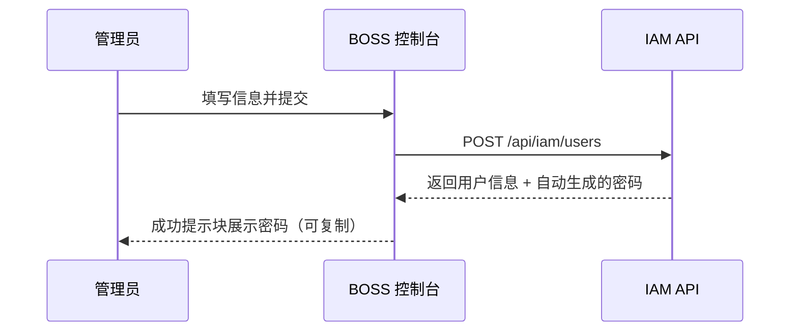

## 功能简介

用户管理是 BOSS 账户中心的核心模块之一，管理员可在此对平台注册用户进行全生命周期管理：**创建用户**、**编辑信息**、**重置密码**、**删除用户**。用户是平台身份体系的基础单元，通过唯一的用户名标识，并关联显示名称、邮箱、手机号等联系信息。

## 进入路径

BOSS → 账户中心 → **用户管理**

控制台路由：`/iam/users`

列表页支持工具栏关键词搜索与分页浏览，并支持多选批量删除。

## 用户列表

列表列定义见 `src/pages/boss/iam/users/list.tsx:72-113`。

| 列 | 字段名 | 展示方式 | 说明 |
|----|--------|----------|------|
| **用户名** | `name` | 头像 + 用户名（链接）+ `displayName` | 点击用户名进入用户详情页 |
| **邮箱** | `email` | 邮箱格式文本 | 用户的联系邮箱 |
| **手机号** | `phone` | 手机号格式文本 | 用户的联系电话 |
| **MFA** | `mfa.enabled` | 文本「是 / 否」 | 是否已启用多因素认证 |
| **创建时间** | `creationTimestamp` | 格式化时间 | 用户账户创建时间 |

行内可执行的操作：

| 操作 | 说明 |
|------|------|
| **编辑** | 跳转到编辑页 `/iam/users/:id/edit` |
| **重置密码** | 打开确认对话框，确认后由服务端生成新密码 |
| **删除** | 确认对话框（`confirmOnDelete`）后删除；多选时可批量删除 |

> ⚠️ 注意: 用户管理**没有**启用/禁用开关，列表也没有独立的「状态」列。停用账号只能通过删除用户，或把用户从租户中移除。

### 搜索

工具栏搜索框会写入 URL 的 `search` 参数，并作为分页参数传给 `GET /api/iam/users`。具体匹配哪些字段由后端决定，前端只负责透传关键词。

> ⚠️ 注意: 搜索命中的字段（用户名 / 邮箱 / 显示名称）后端未在前端声明，文档暂未确认。

---

## 创建用户

控制台路由：`/iam/users/new`。

1. 在用户列表右上角点击**新建用户**。
2. 填写下表字段。
3. 点击**确认**提交（`POST /api/iam/users`）。

表单字段与校验（`src/pages/boss/iam/users/components/form.tsx:44-52`、`114-134`）：

| 字段 | 字段名 | 类型 | 必填 | 校验 | 说明 |
|------|--------|------|------|------|------|
| **用户名** | `name` | 文本 | ✅ | 非空 | 唯一登录标识；创建后不可修改 |
| **显示名称** | `displayName` | 文本 | — | 无 | 显示名称 |
| **邮箱** | `email` | 文本 | ✅ | 非空 + 邮箱格式 | 联系邮箱 |
| **手机号** | `phone` | 文本 | ✅ | 非空 + 正则 `\d{6,16}` | 联系电话 |

### 密码自动生成

> 💡 提示: 创建用户时**无需填写密码**。密码由服务端自动生成，创建成功后表单顶部会展示一条成功提示块，内含用户名、明文密码和**复制按钮**（`ClipboardButton`），见 `form.tsx:99-112`。

密码展示后的建议：复制并安全地发送给用户，提醒其首次登录后尽快修改。

### 批量创建

当前版本不支持批量创建或导入用户。多选批量删除是支持的，批量创建需要通过 API 编写脚本实现。

---

## 编辑用户

控制台路由：`/iam/users/:id/edit`。

| 字段 | 是否可编辑 | 说明 |
|------|-----------|------|
| **用户名** (`name`) | ❌ | 表单中为禁用状态，并显示锁图标 |
| **显示名称** (`displayName`) | ✅ | — |
| **邮箱** (`email`) | ✅ | 需符合邮箱格式 |
| **手机号** (`phone`) | ✅ | 需符合 `\d{6,16}` |

提交调用 `PUT /api/iam/users/:name`。

---

## 重置密码

1. 在用户列表对应行打开操作菜单，点击**重置密码**。
2. 系统弹出确认对话框，确认后调用 `POST /api/iam/users/:name/password`。
3. 服务端返回的新密码在对话框中以成功提示展示，并提供**复制按钮**。

> ⚠️ 注意: 重置密码是破坏性操作。旧密码立即失效；重置后用户既有会话是否被强制下线由后端策略决定，前端未实现相关提示，文档暂未确认。

---

## 删除用户

1. 在用户列表对应行点击**删除**（或勾选多行后批量删除）。
2. 系统弹出确认对话框并显示目标用户。
3. 确认后调用 `DELETE /api/iam/users/:name`。

> ⚠️ 注意: 删除不可恢复。删除后的连带影响（用户在租户中的成员关系、其创建的模型 / 数据集 / API Key 的归属等）由后端实现决定，前端未给出提示，文档暂未确认。

---

## MFA 状态说明

列表中的 **MFA** 列读取 `mfa.enabled`，以「是 / 否」文本展示。

> 💡 提示: MFA 由用户在 Console 个人安全设置中自行管理，BOSS 只做展示，不支持管理员代为开关。

## 对应 API

| 操作 | 方法与路径 |
|------|-----------|
| 用户列表 | `GET /api/iam/users` |
| 用户详情 | `GET /api/iam/users/:name` |
| 创建用户 | `POST /api/iam/users` |
| 更新用户 | `PUT /api/iam/users/:name` |
| 删除用户 | `DELETE /api/iam/users/:name` |
| 重置密码 | `POST /api/iam/users/:name/password` |
| 用户所属租户 | `GET /api/iam/users/:name/tenants` |
| 用户搜索（供选择器使用） | `GET /api/iam/user-search` |

## 最佳实践

- 使用**工号**或**邮箱前缀**作为用户名，确保全局唯一；建议仅用小写字母、数字和连字符。
- 定期审查用户列表，及时删除离职人员账号。
- 密码通过安全通道传递，避免明文发送；鼓励用户启用 MFA。
- 避免共享账号，每人使用独立账户。

## 权限要求

> ⚠️ 注意: 控制台源码中未定义细粒度权限校验，文档中的「系统管理员」为产品约定角色，具体权限点未在代码中确认。
