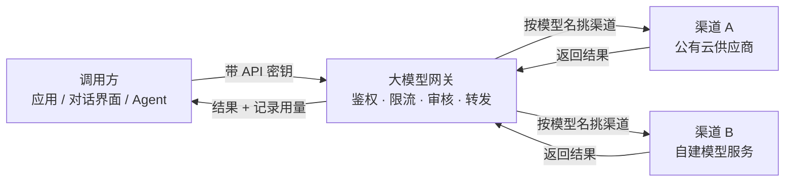

# 大模型网关

大模型网关（也叫 AI 网关）是平台上所有模型调用的**统一入口**。应用、对话界面、Agent 发出的模型请求都先到这里，由网关确认身份、检查限流、做内容审核，再转发给背后真正的模型供应商，最后把结果带回给调用方。

你作为平台管理员，在这里统一管理「请求从哪出去」「价格怎么算」「谁有钥匙能调用」这三件事。读完这一页，你会知道每个菜单是干什么的，以及该从哪一页开始配置。

:::tip 把网关理解成公司的总机
外部电话不会直接打到每个员工的座机，而是先拨总机。总机负责确认你是谁、有没有权限、该转给哪个部门，再把电话接过去。

大模型网关就是模型世界的「总机」：调用方只认一个地址，后面换了哪家供应商、哪条线路，调用方完全不用改。
:::

## 一次模型调用是怎么走的

1. 调用方带上 **API 密钥**（相当于门禁卡）发出请求，请求先到网关。
2. 网关先做三件事：验证密钥（你是谁）、检查限流（还能不能继续用）、做内容审核（内容合不合规）。
3. 网关根据请求里的**模型名**，挑一条可用的**渠道**。
4. 渠道把请求转发给它对接的模型供应商——可能是公有云（如 OpenAI、通义千问），也可能是平台自建的模型服务。
5. 供应商返回结果；网关顺带记下这次调用的用量（用了多少 Token、按价格算出多少费用、耗时多久），再把结果返回调用方。

网关后面接的每个供应商，在平台上都被抽象成一条**渠道**。你后续要做的接入工作，基本都围绕渠道展开。

## 两个入口，别弄混

- **管理入口**：你在后台页面上做的所有配置（建渠道、改价格、发密钥）都从这里进来，改完保存即可生效。
- **调用入口**：调用方实际请求模型时用的地址。它和后台页面是两个不同的入口，页面上的改动不需要调用方改地址。

## 菜单分组一览

Boss 控制台左侧的 **大模型网关** 菜单分成五组，各页面作用如下。

| 分组 | 页面 | 这一页帮你解决什么 | 详细说明 |
| --- | --- | --- | --- |
| 大模型网关 | 数据看板 | 看请求量、成功率、费用和网关健康度 | [数据看板](/boss/gateway/operations) |
| 模型服务 | 渠道管理 | 对接模型供应商，决定请求从哪出去 | [渠道管理](/boss/gateway/channels) |
| 模型服务 | 模型配置 | 维护模型的名片与价格 | [模型配置](/boss/gateway/model-metadata) |
| 用户管理 | 令牌管理 | 发放和管理 API 密钥 | [令牌管理](/boss/gateway/api-keys) |
| 用户管理 | 调用日志 | 查每一次调用的明细 | [调用日志](/boss/gateway/audit) |
| 安全服务 | 敏感词管理 | 维护审核用的词库 | [内容审查](/boss/gateway/moderation) |
| 安全服务 | 策略管理 | 定义命中后怎么处理 | [内容审查](/boss/gateway/moderation) |
| 安全服务 | 命中记录 | 查被审核拦下或改写的内容 | [命中记录](/boss/gateway/sensitive-hits) |
| 平台设置 | 网关配置 | 全局开关与运行参数 | [网关配置](/boss/gateway/config) |
| 平台设置 | 货币配置 | 价格用哪种货币显示 | [货币配置](/boss/gateway/currency-settings) |

## 开始之前

- 本菜单属于平台管理（Boss）控制台，只有平台管理员账号能看到。
- 建议按这个顺序上手：先建**渠道**打通上游 → 再配**模型配置**标好价格 → 然后发**API 密钥**给调用方 → 最后用**数据看板**和**调用日志**核对效果。

## 核心概念

| 名词 | 通俗解释 |
| --- | --- |
| 渠道 | 网关背后对接的一家模型供应商，请求从这里出去 |
| 模型元数据 | 模型的「名片」：叫什么、上下文多长、怎么计价 |
| API 密钥 | 发给租户或应用的门禁卡，请求时要带上 |
| 限流 | 给调用方设的速度上限（每分钟多少次请求、多少 Token） |
| 内容审核 | 门口的安检，检查进出的内容是否违规 |
| 审计日志 | 监控录像，记录谁在什么时候调用了什么 |

:::warning 网关只做计量计价
AI 网关负责统计每次调用用了多少 Token，并按模型价格算出费用（费用快照）。它不提供充值、扣款或在线支付这类功能——账单数字和资金收支是两件事。
:::

## 相关

- [渠道管理](/boss/gateway/channels)
- [模型配置](/boss/gateway/model-metadata)
- [网关配置](/boss/gateway/config)
