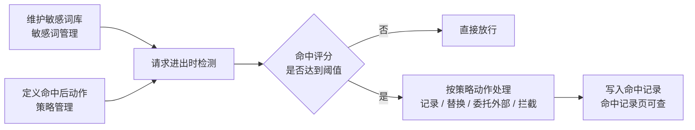

# 内容审查

内容审查是网关的**安检**：请求进来时检查用户输入，模型返回时检查输出，发现敏感内容就按你定的规则处理——只记一笔、把敏感词替换成星号，或者直接把请求拦下来。

读完你能完成一整套审核配置：先维护敏感词库，再定义「命中到什么程度、触发什么动作」的策略，最后到命中记录里核对效果。

:::tip 审核像门口的安检机
安检机需要两样东西：一份**违禁品清单**（对应敏感词库），和一套**处置规则**（对应策略）——查到了是没收、登记，还是放行。清单和规则分开维护，改清单不用动规则，改规则也不用重录清单。
:::

## 整条链路长什么样

1. **词库**（敏感词管理）：定义有哪些敏感词、每个词有多敏感（评分 1–10）。
2. **规则**（策略管理）：定义「评分满足什么条件时，执行什么动作」。
3. **结果**（命中记录）：记录每一次命中，以及当时是怎么处理的。

## 开始之前

- 权限：需要平台管理员账号（能进入 Boss 管理控制台）。
- 确认总开关是开的：到 **大模型网关 → 平台设置 → 网关配置**，检查 **启用内容审核** 处于开启状态。关掉它，所有策略会暂停执行（配置不会丢）。

## 三个页面在哪

| 页面 | 位置 | 作用 |
| --- | --- | --- |
| 敏感词管理 | 大模型网关 → 安全服务 → 敏感词管理 | 维护词库 |
| 策略管理 | 大模型网关 → 安全服务 → 策略管理 | 定义命中后的动作 |
| 命中记录 | 大模型网关 → 安全服务 → 命中记录 | 查看命中结果 |

## 第一步：维护敏感词库

### 进入与概览

1. 左侧菜单点击 **大模型网关**。
2. 展开 **安全服务**，点击 **敏感词管理**。

页面顶部有四个统计卡：**词条总数**、**启用中**（含启用占比）、**本月新增**、**近7日命中**。

### 列表里能看到什么

| 列 | 含义 |
| --- | --- |
| 敏感词 | 词条本身 |
| 启用状态 | 绿色对勾表示启用，灰色表示停用 |
| 风险评分 | 高（≥ 8）/ 中（≥ 5）/ 低，按评分自动着色 |
| 分类 | 这个词属于哪一类，可多个 |
| 标签 | 自定义标签，可多个 |
| 命中次数 | 累计被命中的次数 |
| 更新时间 | 最近一次修改时间 |

筛选项包括：顶部**关键词搜索**、**分类**快捷按钮和下拉、**风险等级**、**标签**、**更新时间**（更新时间 / 今天 / 近 7 天 / 近 30 天）。

### 新建一个敏感词

1. 点击右上角 **创建敏感词**。
2. 填写表单：

   | 表单项 | 怎么填 | 说明 |
   | --- | --- | --- |
   | 敏感词 | 要检测的词 | 必填，创建后**不能修改** |
   | 评分 | 例如 `5` | 必填，范围 `1`–`10`，默认 `5`；越高越敏感 |
   | 分类 | 从常用项里选，或自己输入 | 可多个，输入后回车添加 |
   | 词性 | 例如「名词」 | 选填 |
   | 标签 | 从常用标签里点选，或自己输入 | 可多个，方便归类 |

3. 点击 **确定**。

**常用分类**：政治、暴恐、民生、涉枪涉爆、色情、非法网站、广告、GFW、反动。

**常用标签**：中文、英文、拼音、政治敏感、选举相关、人名、个人信息、网址、营销、高风险。

:::info 匹配靠词库，不靠正则
检测是按词库里的**词条**逐条匹配的，分类和标签只是给你自己归类用，不参与匹配规则。界面里没有写正则表达式的地方。
:::

### 批量导入与导出

- **批量导入**：点击后弹出导入窗口，点 **选择文件** 上传一个 JSON 文件；解析成功会显示「已解析 N 个词条」，再点 **批量导入** 提交。文件最大 2MB，内容必须是 JSON 数组。
- **批量导出**：点击后确认，会把全部词条下载成一个 JSON 文件，方便备份或迁移。

### 批量操作

勾选词条后，列表上方会出现操作条，可执行 **批量启用**、**批量关闭**、**批量删除**。

:::warning 批量删除不可撤销
删除词条会立刻从检测范围里移除，且无法恢复。删除前建议先 **批量导出** 备份一份。
:::

## 第二步：配置命中后怎么处理（策略管理）

### 进入与列表

1. 左侧菜单点击 **大模型网关**。
2. 展开 **安全服务**，点击 **策略管理**。

列表展示每个策略的名称与描述、**触发条件**（形如 `≥ 50`）、**动作类型**、**优先级**、**启用状态**和**更新时间**。上方可按名称或描述搜索，并可按 **是否启用** 筛选。

### 新建一个策略

1. 点击右上角 **创建策略**。
2. 填写表单：

   | 表单项 | 怎么填 | 说明 |
   | --- | --- | --- |
   | 策略名称 | 例如「高分拦截」 | 必填 |
   | 描述 | 一句话说明 | 选填 |
   | 比较运算符 | 默认「大于等于 (≥)」 | 必填，见下表 |
   | 阈值 | 默认 `50` | 必填，范围 `0`–`100` |
   | 执行动作 | 默认「拦截请求」 | 必填，见下表 |
   | 优先级 | 默认 `1` | `1`–`10`，多条策略同时命中时用来排序 |
   | 启用 | 默认开启 | 关闭则这条策略暂不生效 |

3. 如果动作选的是「替换敏感词」或「委托外部服务」，下方会展开对应配置（见下节）。
4. 点击 **确定**。

**比较运算符**只有四种：

| 选项 | 含义 |
| --- | --- |
| 大于等于 (≥) | 评分达到或超过阈值时触发 |
| 大于 (>) | 评分超过阈值时触发 |
| 小于等于 (≤) | 评分不高于阈值时触发 |
| 小于 (<) | 评分低于阈值时触发 |

**执行动作**有四种：

| 选项 | 命中后会怎样 |
| --- | --- |
| 记录日志 | 内容照常通过，只在命中记录里留一笔 |
| 替换敏感词 | 把命中的词替换成掩码字符后继续，例如 `***` |
| 委托外部服务 | 把内容发给一个外部审核服务，由它判定 |
| 拦截请求 | 直接拒绝这次请求，返回错误 |

:::info 建议从「记录日志」开始
第一次配置时先用低风险动作（如「记录日志」）跑一段时间，观察命中记录是否准确，再逐步改成替换或拦截。
:::

### 替换敏感词的配置

| 配置项 | 默认 | 说明 |
| --- | --- | --- |
| 掩码字符 | `*` | 用来替换的字符 |
| 掩码模式 | 逐字替换 | 逐字替换（`敏感词` → `***`）/ 固定长度（统一替换成固定长度）/ 单字符替换（整词换成单个字符） |

### 委托外部服务的配置

| 配置项 | 默认 | 说明 |
| --- | --- | --- |
| 请求地址 | 空 | 必填，外部服务地址 |
| HTTP 方法 | `POST` | 可选 POST / GET |
| 超时时间（秒） | `5` | 请求超时 |
| 自定义请求头 | 空 | 填好后点 **创建请求头** 添加，可删 |
| JSON Path | 空 | 从外部服务的返回里取出判定值 |
| 放行值列表 | 空 | 视为放行的返回值，可选 `pass` / `allow` / `true` / `1` / `ok` |
| 拦截值列表 | 空 | 视为拦截的返回值，可选 `block` / `deny` / `reject` / `false` / `0` |
| 默认动作 | 拦截请求 | 返回值不在任何列表里时采用的动作（拦截请求 / 放行） |
| 消息路径 | 空 | 从返回里取出要展示给调用方的提示 |

### 策略的日常操作

在每行末尾的操作菜单里可以 **启用 / 禁用**、**编辑**、**删除**。

:::warning 删除策略要手动输入名称
删除时需要在确认弹窗里**手动输入策略名称**才能执行，删除后无法恢复。
:::

:::info 优先级怎么理解
优先级取值 `1`–`10`，用来决定多条策略同时命中时先执行哪条。页面上的说明是「数字越小优先级越高，高阈值规则建议设置更高优先级」。
:::

## 命中之后去哪里看

所有命中都会记录到 **命中记录** 页，包含命中的词、风险等级和当时的处理方式。详见 [命中记录](/boss/gateway/sensitive-hits)。

## 改动什么时候生效

词库和策略改完保存后就推送到网关生效，不需要重启，通常几秒内起效。

## 结果确认

配好一条词条和一个「评分 ≥ 5 → 记录日志」的策略后，发一条包含该词的测试请求，然后到 **命中记录** 页面，能在列表里看到这次命中，就说明整条链路通了。

## 常见问题

| 现象 | 可能原因 | 怎么办 |
| --- | --- | --- |
| 命中记录一直为空 | 总开关关闭、词条未启用，或时间范围太窄 | 检查网关配置的「启用内容审核」，确认词条已启用，放宽时间范围 |
| 内容里的词变成了星号 | 策略动作是「替换敏感词」 | 属预期；如需拦截请改动作为「拦截请求」 |
| 请求直接被拒绝 | 策略动作是「拦截请求」 | 检查阈值是否过低，或改动作为记录 / 替换 |
| 敏感词改不了 | 词条创建后不可修改 | 直接新建一条需要的词，再删掉旧的 |
| 想用正则但找不到入口 | 检测按词库词条匹配 | 把需要拦截的字符串逐个加进词库 |

## 相关

- [命中记录](/boss/gateway/sensitive-hits)：查看命中了什么
- [网关配置](/boss/gateway/config)：内容审核总开关
- [调用日志](/boss/gateway/audit)：查看包含未命中在内的全部调用
