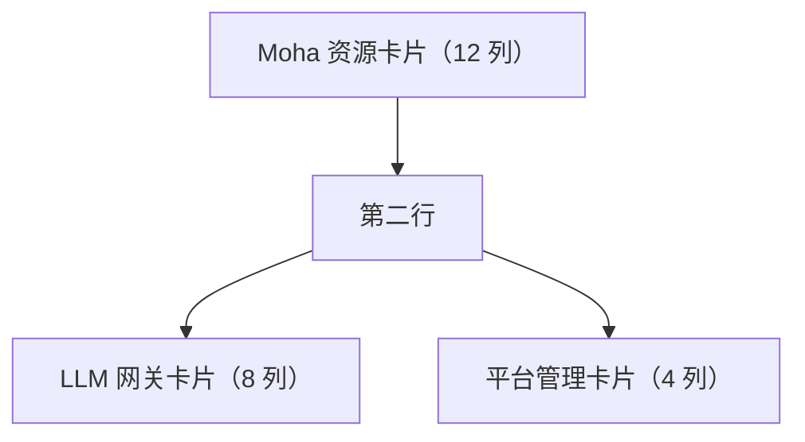

## 功能简介

BOSS 仪表盘是管理员进入管理门户后的**首屏页面**，通过三张卡片集中呈现平台的关键运营数据：

| 卡片 | 组件 | 网格宽度 | 核心内容 |
|------|------|----------|----------|
| Moha 资源卡片 | `MohaCard` | 12 列（独占一行） | 模型 / 数据集 / Space / 镜像数量、存储用量、可见性分布、热门资源 |
| LLM 网关卡片 | `GatewayCard` | 8 列 | 请求量 / 平均延迟 / Token 总量 / 错误率、24 小时趋势、Top 5 模型 |
| 平台管理卡片 | `ManagementCard` | 4 列 | 租户 / 集群 / 用户数、平台快照、待关注项 |

三张卡片的网格 `size` 定义见 `src/pages/boss/home/dashboard.tsx:26-38`。

> 💡 提示: 仪表盘三张卡片均已接入真实后端接口（通过 `useCacheFetch` 拉取），不存在 Mock / 示例数据。接口异常时卡片会以骨架屏或警告条提示，而不是展示假数据。

## 进入路径

BOSS → 首页 / 仪表盘

控制台路由：`/`（index）与 `/dashboard` 均渲染同一页面（`src/routes/sections/boss.tsx:223-224`）。

## 页面布局

三张卡片按响应式网格排布：Moha 卡片固定占满 12 列，网关卡片占 8 列、平台管理卡片占 4 列。

---

## Moha 资源卡片

数据源为 `getMohaDashboard`（`src/services/moha`），字段来自 `assetStatistics`、`distribution` 与 `trendingNow`。

### 资源总量统计

卡片左侧以四个统计块展示资源总数，并在标题栏展示存储用量：

| 指标 | 字段 | 说明 |
|------|------|------|
| **模型** | `assetStatistics.models` | 模型仓库总数 |
| **数据集** | `assetStatistics.datasets` | 数据集总数 |
| **Space** | `assetStatistics.spaces` | 工作空间总数 |
| **镜像** | `assetStatistics.images` | 镜像总数 |
| **存储用量** | `assetStatistics.storage` | 按 `fData` 格式化展示 |

### 可见性分布

卡片左下以三段式分布条展示资源可见性，右侧给出百分比文案：

| 字段 | 含义 |
|------|------|
| `distribution.public` | 公开资源 |
| `distribution.internal` | 内部可见资源 |
| `distribution.private` | 私有资源 |

占比按三者之和计算；当总数为 0 时展示「无数据」。注意分布包含 **public / internal / private 三段**，不是两段。

### 热门资源（Trending Now）

卡片右侧列出近期热门资源（`trendingNow`），每项包含：

| 展示项 | 字段 |
|--------|------|
| 名称 | `alias`（优先）或 `name`，悬停显示 `organization/name` |
| 类型标签 | `type`：`model` / `dataset` / `space` / `image` |
| 体积 | `size`（按 `fData` 格式化，可能为空） |
| 下载量 | `downloads` |

列表为空时展示空状态提示。

---

## LLM 网关卡片

数据源为 `getUsageDashboard`（`src/services/usage`），查询参数为 `interval: 'hour'`、`seriesLimit: 24`、`topN: 5`。

### 四个核心 KPI

| KPI | 字段 | 变化率字段 | 趋势判定 |
|-----|------|-----------|----------|
| **请求总量** | `summary.requestCount` | `requestCountChangeRate` | 上升为正向 |
| **平均延迟** | `summary.averageLatencyMillis` | `averageLatencyChangeRate` | 下降为正向 |
| **Token 总量** | `summary.totalTokens` | `totalTokensChangeRate` | 上升为正向 |
| **错误率** | `summary.errorRate` | `errorRateChangeRate` | 下降为正向 |

趋势展示规则（`getTrendDisplay`）：

- 变化率绝对值 < 0.0001 记为 `flat`，显示 `0%`
- 对「越低越好」的指标（平均延迟、错误率）传入 `lowerIsBetter = true`
- 改善显示绿色，恶化显示红色；上升带 `+`、下降带 `-`

### 流量趋势图

卡片中部为面积图（area chart），以 `timeseries` 为横轴，**两条序列**：

- 请求量 `requestCount`
- Token 量 `totalTokens`

横轴标签按 `interval` 格式化：`hour` 显示 `HH:mm`，`day` 显示 `MM-DD`。无数据时展示空状态。

### Top 5 模型

卡片右侧按请求量列出 `topModels`（最多 5 个）：

| 展示项 | 字段 |
|--------|------|
| 模型名 | `displayName` |
| 请求量 | `requestCount` |
| 请求占比进度条 | `requestCount / summary.requestCount` |
| 补充信息 | `totalTokens` 与 `requestCount` 的缩写值 |

### 异常状态

接口失败时卡片直接渲染 `Alert severity="error"` 并显示错误信息，不展示任何指标。

---

## 平台管理卡片

数据源为三个列表接口：`listTenants`、`listUsers`、`listClusters`（`src/services/tenant`、`src/services/user`、`src/services/cloud`），查询参数 `{ page: 1, size: 1000 }`。

### 平台统计数字

卡片顶部展示三个实体总数：

| 指标 | 字段 |
|------|------|
| **租户数** | 租户列表 `total` |
| **集群数** | 集群列表 `total` |
| **用户数** | 用户列表 `total` |

### 平台快照

列表全部加载完成后（`total <= items.length`）追加展示以下快照项，某行数据源失败时该项不出现：

| 快照项 | 判定依据 |
|--------|----------|
| **启用租户数** | `tenant.enabled === true` |
| **连通集群数** | `cluster.status.connected === true`，否则回退判断 `status.phase === 'connected'` |
| **已发布集群数** | `cluster.published === true` |
| **已启用 MFA 用户数** | `user.mfa?.enabled === true` |

### 待关注项

卡片底部为「待关注」区域，仅列出数量大于 0 的项，每项展示名称摘要并可点击「详情」跳转：

| 待关注项 | 跳转目标 |
|----------|----------|
| 禁用租户（`!tenant.enabled`） | `/iam/tenants` |
| 未连通集群（`!isClusterConnected`） | `/rune/clusters` |
| 未发布集群（`!cluster.published`） | `/rune/clusters` |

当可评估且无任何待关注项时，展示「全部正常」的绿色提示块。

### 数据源异常

任一数据源请求失败时，卡片顶部展示警告条并列出不可用的数据源名称（租户 / 用户 / 集群）。

> ⚠️ 注意: 本卡片**不包含** CPU / 内存 / 容量健康度阈值，也**不包含**审批、配额预警、API Key 过期之类的待办列表——这些在控制台源码中不存在。真实待关注项以本节上表为准。

---

## 数据刷新

- 三个卡片的请求都通过 `useCacheFetch` 完成，即在客户端按需拉取并缓存。
- 页面未暴露手动刷新按钮或刷新间隔配置；Moha 卡片与网关卡片各自独立请求，平台管理卡片一次拉取租户 / 用户 / 集群三份列表。

## 常见问题

### 仪表盘数据是实时的吗？

卡片数据来自真实接口，不是 Mock。数据在进入页面时拉取并缓存；页面本身不提供自动轮询或自定义刷新间隔。

### 卡片是否支持自定义？

当前三张卡片的布局与内容是固定的，不提供拖拽或增删组件。集群级别的自定义监控面板使用独立的「集群动态仪表盘」页面（控制台路由 `/rune/clusters/:cluster/dynamic-dashboard`），与本页不同。

### 如何判断平台是否健康？

可关注以下信号：

1. 平台管理卡片的**待关注项为空**（显示「全部正常」）
2. 网关卡片**错误率为 0 或接近 0**
3. 网关卡片**平均延迟**处于合理区间

> ⚠️ 注意: 仪表盘只汇总概要与计数，不覆盖全部细节。排查具体问题时仍需进入对应管理模块。
