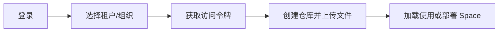

## 快速开始

帮助您快速上手魔哈仓库的核心功能。

## 准备工作

使用魔哈仓库前，请确认：

1. **拥有平台账户** — 联系管理员创建账户或自行注册
2. **选择租户/组织** — 模型、数据集等资源归属于组织，需先选择或创建组织
3. **获取访问令牌** — 用于 Git 操作和 API 调用的身份认证

## 快速上手流程

## 相关文档

| 文档 | 说明 |
| --- | --- |
| [新手指南](/moha/quickstart/guide) | 从零开始的完整操作流程 |
| [账号设置](/moha/quickstart/account) | 账号、安全与凭据的实际入口（IAM） |
| [访问令牌](/moha/quickstart/token) | 查看与使用访问令牌 |
