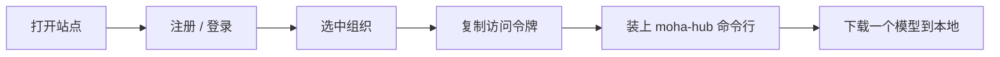

# 快速开始

这一节是魔哈的**新手第一课**。按顺序做完下面三页，你就能：打开站点 → 注册或登录 → 选中自己的组织 → 拿到访问令牌 → 在命令行里把第一个模型拉到本地。

全程大约 15 分钟，只需要一个浏览器和一个命令行窗口，不用提前懂任何专业名词。

:::tip 先记住三个词

- **组织**：一个团队空间，里面的人共享仓库。
- **仓库**：一个放模型或数据集的文件夹，名字形如 `ai-lab/qwen2-7b`。
- **访问令牌**：代替密码的通行证，命令行靠它证明「你是你」。

:::

## 整条路径

## 三页读完就能跑通

| 顺序 | 页面 | 读完你会 |
| --- | --- | --- |
| 1 | [快速开始](/moha/quickstart/guide) | 手把手走完注册登录、复制令牌、命令行下载的完整链路 |
| 2 | [账号设置](/moha/quickstart/account) | 知道账号、密码、组织在哪里改，令牌和 API 密钥有什么不同 |
| 3 | [访问令牌](/moha/quickstart/token) | 会复制令牌、在命令行里用它、令牌泄漏后怎么处理 |

## 开始之前

- 一个能收邮件的邮箱，注册时要收验证码。
- 一台装了 Python 3.10 或更高版本的电脑，第三步用命令行下载时需要。
- 不用提前装 Git 或任何容器工具。

## 相关

- [魔哈仓库总览](/moha)
- [模型仓库](/moha/models)
- [SDK 教程](/moha/sdk-tutorial/quick-start)
