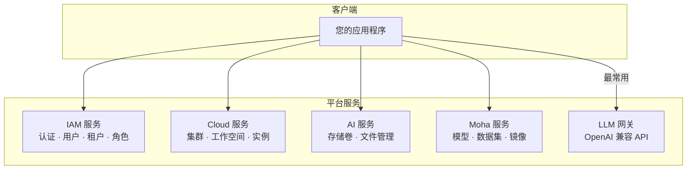

本文介绍如何通过 API 与晓石 AI 平台进行集成，主要面向需要通过程序调用平台能力的开发者。

---

## 平台服务架构

晓石 AI 平台提供 5 个核心服务域，覆盖认证、计算、存储、模型仓库和 LLM 网关：



---

## 认证方式

所有 API 请求需在请求头中携带认证信息：

| Header | 说明 | 示例值 |
|--------|------|--------|
| `Authorization` | 认证令牌 | `Bearer eyJhbGci...`（平台 Token）或 `Bearer sk-xxx`（LLM 网关 Key） |
| `Content-Type` | 请求格式 | `application/json` |

:::tip
LLM 网关使用独立的 API Key（`sk-` 前缀），可在 Console → 个人中心 → API Key 管理 中创建。平台其他服务使用登录后获取的 Token。
:::

---

## LLM 网关 API（最常用）

LLM 网关提供与 **OpenAI API 完全兼容**的接口，是最常用的集成方式。您可以直接使用 OpenAI 官方 SDK：

### Python 示例

```python
from openai import OpenAI

client = OpenAI(
    api_key="sk-xxxxxxxxxxxxxxxx",
    base_url="https://your-platform.com/api/airouter/v1"
)

response = client.chat.completions.create(
    model="deepseek-v3",
    messages=[
        {"role": "system", "content": "你是一个有帮助的助手。"},
        {"role": "user", "content": "什么是 Kubernetes？"}
    ],
    stream=True
)

for chunk in response:
    if chunk.choices[0].delta.content:
        print(chunk.choices[0].delta.content, end="")
```

### cURL 示例

```bash
curl -X POST https://your-platform.com/api/airouter/v1/chat/completions \
  -H "Authorization: Bearer sk-xxxxxxxxxxxxxxxx" \
  -H "Content-Type: application/json" \
  -d '{
    "model": "deepseek-v3",
    "messages": [{"role": "user", "content": "你好"}],
    "stream": false
  }'
```

:::tip
将 `base_url` 指向平台地址即可使用任何兼容 OpenAI SDK 的客户端库（Python、Node.js、Java 等）。
:::

---

## 常见 API 响应状态码

| 状态码 | 含义 | 说明 |
|--------|------|------|
| `200` | 请求成功 | 正常返回数据 |
| `201` | 创建成功 | 资源已创建 |
| `204` | 删除成功 | 无响应体 |
| `400` | 请求参数错误 | 检查请求参数 |
| `401` | 未认证 | Token 无效或已过期 |
| `403` | 无权限 | 当前用户无权执行此操作 |
| `404` | 资源不存在 | 检查资源 ID 或路径 |
| `409` | 资源冲突 | 名称已存在等 |
| `429` | 请求频率超限 | 降低调用频率后重试 |
| `500` | 服务器错误 | 联系平台管理员 |

---

## 速率限制

| 接口类型 | 限制 | 说明 |
|---------|------|------|
| LLM 网关 | 按 API Key 配置 | 管理员可设置每分钟请求数（RPM）和每分钟 Token 数（TPM） |
| 登录接口 | 5 次/分钟 | 防止暴力破解 |
| 文件上传 | 单文件最大 10GB | 超大文件建议使用对象存储 CLI 工具 |

:::warning
触发速率限制时平台返回 `429` 状态码，请降低调用频率后重试。具体限制数值由平台管理员配置。
:::

---

## 下一步

- [权限说明](./permissions) — 了解角色和权限体系
- [常见问题](./faq) — 常见问题解答
