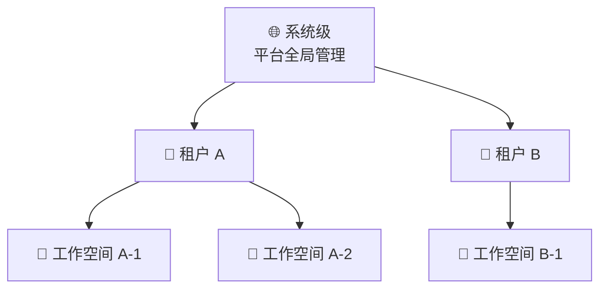

本文介绍晓石 AI 平台的角色体系和权限模型，帮助您了解不同角色的操作范围和功能边界。

---

## 权限模型总览

平台采用**三级作用域**的权限模型：系统级 → 租户级 → 工作空间级。上级作用域的角色拥有更大的操作范围。

| 作用域 | 说明 | 管理界面 | 示例 |
|--------|------|---------|------|
| **系统级** | 平台全局管理，可管理所有租户和资源 | BOSS | 系统管理员管理整个平台 |
| **租户级** | 限定在某个租户范围内 | Console | 租户管理员管理本租户的工作空间和成员 |
| **工作空间级** | 限定在某个工作空间内 | Console | 开发者在工作空间中创建和管理实例 |

---

## 角色定义

平台预定义了 4 个角色：

| 角色 | 作用域 | 可访问界面 | 说明 |
|------|--------|----------|------|
| **系统管理员** | 系统级 | BOSS + Console | 平台最高权限，可管理所有租户、集群、用户 |
| **租户管理员** | 租户级 | Console | 管理本租户下所有工作空间、成员和资源 |
| **开发者** | 租户级 | Console | 可创建和管理实例，只读查看工作空间和模板等 |
| **成员** | 租户级 | Console | 仅有查看权限 |

:::tip
一个用户在不同租户中可以拥有不同角色。例如，张三在租户 A 是管理员，在租户 B 是开发者。切换租户时，可用的功能会随角色变化。
:::

---

## 角色权限对比

### 资源操作权限

| 资源 | 操作 | 系统管理员 | 租户管理员 | 开发者 | 成员 |
|------|------|:---:|:---:|:---:|:---:|
| **工作空间** | 查看 | ✅ | ✅ | ✅ | ✅ |
| **工作空间** | 创建/编辑/删除 | ✅ | ✅ | ❌ | ❌ |
| **实例** | 查看 | ✅ | ✅ | ✅ | ✅ |
| **实例** | 创建/启停/删除 | ✅ | ✅ | ✅ | ❌ |
| **实例** | 查看日志/终端 | ✅ | ✅ | ✅ | ❌ |
| **镜像** | 查看 | ✅ | ✅ | ✅ | ✅ |
| **镜像** | 创建/编辑/删除 | ✅ | ✅ | ❌ | ❌ |
| **模板** | 查看 | ✅ | ✅ | ✅ | ❌ |
| **模板** | 创建/编辑/删除 | ✅ | ✅ | ❌ | ❌ |
| **成员** | 管理 | ✅ | ✅ | ❌ | ❌ |
| **配额** | 管理 | ✅ | ✅ | ❌ | ❌ |
| **存储卷** | 管理 | ✅ | ✅ | ❌ | ❌ |

### 功能入口权限

| 功能 | 系统管理员 | 租户管理员 | 开发者 | 成员 |
|------|:---:|:---:|:---:|:---:|
| BOSS 管理后台 | ✅ | ❌ | ❌ | ❌ |
| Console 控制台 | ✅ | ✅ | ✅ | ✅ |
| 部署推理服务 | ✅ | ✅ | ✅ | ❌ |
| 提交微调任务 | ✅ | ✅ | ✅ | ❌ |
| 创建开发环境 | ✅ | ✅ | ✅ | ❌ |
| 实验追踪 | ✅ | ✅ | ✅ | ❌ |
| 工作空间管理 | ✅ | ✅ | ❌ | ❌ |
| 成员管理 | ✅ | ✅ | ❌ | ❌ |
| 配额管理 | ✅ | ✅ | ❌ | ❌ |
| 集群管理 | ✅ | ❌ | ❌ | ❌ |
| 用户管理 | ✅ | ❌ | ❌ | ❌ |

---

## 权限生效规则

- **最小权限原则**：用户默认无权限，只有被明确授予角色后才获得对应权限
- **系统管理员特权**：系统管理员自动拥有所有租户和工作空间的全部权限
- **自动刷新**：登录、切换租户或工作空间时，平台自动更新权限。无权限的菜单和操作按钮会自动隐藏

:::warning
页面上隐藏或禁用的操作按钮表示您当前角色无权执行该操作。如需更多权限，请联系您的租户管理员或系统管理员。
:::

---

## 常见场景

### 场景一：新成员加入

1. 租户管理员在 Console → 成员管理 中添加新用户
2. 为其分配角色（开发者 / 成员）
3. 新用户登录后选择对应租户即可开始工作

### 场景二：开发者需要创建工作空间

开发者角色没有创建工作空间的权限，需要：
1. 联系租户管理员创建工作空间
2. 租户管理员为工作空间分配配额和规格
3. 租户管理员将开发者添加为工作空间成员

### 场景三：查看操作被拒绝

如果访问某个页面显示 403（无权限），可能原因：
- 当前登录的租户不正确 — 尝试切换租户
- 角色权限不足 — 联系管理员提升角色
- 工作空间未分配 — 联系管理员添加为工作空间成员

---

## 下一步

- [API 集成概述](./api-overview) — 了解平台 API 接口
- [常见问题](./faq) — 常见问题解答
