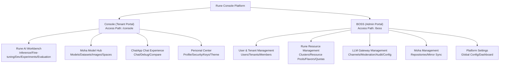

## What is Rune Console

**Rune Console** is the enterprise-grade AI platform unified control center developed by **XiaoShi AI**. It provides AI teams with an end-to-end workflow covering model training, fine-tuning, inference deployment, and online conversational experiences, equipped with comprehensive multi-tenant isolation, resource quotas, permission systems, and a unified LLM gateway to help enterprises securely and efficiently manage GPU/NPU computing resources and AI model assets.

Rune Console consists of **three sub-products** and **two control planes**, covering the needs of various roles throughout the entire AI lifecycle.

---

## Three Sub-Products

### Rune — AI Workbench

Rune is the platform's core compute engine, designed for ML engineers and data scientists, providing rich AI workload management capabilities:

| Module | Description | Typical Use Cases |
|--------|-------------|-------------------|
| **Inference Service** | One-click deployment of trained models with automatic GPU resource allocation and RESTful API endpoint exposure | Deploy large language models like LLaMA, ChatGLM for online inference |
| **Fine-tuning Service** | Submit SFT/LoRA fine-tuning tasks based on pre-trained models and track training metrics | Fine-tune base models with private data for domain adaptation |
| **Dev Environment** | Launch JupyterLab / VS Code Server / SSH remote development environments with direct GPU access | Interactive model code debugging and data exploration |
| **Application Management** | Deploy and manage custom AI applications (e.g., web demos, API services) | Deploy Gradio/Streamlit demo applications |
| **Experiment Management** | Track ML experiment parameters, metrics, and artifacts; compare different experiments | Record multi-round hyperparameter search results and select optimal configurations |
| **Evaluation Management** | Perform systematic benchmark evaluations on models | Evaluate model accuracy/latency using standard evaluation datasets |
| **Storage Volumes** | S3-compatible persistent storage that can be mounted to any instance, with built-in file manager | Store model weights, training data, and checkpoints |
| **App Market** | Platform-provided application template library with one-click deployment | Quickly deploy mainstream frameworks like vLLM, TGI, LLaMA-Factory |

> 💡 **Tip**: All workload types (inference, fine-tuning, dev environments, applications, experiments, evaluations) share a unified deployment workflow: select template → configure parameters → choose flavor → submit deployment. Differences between types are reflected in available templates and parameter configurations.

### Moha — Model Hub

Moha is the platform's built-in AI asset repository, providing a HuggingFace-like model/dataset/Space management experience, but designed for enterprise private deployment:

| Module | Description | Typical Use Cases |
|--------|-------------|-------------------|
| **Model Management** | Git-style version control with file browsing, branch management, commit history, and Pull Requests | Manage and distribute enterprise private models, control model version iterations |
| **Dataset Management** | Dataset upload, version management, and format preview | Manage training and evaluation datasets |
| **Image Registry** | Container image management with security scanning and visibility control | Manage custom training/inference container images |
| **Space** | Online showcase space supporting Gradio/Streamlit and other frontend application hosting | Create model experience demos or interactive documentation |
| **Organization Management** | Manage repositories and members at the organization level with role assignment | Divide model asset ownership by team/department |
| **Discussions & PRs** | Community-style discussions, code reviews, and merge requests | Model version review and merge management |
| **Mirror Sync** | Automatically sync models and datasets from external sources (HuggingFace/ModelScope, etc.) | Automatically sync public models to enterprise intranet |
| **Favorites & Ratings** | Model/dataset favoriting and rating system | Help teams discover high-quality internal models |

> 💡 **Tip**: Every Moha repository (model/dataset/Space) has an independent Git repository supporting Git LFS for large file storage, operable via Web UI or command line.

### ChatApp — Conversational Experience

ChatApp provides business users and developers with a ready-to-use large model chat interface, allowing them to experience deployed AI models without writing any code:

| Module | Description | Typical Use Cases |
|--------|-------------|-------------------|
| **Model Marketplace** | Browse available models and inspect context length, parameter scale, prices and channels | Model selection; confirming capability and cost |
| **Model Experience** | Pick a model and API key for streaming chat, with deep thinking and image input | Business users experiencing privately deployed models |
| **Parameter Tuning** | Adjust Temperature / Top P / Max Tokens / System Prompt / Stop in the parameter popover | Developers tuning prompts and parameters for optimal output |
| **Model Comparison** | Side-by-side dual-column chat, sending the same input to two models simultaneously | Evaluating answer quality across different models (or versions) |
| **My Tokens** | Manage personal API access tokens with expiry, RPM/TPM limits and IP allowlisting | Controlling API call frequency and access scope |
| **Usage** | View requests, token consumption, cost, success rate and model rankings | Tracking personal usage and cost |

> 💡 **Tip**: ChatApp's top navigation has five items — Marketplace / Experience / Comparison / My Tokens / Usage (`src/pages/chatapp/layout.tsx:24-50`). Default parameters are Temperature `0.7` (0–1.999), Top P `0.8` (0.1–1.0) and Max Tokens `4096` (0–32768); deep thinking is on by default and the request body's `reasoning_effort` only takes `high` (on) or `none` (off) (`src/pages/chatapp/chat.tsx:59-77,169`).

---

## Two Control Planes

Rune Console provides two completely independent management interfaces for different user groups and management responsibilities:

### Console — Tenant Portal

Designed for **tenant administrators, developers, and general members**. This is the daily work interface for most users.

**Core Responsibilities**:
- Deploy and manage various AI workloads within assigned workspaces
- Manage models, datasets, and other AI assets
- Experience and invoke deployed models through ChatApp and LLM Gateway API
- Manage personal account information, security settings, API Keys, and SSH Keys

**Target Roles**: Tenant Admin, Developer, Member

### BOSS — Platform Admin Portal

Designed for **platform administrators (System Admin)**. Provides global platform operations and resource management capabilities.

**Core Responsibilities**:
- Manage the lifecycle of all platform users and tenants
- Manage GPU/NPU compute clusters, resource pools, and Flavors (hardware specifications)
- Allocate tenant quotas (GPU count, storage capacity, etc.)
- Manage the unified LLM gateway (channel routing, content moderation, audit logs)
- Configure platform-wide settings (login methods, branding, dashboards, etc.)

**Target Roles**: System Admin only

### Responsibility Matrix

| Management Function | Console | BOSS |
|---------------------|:-------:|:----:|
| Deploy inference/fine-tuning/dev environments | ✅ | — |
| Manage models/datasets/Spaces | ✅ | ✅ (audit) |
| ChatApp conversational experience | ✅ | — |
| Personal account & security settings | ✅ | — |
| Workspace CRUD | ✅ (tenant scope) | — |
| User registration & management | — | ✅ |
| Tenant creation & quota allocation | — | ✅ |
| Cluster onboarding & resource pool management | — | ✅ |
| Flavor management | — | ✅ |
| LLM gateway channel configuration | — | ✅ |
| Content moderation policies | — | ✅ |
| Audit log viewing | — | ✅ |
| Platform-wide settings | — | ✅ |
| Dynamic dashboard configuration | — | ✅ |

---

## Target Users & Use Cases

### ML Engineers / Algorithm Engineers

**Typical Operations**:
1. Upload private models to Moha → Select model template in Rune → Deploy inference service → Invoke via API
2. Submit fine-tuning tasks → View training metrics and logs → Register fine-tuned models to Moha
3. Launch JupyterLab dev environment → Mount storage volumes → Interactive development and debugging

**Recommended Usage**: All Rune Workbench features + Moha Model Hub

### Data Scientists / Data Engineers

**Typical Operations**:
1. Manage training datasets in Moha → Mount to dev environments for data preprocessing
2. Submit experiment tasks → Compare different experiment results → Select optimal configuration
3. Use evaluation features to perform standardized model assessments

**Recommended Usage**: Moha dataset management + Experiments/Evaluations + Storage Volumes

### Platform Administrators

**Typical Operations**:
1. Onboard GPU clusters → Create resource pools → Define Flavor specifications → Allocate tenant quotas
2. Create tenants → Invite members → Assign roles
3. Configure LLM gateway channels → Set content moderation policies → Monitor API call volume

**Recommended Usage**: All BOSS features

### Business Teams / Product Managers

**Typical Operations**:
1. Experience deployed large models directly through ChatApp
2. Use comparison mode to evaluate answer quality across different models
3. View dashboards to understand model usage and business metrics

**Recommended Usage**: ChatApp conversational experience + Dashboards

---

## Core Platform Advantages

| Advantage | Details |
|-----------|---------|
| **Multi-Tenant Isolation** | Platform → Tenant → Workspace three-level isolation, each with independent resource quotas and member permissions, with no data or resource interference |
| **GPU/NPU Intelligent Scheduling** | Supports NVIDIA GPUs, Huawei Ascend NPUs, Cambricon MLUs, and other accelerators with automatic detection and scheduling |
| **Full Model Lifecycle** | End-to-end management from model development, training, and fine-tuning to inference deployment, with Git-based model version management |
| **Unified LLM Gateway** | OpenAI API-compatible unified gateway supporting multi-channel routing, failover retry, rate limiting, and content moderation |
| **Flexible Deployment Templates** | App Market with pre-built templates for mainstream frameworks (vLLM, TGI, LLaMA-Factory, etc.), plus support for custom Helm Charts |
| **Enterprise-Grade Security** | RBAC role permissions + MFA multi-factor authentication + API Key management + IP whitelisting + audit logs |
| **Built-in File Management** | S3-compatible object storage with built-in web file manager supporting upload/download/preview/directory browsing |
| **Rich Observability** | Prometheus monitoring metrics + Loki log aggregation + custom dashboards + event streams |
| **Bilingual Support** | Full Chinese and English language support across all functional modules |
| **Open-Source Tech Stack** | Frontend built with React 19 + TypeScript + MUI 7 + Vite 6, high-performance and modern |

---

## Platform Capability Overview

### Workload Types

| Type | Category ID | Description | Status Transitions |
|------|-------------|-------------|-------------------|
| Inference Service | `inference` | Online model inference deployment | Installed → Healthy / Unhealthy / Failed |
| Fine-tuning Task | `tune` | Model fine-tuning training task | Installed → Healthy → Succeeded / Failed |
| Dev Environment | `im` | Interactive development environment | Installed → Healthy |
| Application | `app` | Custom AI application | Installed → Healthy / Failed |
| Experiment | `experiment` | ML experiment tracking | Installed → Healthy |
| Evaluation | `evaluation` | Model evaluation | Installed → Healthy → Succeeded |

### Resource Flavors

A flavor is defined by the platform administrator per cluster and usually combines a number of CPU cores, an amount of memory and a number of accelerators (GPU/NPU).

> ⚠️ **Note**: The available flavor names and counts depend on the cluster configuration; the front end ships no fixed flavor list, so this page does not enumerate specific models. Check the flavor selection step when creating an instance to see what is currently available.

---

## Environment Requirements

### Browsers and Screens

The console is a desktop web application; using the latest version of a mainstream desktop browser (Chrome / Firefox / Edge / Safari) is recommended.

> ⚠️ **Note**: The front-end code does not enforce a minimum browser version or screen resolution, and the exact trigger for the "not suitable for mobile" prompt is not fixed in code, so it is not confirmed.

---

## Next Steps

| Recommended Reading | Description |
|--------------------|-------------|
| [Quick Start](/guide/quick-start) | Complete guide from sign-in to deploying your first inference service |
| [Platform Architecture](/guide/architecture) | Deep dive into multi-tenant architecture and core concepts |
| [Glossary](/guide/glossary) | Familiarise yourself with core platform concepts and terminology |
| [Authentication](/account/auth) | Learn about sign-in, registration and MFA |
| [Inference Services](/rune/console/inference) | Go directly to the inference service documentation |
