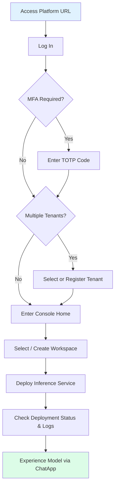
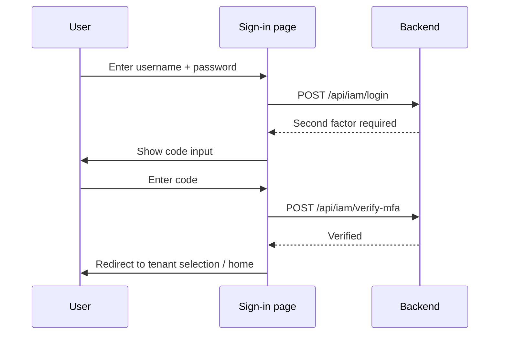
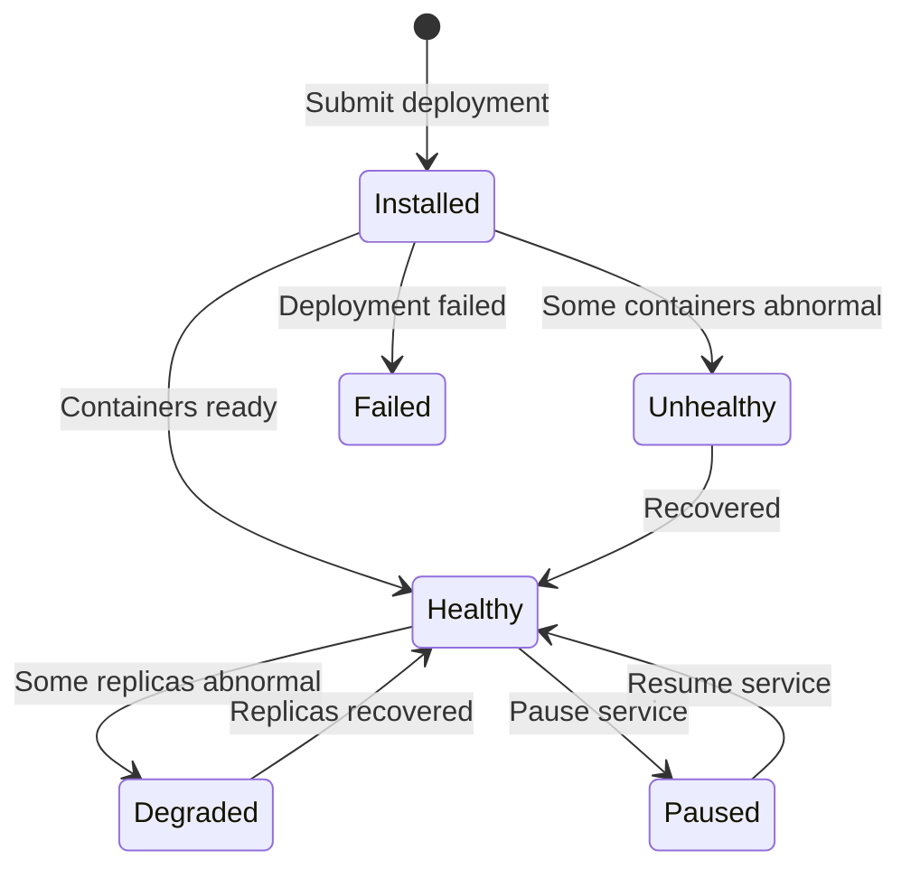

This guide walks you step by step through the whole flow: **Sign-in → Select Tenant → Explore the Interface → Create Workspace → Deploy Inference Service → Check Status → Experience AI Chat**.

---

## Full Process Overview



---

## Prerequisites

Before getting started, please confirm you have met the following conditions:

| Condition | Description |
|-----------|-------------|
| **Browser** | Latest version of a mainstream desktop browser (Chrome / Firefox / Edge / Safari) |
| **Network** | Able to access the platform domain (e.g., `https://your-domain/console`), with no proxy interception |
| **Account** | A login username and password (assigned by an administrator, or self-registered on the sign-up page) |
| **MFA (Optional)** | If the platform has MFA enabled, have a TOTP-compatible authenticator app ready |

> ⚠️ **Note**: The front-end code enforces no minimum browser version and no mobile-support level, so this is not confirmed; a recent desktop browser is recommended.

> 💡 **Tip**: If you don't have an account yet, contact the platform administrator or visit `/auth/sign-up` to self-register. See [Register an Account](/account/auth/register) for the registration flow.

---

## Step 1: Log In to the Platform {#step-login}

### 1.1 Access the Login Page

Enter the platform URL in your browser's address bar, for example:

```
https://your-domain/console
```

The system will automatically redirect to the sign-in page at `/auth/sign-in`.

### 1.2 Enter Credentials

Fill in the login form:

| Field | Description |
|-------|-------------|
| **Username** | Your platform login account |
| **Password** | Your login password |

### 1.3 Login CAPTCHA

When the platform requires a CAPTCHA in the login response (for example after repeated failures trigger a locked login, `LoginLocked`), the sign-in form shows one. The captcha is issued by `GET /api/iam/login-captcha` and its `provider` may be:

| provider | Interaction |
|----------|-------------|
| `Slider` | Drag a slider to complete a puzzle |
| `Graphic` | Type the characters in the image |

> ⚠️ **Note**: The captcha validity period, case sensitivity and login lock duration are all controlled by the back end; there are no such constants in the front-end code, so they are not confirmed.

### 1.4 Multi-Factor Authentication (MFA)

If your account has MFA bound, a second verification step follows the username and password. The endpoints are `POST /api/iam/init-mfa` (initialise) and `POST /api/iam/verify-mfa` (verify), see `src/services/account.ts:44-54`.



> ⚠️ **Note**: The code length, validity period, whether MFA is enforced and the recovery-code mechanism are all outside the front-end code and are not confirmed.

---

## Step 2: Select or Create a Tenant {#step-tenant}

### 2.1 What is a Tenant?

A **Tenant** is the top-level resource isolation unit in Rune Console. Each tenant has independent:

- Members and role permissions
- Workspaces and resource quotas
- Models, datasets, and other assets
- Billing and usage statistics

You can think of a tenant as an **"organization"** or **"team"**. A user can belong to multiple tenants, but can only operate under one tenant at a time.

### 2.2 Select a Tenant

If you belong to **multiple tenants**, after successful login the system will automatically redirect to the **tenant selection page**:

1. The page displays all tenants you have access to in a list format
2. Each tenant shows its name and description
3. Click the target tenant to enter

> 💡 Tip: If you only belong to one tenant, the system will **automatically skip** this step and go directly to the console home page.

### 2.3 Register a New Tenant

If you are a new user, you may not have joined any tenant yet. You can then choose to **register a new tenant**:

1. Open the tenant registration form from the tenant selection page (route `/auth/regist-tenant`)
2. Fill in **Name**, **Email** and **Phone** — the form has only these three fields (`src/auth/view/centered/centered-regist-tenant-view.tsx:37-41`)
3. On submit it re-checks the login state and redirects to the Rune dashboard (same file, `:71-79`)

> ⚠️ **Note**: Resource quotas and role assignment for the new tenant are handled by the back end and are not visible in the front end, so they are not confirmed. If you cannot create workspaces or deploy services afterwards, contact the platform administrator to allocate quotas.

---

## Step 3: Explore the Console Layout {#step-layout}

After entering the console, you will see the following overall layout:

### 3.1 Top Navigation Bar

The top navigation bar spans the entire page and contains the following elements:

| Area | Description |
|------|-------------|
| **Sub-product Tabs** | `Rune` · `Moha` · `ChatApp` three tabs for switching between sub-products |
| **Language Switcher** | Click to switch the interface language (Chinese / English) |
| **Theme Switcher** | Toggle between light / dark theme |
| **User Avatar** | Click to expand the dropdown menu with access to personal center, security settings, tenant switching, logout, etc. |

#### Three Sub-Products at a Glance

- **Rune (AI Workbench)**: Core workbench for managing inference services, fine-tuning tasks, dev environments, experiments, evaluations, applications, etc.
- **Moha (Model Hub)**: Model asset management center for managing models, datasets, images, Spaces, etc.
- **ChatApp (Chat Experience)**: Chat interaction with deployed AI models, supporting parameter tuning, model comparison, etc.

### 3.2 Left Navigation Menu

The left navigation changes with the current sub-product. The Rune groups and items are (`src/routes/navs/rune.tsx:16-161`):

| Group | Items |
|-------|-------|
| **Dashboard** | Dashboard, App Market |
| **AI Platform** | Inference Services, Fine-tuning Services, Dev Environments (IM), Applications, Instance Templates, Storage Volumes |
| **Observability** | Experiments, Logs, Evaluations |

> 💡 **Tip**: The "AI Platform" and "Observability" groups are visible to `admin` and `developer` roles (`src/routes/navs/rune.tsx:43,121`); the `member` role does not see them. See the respective chapters for the Moha and ChatApp menu structures.

### 3.3 Workspace Selector

At the **top** of the left menu, there is a **workspace selector** consisting of two dropdown selectors:

| Selector | Description |
|----------|-------------|
| **Cluster** | Select the target cluster you want to operate on; different clusters have different compute resources |
| **Workspace** | Under the selected cluster, choose the specific workspace |

> 💡 Tip: A workspace is the basic unit for resource isolation and permission control in Rune Console. Multiple workspaces can be created under the same tenant, with services and data isolated between different workspaces.

---

## Step 4: Select or Create a Workspace {#step-workspace}

### 4.1 Select an Existing Workspace

If the administrator has already assigned a workspace to you, simply select it from the workspace selector dropdown.

### 4.2 Create a New Workspace

If there is no workspace yet, or you wish to create a new independent one:

1. Open the creation page at `/rune/tenants/:tenant/clusters/:cluster/workspaces?action=create` (a cluster must be selected first, `src/routes/paths.ts:542-543`)
2. Fill in the form (`src/pages/rune/tenant/workspaces/components/form.tsx:50-55`):

| Field | Required | Description |
|-------|----------|-------------|
| **ID** | ✅ | Resource identifier, validated as "starts with a lowercase letter, only lowercase letters, digits and hyphens, max 63 characters"; a Chinese name is converted to pinyin automatically (`src/utils/id-generator.ts`) |
| **Name** | ✅ | Display name |
| **Cluster** | ✅ | Owning cluster; cannot be changed when editing an existing workspace |
| **Description** | ❌ | Purpose description, may be empty |

3. Click **Confirm** to submit

> 💡 **Tip**: The ID is normally used as the resource identifier, so double-check it when creating.

---

## Step 5: Deploy Your First Inference Service {#step-deploy}

This is the core step of this tutorial. We will demonstrate the complete process of selecting a template from the App Market, configuring parameters, and completing the deployment.

### 5.1 Navigate to the Inference Service Page

1. Confirm the top tab is switched to **Rune**
2. Click **"Inference Services"** in the left menu
3. Enter the inference service list page

### 5.2 Initiate Deployment

Click the **"Deploy"** button in the upper right corner of the page to enter the deployment wizard.

### 5.3 Select a Product Template

The first step of deployment is selecting a product template from the **App Market (Marketplace)**:

- Templates are displayed as **cards**, each containing a template icon, name, description and category tags
- A category filter at the top narrows the templates (the available categories depend on the platform configuration)
- Click the target template card to enter the configuration page

> 💡 Tip: If you're unsure which template to choose, start with a commonly used LLM inference engine such as **vLLM** or **TGI (Text Generation Inference)**.

### 5.4 Configure Basic Information

After selecting a template, enter the configuration page and fill in the basic information:

| Field | Required | Description |
|-------|----------|-------------|
| **ID** | ✅ | Resource identifier, validated as "starts with a lowercase letter, only lowercase letters, digits and hyphens, max 63 characters" (`src/utils/id-generator.ts`) |
| **Name** | ✅ | Display name |
| **Description** | ❌ | Description for this deployment |

> ⚠️ Note: The exact fields and required flags vary with the selected template's schema and have not been confirmed individually.

### 5.5 Select Template Version

In the **Version Selector (VersionPopover)**, select the template version to deploy:

- The dropdown displays all available version numbers (e.g., `v1.2.0`, `v1.1.3`, etc.)
- It is generally recommended to select the **latest stable version**
- Different versions may correspond to different underlying Helm Charts and default parameters

> 💡 Tip: Version numbers may have labels such as `latest` or `recommended` — prioritize these versions.

### 5.6 Select Flavor

The **Flavor** determines the compute resource configuration for the service instance. The selection page displays **resource cards**:

| Flavor Type | Typical Configuration Example | Use Case |
|-------------|-------------------------------|----------|
| **GPU Flavors** | 1×A100 80GB, 2×A100 80GB, 4×A100 80GB | Large model inference (7B, 13B, 70B, etc.) |
| **CPU Flavors** | 4C8G, 8C16G, 16C32G | Lightweight services or vector databases |

Each flavor card displays:

- GPU type and count (e.g., `NVIDIA A100 × 2`)
- CPU cores and memory size
- Available inventory status

> ⚠️ Note: Flavor selection is limited by **workspace quotas**. If a flavor appears grayed out or unselectable, it means the current workspace's resource quota is insufficient — please contact your tenant administrator to adjust the quota.

### 5.7 Configure Dynamic Parameters

Rune Console automatically generates a parameter configuration form (SchemaForm) based on the **JSON Schema** defined in the Helm Chart. Parameters vary by template; common configuration items include:

| Parameter | Description | Example Value |
|-----------|-------------|---------------|
| **Model Path** | Path to the model files in storage | `/models/llama-2-7b-chat` |
| **Max Sequence Length** | Maximum Token count the model can process | `4096` |
| **Tensor Parallel Size** | Number of parallel splits across GPUs | `2` (for dual-GPU) |
| **Quantization Method** | Model quantization method | `awq` / `gptq` / `none` |
| **Replicas** | Number of service replicas | `1` |

#### Switching Between Form Mode and JSON Editor

Parameter configuration supports two editing modes, switchable via a **toggle button** on the page:

- **Form Mode** (default): SchemaForm automatically renders form controls with labels, descriptions, and validation, suitable for most users
- **JSON Editor Mode**: Uses Monaco Editor (the same editor as VS Code) to directly edit JSON, suitable for advanced users or bulk parameter modifications

```json
{
  "model": {
    "path": "/models/llama-2-7b-chat",
    "maxSequenceLength": 4096,
    "tensorParallelSize": 2
  },
  "resources": {
    "replicas": 1
  }
}
```

> 💡 Tip: In form mode, each parameter has a help icon `ℹ️` — hover over it to view detailed descriptions and default values.

### 5.8 Mount Storage Volumes (Optional)

If your model files are stored in a **Persistent Volume Claim (PVC)**, you need to configure storage mounting during deployment:

1. Find the **"Storage Mounts"** section in the deployment form
2. Click the **"Add Mount"** button
3. Select an existing storage volume
4. Specify the mount path (e.g., `/models`)

| Field | Description |
|-------|-------------|
| **Storage Volume** | Select an existing PVC in the current workspace from the dropdown |
| **Mount Path** | The mount path inside the container where models or data will be accessed |
| **Read/Write Mode** | Read-only `ReadOnly` or read-write `ReadWrite` |

> 💡 Tip: If you don't have a storage volume yet, you need to first go to **Rune → Storage Volumes** to create one, or use the model reference feature in Moha Model Management.

### 5.9 Configure Environment Variables (Optional)

Some services may require additional environment variable configuration:

1. Find the **"Environment Variables"** section in the deployment form
2. Click the **"Add Variable"** button
3. Enter key-value pairs

```
HUGGING_FACE_HUB_TOKEN = hf_xxxxxxxxxxxx
CUDA_VISIBLE_DEVICES   = 0,1
```

### 5.10 Submit Deployment

Once all parameters are confirmed:

1. Click the **"Submit"** button at the bottom of the page
2. The system begins creating the inference service instance
3. The page automatically redirects to the **instance detail page**
4. The initial status is `Installed`, waiting for container image pull and startup

Statuses come from `InstanceStatusPhaseEnum` (`src/types/instance.ts:80-93`); the full set of values includes:



> ⚠️ **Note**: The first deployment's waiting time depends on image pull and model loading; there is no fixed limit in the front end, so it is not confirmed.

---

## Step 6: Check Deployment Status and Logs {#step-status}

After deployment submission, the system automatically redirects to the **instance detail page**, which contains multiple tabs providing comprehensive runtime monitoring.

### 6.1 Overview Tab

The overview tab is the default page of instance details, containing two core components:

#### ServiceInfoCard — Service Information Card

Displays key summary information about the service:

| Item | Description |
|------|-------------|
| **Name** | Service instance name |
| **Status** | Current runtime status (`Healthy` / `Unhealthy` / `Failed` / `Degraded` / `Paused`) |
| **Access Endpoint** | Service API access URL (Endpoint URL) |
| **Resource Flavor** | GPU/CPU flavor information in use |
| **Template Version** | Corresponding product template and version number |
| **Created At** | Timestamp when the service was created |

#### InstancePodList — Container Instance List

Displays runtime details of all containers (Pods) under this service:

| Column | Description |
|--------|-------------|
| **Pod Name** | Container name identifier |
| **Status** | `Running`, `Pending`, `CrashLoopBackOff`, `ImagePullBackOff`, etc. |
| **Restart Count** | Cumulative container restart count |
| **Uptime** | Duration the container has been running |
| **Node** | Physical/virtual node where the container is located |

### 6.2 Monitoring Tab

Displays real-time and historical metric charts of service runtime:

- **GPU Utilization**: Usage percentage of each GPU
- **GPU Memory Usage**: Used / total GPU memory
- **CPU Usage**: CPU core usage percentage
- **Memory Usage**: Memory consumption trend chart
- **Network Traffic**: Inbound / outbound traffic
- **Request Throughput**: Requests per second (RPS)
- **Request Latency**: P50 / P95 / P99 latency distribution

> 💡 Tip: You can adjust the monitoring chart time range (last 15 minutes, 1 hour, 6 hours, 24 hours, 7 days, etc.) to view trends at different time granularities.

### 6.3 Logging Tab

The Log Viewer supports two modes:

| Mode | Description | Use Case |
|------|-------------|----------|
| **Query Mode** | Search historical logs by time range with keyword search and filtering | Troubleshoot past issues |
| **Stream Mode** | Real-time push of latest logs, similar to `kubectl logs -f` | Real-time service output monitoring |

Log operation tips:

- Use keyword search to quickly locate error messages (e.g., search for `error`, `OOM`, `CUDA`)
- Select a specific container to view (e.g., `main` container or `sidecar` container)
- Supports log download/export

### 6.4 Events Tab

Displays the Kubernetes event stream related to this instance:

- Image pull events (`Pulling image...`, `Successfully pulled image...`)
- Scheduling events (`Scheduled to node xxx`)
- Health check events
- Anomaly alert events

> 💡 Tip: When deployment fails, the **Events tab** is usually the first place to look for troubleshooting. Focus on `Warning` type events.

### 6.5 Pause and Resume Services

Rune Console supports **pausing** and **resuming** inference services. When paused, the service releases compute resources (GPU/CPU) but retains configuration information for easy one-click restoration later.

- **Pause**: Click the **"Pause"** button on the instance detail page or list page. The system releases resources by setting `values.global.paused = true`
- **Resume**: Click the **"Resume"** button on a paused instance. The service will reallocate resources and restart

> 💡 Tip: Pausing services when not in use can effectively conserve GPU resource quotas, making resources available for other team members.

---

## Step 7: Experience the Model via ChatApp {#step-chatapp}

After the inference service is successfully deployed and its status changes to `Healthy`, you can interact with the model directly through the **ChatApp** sub-product.

### 7.1 Enter ChatApp

1. Click the **"ChatApp"** tab in the top navigation bar
2. The ChatApp top navigation then shows: **Marketplace / Experience / Comparison / My Tokens / Usage** (`src/pages/chatapp/layout.tsx:24-50`)

### 7.2 Select a Model

On the **Experience** page (`/rune/chatapp/experience`), in the left-hand model list:

1. Models are grouped into a tree by visibility (Public / Private / Tenant) and then by channel
2. Only chat-capable models are listed (the `isChatModel` filter, `src/pages/chatapp/components/model-list-panel.tsx:59-110`)
3. Select a model to start; the model info panel on the right shows its parameters and available channels

### 7.3 Configure API Key

ChatApp calls the data plane with the selected model's **API key**:

1. The page reads the account's API keys automatically and uses the first one by default (`src/pages/chatapp/chat.tsx:114-117`)
2. Switch to another key in the API key selector
3. If there is no key at all, the page points you to **ChatApp → My Tokens** (`/rune/chatapp/tokens`)

> ⚠️ Note: The data plane rate limits per API key (`rateLimitRPM` / `rateLimitTPM`) and enforces the IP allowlist; make sure the key allows the current source.

### 7.4 Adjust Inference Parameters

Open the parameter popover from the parameters button at the top (or the "parameters" panel on the right at wide widths) to adjust (`src/pages/chatapp/chat.tsx:59-77`, `src/pages/chatapp/components/chat-params.tsx`):

| Parameter | Default | Range / step | Description |
|-----------|:---:|--------------|-------------|
| **Temperature** | `0.7` | `0 – 1.999`, step `0.1` | Controls randomness; lower is more deterministic |
| **Top P** | `0.8` | `0.1 – 1.0` | Nucleus sampling threshold; usually adjusted instead of Temperature |
| **Max Tokens** | `4096` | `0 – 32768`, step `10` | Maximum tokens per response |
| **System Prompt** | Empty | Free text | System prompt defining the model's role and instructions |
| **Stop** | Empty | Free text | Stop sequence; submitted as `null` when empty |

In the request body these map to `temperature`, `top_p`, `max_tokens` and `stop` (`src/pages/chatapp/chat.tsx:162-171`).

### 7.5 Start Chatting

1. Type your message in the input box at the bottom
2. Click **Send** (or press `Enter`; `Shift + Enter` inserts a new line)
3. The model responds as a **stream**
4. Continue the conversation for multi-turn dialogue

### 7.6 Deep Thinking Mode

ChatApp supports **Deep Thinking**:

1. The toggle is **on by default** (`src/pages/chatapp/chat.tsx:59-77`)
2. When on, the request body sends `reasoning_effort: 'high'`; when off it sends `'none'` (`src/pages/chatapp/chat.tsx:169`)
3. Only `high` and `none` exist — there is no intermediate level

> ⚠️ **Note**: Whether a given model actually uses the reasoning parameter and how the reasoning trace is shown depend on the back end and the model, and cannot be confirmed from the front-end code.

---

## Troubleshooting {#troubleshooting}

### Login Issues

| Problem | Possible Cause | Solution |
|---------|----------------|----------|
| Cannot access the sign-in page | Network unreachable or DNS resolution failure | Check the network connection and DNS configuration |
| Incorrect username or password | Credentials entered incorrectly | Verify capitalisation; try [resetting the password](/account/auth/reset-password) |
| A CAPTCHA is required | The platform is issuing a captcha challenge (e.g. repeated failures trigger `LoginLocked`) | Complete the slider or graphic captcha and retry |
| Account locked | Multiple incorrect password attempts | The lock duration is decided by the back end (not confirmed); retry later or contact an administrator |

### Deployment Issues

| Problem | Possible Cause | Solution |
|---------|----------------|----------|
| Cannot select a flavor | Workspace quota insufficient | Contact tenant admin to increase quota |
| Stuck in `Installed` status for a long time | Slow or failed image pull | Check the Events tab; verify the image address is correct and network is accessible |
| Status changes to `Failed` | Container startup failure | Check the Logging tab; common causes: GPU out of memory (OOM), model file not found |
| Status changes to `Unhealthy` | Health check failure | Check container logs; verify the service port and health check path are configured correctly |
| `CrashLoopBackOff` | Container crashes and restarts repeatedly | Check log error messages; common: CUDA version mismatch, model loading failure |

### ChatApp Issues

| Problem | Possible Cause | Solution |
|---------|----------------|----------|
| Model list is empty | No chat-capable model is visible | Check that a model is connected through a channel, or browse the Model Marketplace |
| The page asks you to create a token | The account has no API key | Go to **ChatApp → My Tokens** and create one |
| No response to chat | API key invalid, rate limited, or IP not allowlisted | Check the token's RPM/TPM and allowed-IP settings |
| Response truncated | Max Tokens set too low | Increase the Max Tokens value |
| Poor response quality | Unreasonable parameter settings | Adjust Temperature and refine the System Prompt |

---

## Quick Reference Table

| Operation | Navigation Path | Description |
|-----------|-----------------|-------------|
| Deploy Inference Service | `Rune → Inference Services → Deploy` | Deploy a new inference service from marketplace templates |
| Create Fine-tuning Task | `Rune → Fine-tuning Services → Create` | Perform instruction fine-tuning on a base model |
| Launch Dev Environment | `Rune → Dev Environments → Launch` | Launch JupyterLab / VS Code Server |
| Manage Storage Volumes | `Rune → Storage Volumes → Create` | Create persistent storage for models and data |
| Upload Model | `Moha → Models → New` | Upload or register a model to the Model Hub |
| Manage Datasets | `Moha → Datasets → New` | Upload training or evaluation datasets |
| AI Chat Experience | `ChatApp → Experience` | Chat with available models |
| Model Comparison | `ChatApp → Comparison` | Two-column side-by-side chat comparison |
| View Usage | `ChatApp → Usage` | Requests, token consumption, cost and model rankings |
| Personal Settings | `Top-right Avatar → Personal Center` | Change password, bind MFA, manage API Keys |
| Switch Tenant | `Top-right Avatar → Switch Tenant` | Switch between multiple tenants |
| Switch Theme | `Top Navigation Bar → Theme Icon` | Light / dark mode toggle |

---

## Recommended Further Reading

After completing the quick start, we recommend continuing your learning in the following order:

| Section | Link | Description |
|---------|------|-------------|
| Platform Architecture | [Platform Architecture Overview](/guide/architecture) | Understand the hierarchy of multi-tenancy, clusters, workspaces and the resource model |
| Core Concepts | [Glossary](/guide/glossary) | Familiarise yourself with platform terminology and core concepts |
| Inference Service | [Inference Services](/rune/console/inference) | Deep dive into inference service configuration and operations |
| Fine-tuning | [Fine-tuning](/rune/console/finetune) | Learn how to fine-tune base models |
| Dev Environment | [Dev Environments](/rune/console/devenv) | Use JupyterLab or VS Code Server for interactive development |
| Model Management | [Model Hub](/moha) | Learn about model upload, version management and sharing |
| Roles & Permissions | [Permission Guide](/account/auth/roles) | Understand your role's permission scope |
| API Reference | [API Overview](/reference/api-overview) | Access platform capabilities programmatically |
| FAQ | [FAQ](/reference/faq) | Browse frequently asked questions and answers |
