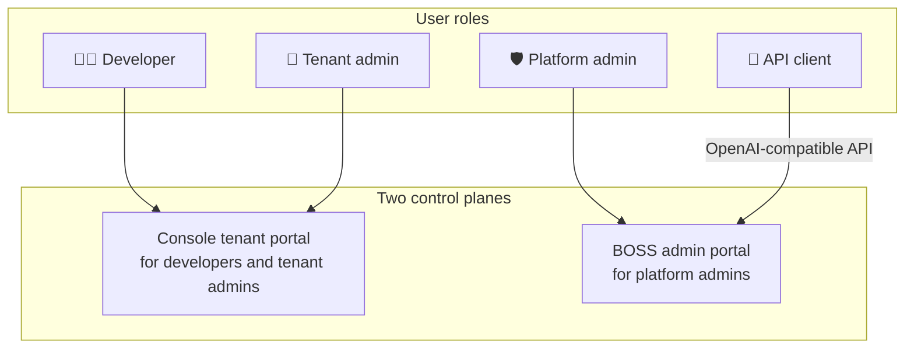
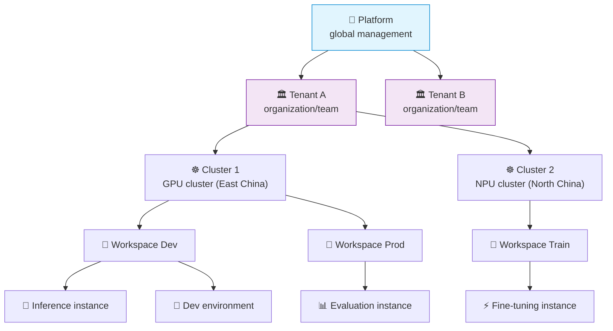
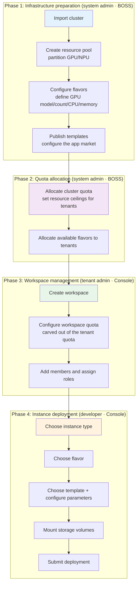
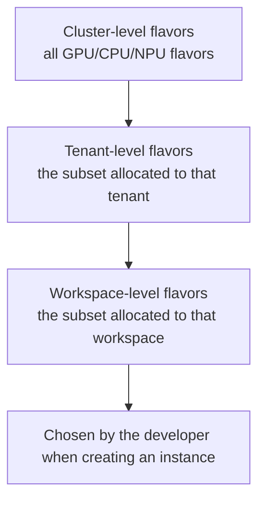
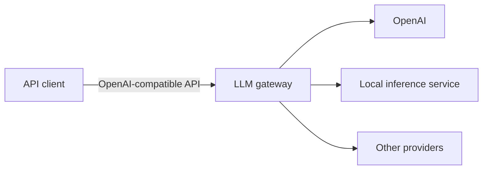
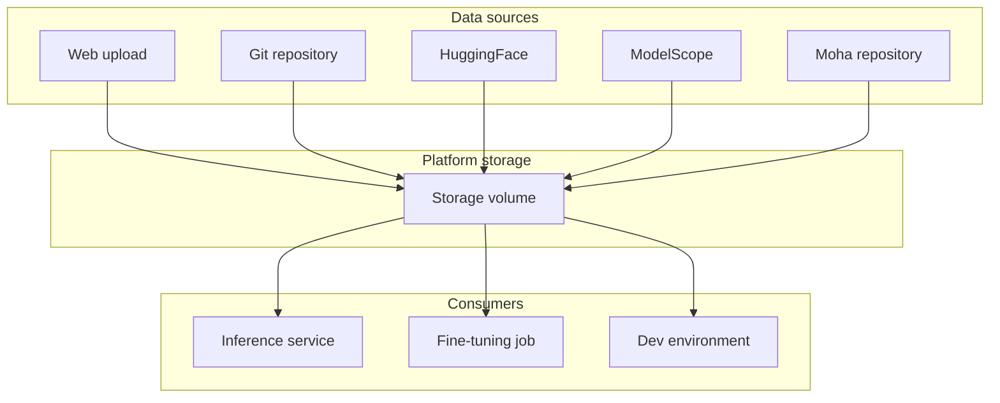

This article introduces the core concepts and overall structure of the Xiaoshi AI platform, to help you quickly understand how the platform is organised and divided into capabilities.

---

## Overall platform structure

The Xiaoshi AI platform is an enterprise-oriented platform for the full AI lifecycle. It provides inference deployment, model fine-tuning, development environments, model repositories, an LLM gateway and more. The platform consists of **three sub-products** and **two control planes**.

---

## Three sub-products

### Rune — AI workbench

Aimed at ML engineers and data scientists, providing AI workload management:

| Module | Description | Typical scenario |
|---------|------|---------|
| **Inference services** | Deploy models as online APIs with automatic GPU allocation | Deploy LLMs such as LLaMA and ChatGLM |
| **Fine-tuning services** | Submit SFT/LoRA fine-tuning jobs based on pretrained models | Domain fine-tuning with private data |
| **Dev environments** | Launch JupyterLab / VS Code Server remote development environments | Interactive model debugging and data exploration |
| **App management** | Deploy custom AI applications (web demos, API services, etc.) | Deploy Gradio/Streamlit apps |
| **Experiment management** | Track ML experiment parameters and metrics, compare runs | Record hyper-parameter searches and pick the best configuration |
| **Evaluation** | Run systematic benchmarks against models | Evaluate model quality with standard datasets |
| **Storage volumes** | Persistent storage that can be mounted into any instance, with a built-in file manager | Store model weights and training data |
| **App market** | A library of prebuilt templates with one-click deployment | Quickly deploy vLLM, TGI or LLaMA-Factory |

> 💡 Tip: All workload types share the same deployment flow: **choose a template → configure parameters → choose a flavor → submit**.

### Moha — Model hub

The platform's built-in AI asset repository, providing enterprise-grade model, dataset and image management:

| Module | Description | Typical scenario |
|---------|------|---------|
| **Model management** | Git-style version control with file browsing, branches and PRs | Manage private model version iterations |
| **Dataset management** | Dataset upload, version management and format preview | Manage training and evaluation datasets |
| **Image registry** | Container image management with security scanning | Manage custom training/inference container images |
| **Spaces** | Online showcase spaces hosting Gradio/Streamlit apps | Build model demo experiences |
| **Organizations** | Manage repositories and members by organization | Divide model asset ownership by team |
| **Image mirroring** | Automatic synchronisation from HuggingFace/ModelScope and similar sources | Mirror public models into an internal network |

### ChatApp — Conversation experience

An out-of-the-box LLM chat window that requires no coding:

| Module | Description | Typical scenario |
|---------|------|---------|
| **AI chat** | Pick a model and an API key, then chat with streaming responses | Try a privately deployed LLM |
| **Parameter tuning** | Adjust Temperature/TopP/MaxTokens and other parameters in real time | Developers tuning prompts and parameters |
| **Model comparison** | Two side-by-side panes to compare output quality | Evaluate answers from different models |
| **Token management** | Manage API access tokens and set usage limits | Control API call rate and scope |

---

## Two control planes

### Console — Tenant portal

The daily working interface for **tenant admins, developers and regular members**.

| Module | Core capabilities | Target users |
|------|---------|---------|
| **Rune** | Inference, fine-tuning, dev environments, apps, experiments, evaluation, storage volumes | Developers |
| **Moha** | Models, datasets, images, Spaces, organizations | Developers / data engineers |
| **ChatApp** | AI chat, parameter tuning, model comparison | All users |
| **Personal center** | Profile, security settings, SSH keys, API keys, tenant switching | All users |

### BOSS — Admin portal

The global management interface for **platform admins**.

| Module | Core capabilities | Target users |
|------|---------|---------|
| **Account center** | User management, tenant management, member role assignment | Platform admins |
| **Rune admin** | Cluster onboarding, resource pools, GPU/NPU flavors, templates/products, app market | Platform admins |
| **LLM gateway** | Channels, model metadata, tokens, content moderation, call logs, operations overview | Platform admins |
| **Data repository** | Platform-level model/dataset/image/Space management, image mirroring | Platform admins |
| **Platform settings** | System members, platform and sub-product display configuration, AI assistant, license | Platform admins |

> ⚠️ Note: Console and BOSS are two independent management interfaces; users cannot jump directly between them. Regular users work in Console, and only platform admins can access BOSS.

---

## Resource hierarchy model

The platform uses a five-level resource isolation model: **platform → tenant → cluster → workspace → instance**.

### Level descriptions

| Level | Managed by | Description |
|------|--------|------|
| **Platform** | System administrator | Globally manages all tenants, clusters and configuration. Operated through the BOSS admin portal |
| **Tenant** | Tenant administrator | The top-level unit of business isolation, corresponding to one organization or team. Data is fully isolated between tenants |
| **Cluster** | System administrator | The infrastructure that actually carries compute resources, supporting heterogeneous compute such as GPU and NPU |
| **Workspace** | Tenant administrator | The smallest resource isolation unit and the core container developers work in every day |
| **Instance** | Developer | The collective term for all kinds of AI workloads (inference, fine-tuning, dev environments, apps, experiments, evaluation) |

---

## Resource configuration flow

Onboarding a cluster through to a developer deploying an instance involves different roles collaborating:

### Three-level flavor inheritance

Flavors use a **cluster → tenant → workspace** three-level inheritance model. A system administrator defines all available flavors on the cluster, allocates them to tenants, and the tenant administrator then allocates a subset of those to workspaces.

> ⚠️ Note: resource quotas follow the same three-level inheritance. A workspace quota cannot exceed the tenant quota, and a tenant quota cannot exceed the cluster's total available resources.

---

## LLM gateway

The LLM gateway is the unified proxy layer for large language model calls, providing enterprise-grade API management.

**Core capabilities**:

| Capability | Description |
|------|------|
| **Unified access** | Wrap multiple LLM providers behind a single OpenAI-compatible API |
| **Channel routing** | Match a channel automatically by model name, with priority and fallback |
| **Token management** | Create independent access tokens for different users/teams with RPM/TPM rate limits |
| **Content moderation** | Safety checks on request and response content (keyword matching, AI review, etc.) |
| **Call logs** | Record the full detail of every API call (token usage, latency, channel, etc.) |
| **Rate limiting** | Limit request rate and token usage per token or globally |

> 💡 Tip: Inference services deployed inside the platform can be registered with the LLM gateway through **channel management**, so that all access goes through the gateway API and the inference service address is never exposed directly.

---

## Storage system

The platform provides object-storage-backed persistent storage.

**Storage volume workflow**:
1. **Create** a storage volume, specifying a name and capacity
2. **Import data**: upload through the page, or create a storage task to synchronise from Git/HuggingFace/ModelScope and other sources
3. **Mount and use**: associate the storage volume when deploying an instance; it becomes accessible once the instance starts
4. **Delete**: all associated instances must be stopped first, then the storage volume can be deleted

> ⚠️ Note: a storage volume cannot be deleted while it is mounted to a running instance. Stop or delete the associated instances first.

---

## Monitoring and logs

The platform provides full operational monitoring for instances, clusters and the gateway.

### Instance-level monitoring

| Capability | Description |
|------|------|
| **Runtime metrics** | GPU utilisation, VRAM usage, CPU, memory, network IO |
| **Container logs** | stdout/stderr logs with keyword search and live streaming |
| **Terminal access** | An interactive command-line terminal directly inside the container |
| **Monitoring panels** | Dynamically generated visual monitoring dashboards |

### Cluster-level monitoring

| Capability | Description |
|------|------|
| **Cluster dashboard** | Node overview, resource utilisation, scheduling status |
| **Log query** | Cluster-wide log search |
| **Resource monitoring** | GPU/NPU pool utilisation and quota consumption trends |

### Gateway operations data

| Capability | Description |
|------|------|
| **Usage records** | Token usage, latency, model and channel of every API call |
| **Call logs** | A complete request/response audit trail |
| **Operations panel** | Request trends, token usage statistics, channel distribution, error rate |

---

## Next steps

- [Glossary](./glossary) — core platform terminology
- [Roles and permissions](../account/auth/roles) — how the permission model works
- [Quick start](./quick-start) — a hands-on guide from scratch
- [Rune console](../rune/console/) — get started with the Console portal
