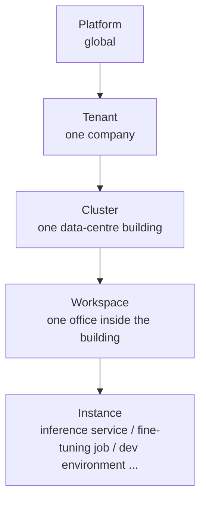

# Platform Concepts

When you click a button on the page, what has to happen before a model actually runs? This page talks through the platform's skeleton in plain language. After reading it you can answer three questions: **which layer the page, the back end and the machines each sit in**, **how a single click travels**, and **where model files and data are stored**.

:::tip The conclusion in one sentence

The platform has three layers: the **interface layer** (the web pages you see) → the **platform service layer** (back-end services, each with its own job) → the **foundation layer** (Kubernetes clusters and storage). You only deal with the interface layer; the platform looks after the other two for you.

:::

## The three layers

| Layer | What is inside it | What you notice |
| --- | --- | --- |
| **Interface layer** | The AI Platform, BOSS, Moha Hub and Chat App — all parts of the same web application | The place where you click menus and fill in forms |
| **Platform service layer** | Several back-end services for identity, clusters and resources, model assets, the model gateway and more | Where the data on the page comes from, and whether a button click took effect |
| **Foundation layer** | Kubernetes clusters (which hold the machines), storage (which holds files), accelerators (GPU/NPU) | Whether you have enough compute, and whether your model files are there |

## Interface layer: two entry points first

| Entry | URL pattern | Who uses it |
| --- | --- | --- |
| **AI Platform / Chat App / Moha Hub** | Starts with `/console` | Everyone inside a tenant |
| **BOSS** | Starts with `/boss` | Platform admins only |

The same web application decides which interface and menu to show based on the URL prefix. Regular users only ever use the `/console` set, and never see BOSS menus. That is normal.

:::info What the "Products" switcher at the top is

It is not a third system. It is a shortcut inside `/console` for moving between the sub-products: the AI Platform, Moha Hub and Chat App. All three share the same sign-in state and tenant identity.

:::

## How one click travels

Every action you take on the page becomes a network request to the back end. The platform does not send every request to the same service; it **splits them by URL path prefix**:

| Path prefix | Service responsible | Typical use |
| --- | --- | --- |
| `/api/iam` | Identity service | Sign-in, users, tenants, members and roles, captcha, multi-factor authentication, SSH keys |
| `/api/cloud` | Compute control service | Clusters, workspaces, instances, flavors, quotas, scheduling, logs |
| `/api/ai` | Metrics service | Instance runtime metrics |
| `/api/moha` | Moha Hub service | Models, datasets, images, organizations |
| `/api/airouter/v1` | Model gateway (management plane) | Tokens, call logs, usage, gateway settings |
| `/api/license` | License service | License records |
| `/airouter-data/v1` | Model gateway (data plane) | Actually sending a model conversation |

All of these requests go to the same domain you are already visiting, and one shared entry point behind that domain forwards them by prefix. So you never have to remember a pile of different back-end addresses — just open one web page.

:::tip Why `/airouter-data` is separate

The management-plane APIs authenticate with your browser session, which suits use inside the page. Calling a model from a program, on the other hand, needs a standalone secret (an API key), so the platform put the conversation endpoint separately under `/airouter-data`, where the key — not the session — is the credential. For the full difference, see [API Overview](/reference/api-overview).

:::

## Two "gateways" that are easy to confuse

| Name | What it is | Where you see it |
| --- | --- | --- |
| **Platform entry point** (a shared reverse proxy) | The single entry for all platform APIs; it forwards each request to the right back-end service | Every action you take on the page passes through it |
| **Model gateway** | A gateway dedicated to model-call traffic; it routes conversation requests to a model, applies rate limits, runs content moderation and records usage | Chat App, Marketplace, API Keys, Usage analysis |

In one line: **the platform entry point forwards "management" requests, and the model gateway forwards "model inference" requests.** They are not the same thing.

The model gateway also has several capabilities you can use directly:

| Capability | What you see |
| --- | --- |
| **One API** | Models deployed inside the platform and models from external providers are all called through the same API |
| **Channel routing** | You use one model name and the gateway picks an available channel for you |
| **Token rate limits** | Each API key can have its own requests-per-minute and token limits |
| **Content moderation** | Requests and replies go through a safety check and are blocked when a policy is hit |
| **Call records** | Every call leaves a record, visible under **Usage analysis** |

## Resource hierarchy: from the platform down to your instance

The platform manages resources in five levels, narrowing as you go down:

| Level | Plain-English meaning | Who manages it |
| --- | --- | --- |
| **Platform** | The whole platform, including every tenant and cluster | Platform admins, working in BOSS |
| **Tenant** | One company's own space, with members, assets and quota isolated from everyone else | Tenant admins |
| **Cluster** | One data-centre building, holding the real machines and accelerators | Onboarded by platform admins |
| **Workspace** | One office inside the building, shared by colleagues; the smallest unit of resource isolation | Allocated by tenant admins |
| **Instance** | The individual "machines" in the office: inference services, fine-tuning jobs, dev environments, applications, experiments, evaluations | Created and maintained by developers |

:::info Why you must pick a workspace before doing anything

Almost every action has to land inside one particular workspace, because quota, members and resources are all divided by workspace. That is why the workspace selector lives permanently at the top of the left menu.

:::

## Flavor and quota: three-level inheritance

**Flavor** (think of it as "how many CPU cores, how much memory and how many accelerators this machine has") and **quota** (how much you may use) both follow the same three-level inheritance:

| Level | What it means |
| --- | --- |
| Cluster level | A platform admin defines every available flavor on the cluster and marks out the total compute |
| Tenant level | A platform admin hands part of it to a tenant |
| Workspace level | A tenant admin then splits the tenant's share among workspaces |

Two practical conclusions follow:

1. **The flavors a workspace can use are always less than or equal to the tenant's allocation**, and the tenant's allocation never exceeds the cluster's total.
2. If you cannot see a flavor while deploying, it is usually **not a page error** — the current workspace simply does not have enough quota. Ask a tenant admin to adjust it.

## Where data lives: three ways models and files get in

| Route | Good for | After it is in |
| --- | --- | --- |
| **Storage (storage volumes)** | Large files such as model weights and datasets | Mount it when you deploy an instance; files survive instance restarts and deletion |
| **Moha Hub** | Models and datasets that need version management and sharing across people | Has branches, versions and pull requests, and can be referenced directly by a deployment |
| **Storage jobs** | Pulling files in from an external source | Fetch from a Git repository, HuggingFace, ModelScope or Moha Hub, running asynchronously in the background |

The relationship is: **a storage volume is an instance's hard disk, and Moha Hub is the shelf for models and data.** A model can be version-managed in Moha Hub and then mounted on an instance to run; a new model produced by fine-tuning can go back into Moha Hub or into a storage volume.

## Authentication and permissions

- After a successful sign-in the platform remembers who you are, so you do not have to type your password again for later actions.
- Inside a tenant there are only three roles: **admin**, **developer** and **member**. Different roles see different menus and buttons.
- A button that is not on the screen is usually **not a loading failure** — it means your role does not have that permission.

For exactly what each role can do, see [Permission Guide](/account/auth/roles); for a plain-English explanation of every term on the screen, see the [Glossary](/guide/glossary).

## Next steps

- [Glossary](/guide/glossary) — plain-English explanations and analogies for every term
- [Permission Guide](/account/auth/roles) — what each of the three roles can do
- [API Overview](/reference/api-overview) — the difference between management-plane and data-plane APIs
- [Quick Start](/guide/quick-start) — back to the hands-on steps
