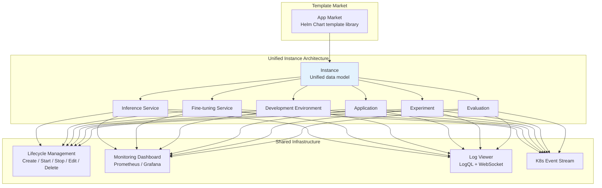
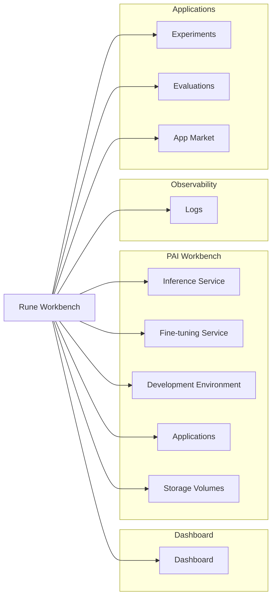
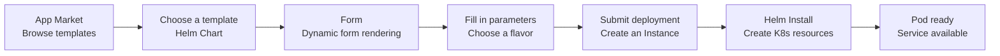
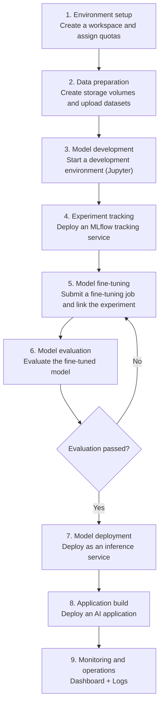

# Rune AI Workbench

## Introduction

The Rune AI workbench is the core module of the Console platform, providing AI engineers and researchers with complete lifecycle management capabilities for AI workloads. From model inference deployment, fine-tuning training, development and debugging, to experiment tracking, model evaluation and application implementation, Rune covers every key aspect of AI development.

Rune adopts a **unified instance architecture** and a **template-driven deployment model**. All workload types (inference, fine-tuning, development environment, application, experiment, evaluation) share the same underlying resource management, life cycle control and monitoring system, which greatly reduces users' learning costs and operation and maintenance complexity.

### Design concept

### Core Advantages

- **Unified Architecture**: All workload types share the Instance model, operate in the same way, and learn all functions once
- **Template driver**: A template system based on Helm Chart that dynamically generates configuration forms through forms without writing YAML
- **Multi-level resource management**: cluster → tenant → workspace three-level quota system, refined resource management and control
- **Multiple accelerator support**: Supports NVIDIA GPU, AMD GPU, Huawei NPU, Hygon DCU, Cambrian MLU and other accelerators
- **Full-link observability**: Complete observability solution for Prometheus monitoring + Loki logs + K8s events

## Navigation structure

After entering the Rune workbench, the left navigation bar displays the following modules:

## Context selection

Resource operations in the Rune workbench require selecting the correct context:

1. **Region/Cluster**: Region selector in the top navigation, select the target computing cluster
2. **Workspace**: Next to the area selector, select a specific workspace

:::tip
After selecting a different region and workspace, the page will automatically refresh to load the resources of the corresponding context. All workloads, including inference, fine-tuning, and applications, run inside the selected workspace. Resources for different teams can be managed by switching workspaces.
:::

---

## Unified Instance architecture

All workload types of the Rune platform are based on a unified **Instance** data model, and different types are distinguished by the `category` field. This means:

### Capabilities shared by all Instance types

| Capabilities | Description |
|------|------|
| Template deployment | Based on Helm Chart templates and dynamically generated forms |
| Flavor selection | Flavor specifications for CPU, GPU, and memory |
| Lifecycle | Create, start, stop, edit, and delete |
| Status management | Installed → Healthy → Succeeded / Failed |
| Monitoring dashboard | Prometheus metrics and Grafana-style dashboards |
| Log viewing | Instance-level logs and Pod-level logs |
| K8s events | Kubernetes event streaming |
| Pod Management | Pod List, Status View |

### Unique characteristics of each Category

| Category | Unique Features |
|----------|---------|
| `inference` | Gateway registration, API endpoint, model name display |
| `tune` | Web UI access, automatic marking of training completion Succeeded |
| `devenv` | Web UI access (Jupyter/VS Code) |
| `app` | PVC list, common web application deployment |
| `experiment` | Experiment endpoint API, integrated with fine-tuning tasks |
| `evaluation` | Evaluate Web UI, benchmark results |

---

## Template driven deployment model

All instance deployments of Rune follow a unified template-driven process:

1. **Template Definition**: Each template is a Helm Chart, including defining configurable parameters
2. **Form Rendering**: The Console front-end dynamically generates the configuration form according to Schema through the form component.
3. **Parameter filling**: The user fills in the parameters in the form (model path, hyperparameters, resource specifications, etc.)
4. **Instance Creation**: After submission, the backend executes Helm Install and creates resources in the K8s Namespace of the workspace.
5. **Status synchronization**: The system continuously synchronizes K8s resource status to display the running status of the instance.

---

## Overview of functional modules

| Module | Description | Category | Permission Requirements |
|------|------|----------|---------|
| [Inference Service](./inference.md) | Deploy model inference API, support gateway registration and multiple copies | `inference` | ADMIN / DEVELOPER |
| [Fine-tuning service](./finetune.md) | Submit model fine-tuning training tasks, support Web UI | `tune` | ADMIN / DEVELOPER |
| [Development environment](./devenv.md) | Start the Jupyter/VS Code interactive development environment | `devenv` | ADMIN / DEVELOPER |
| [Application Management](./app.md) | Deploy various AI applications and support PVC management | `app` | ADMIN / DEVELOPER |
| [Experiment Management](./experiment.md) | Deploy MLflow/Aim experiment tracking service | `experiment` | ADMIN / DEVELOPER |
| [Evaluation Management](./evaluation.md) | Model performance benchmark evaluation | `evaluation` | ADMIN / DEVELOPER |
| [Storage Volume Management](./storage.md) | Manage PVC persistent storage volumes | — | ADMIN / DEVELOPER |
| [Log View](./logging.md) | Log query and real-time streaming | — | ADMIN / DEVELOPER |
| [App Market](./app-market.md) | Browse and manage deployment templates | — | ADMIN / DEVELOPER |
| [Workspace Management](./workspace.md) | Manage workSpaces and members | — | ADMIN |
| [Quota Management](./quota.md) | View and manage resource quotas | — | ALL |
| [Specification View](./flavor.md) | View available computing resource specifications | — | ALL |

---

## The whole process of AI development

The Rune platform covers the complete process of AI development. The following is a typical workflow example:

---

## Quick start

### First time use

1. **Select context**: Select the target cluster and workspace in the top navigation
2. **Browse the Market**: Enter the App Market to learn about available templates
3. **Deployment Service**: Select template → fill in parameters → submit deployment
4. **View status**: View the instance status in the corresponding function module list
5. **Access Service**: Once the instance is ready, use the service through the web access button or API endpoint

### Recommended learning path

1. First read the [Inference Service](./inference.md) document to understand the general operating mode of the Instance architecture.
2. Select and read topic-specific documents such as [Fine-tuning Service](./finetune.md) and [Development Environment](./devenv.md) based on your needs.
3. Understand how [Workspace](./workspace.md) and [Quota](./quota.md) management work.
4. Learn how to view and troubleshoot [Logs](./logging.md).

:::tip
Since all workload types share a unified instance architecture, after mastering the operation process of the inference service, the fine-tuning, development environment, application and other functions are used in very similar ways. You only need to pay attention to their unique characteristics.
:::
