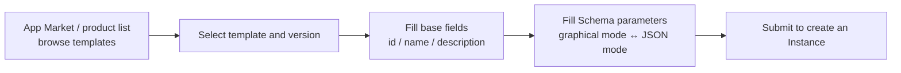

# Rune Console

Rune provides a full lifecycle for AI workloads. Every workload shares the same **Instance** data model and the same template-driven deployment mechanism.

## Unified Instance Architecture

Inference, fine-tuning, dev environments, applications, experiments, and evaluations are all instances, distinguished by `category`:

| Category | Module | Description |
| --- | --- | --- |
| `inference` | Inference Service | Deploy model inference services; can register with the gateway |
| `tune` | Fine-tuning | Submit fine-tuning jobs |
| `im` | Dev Environments | Interactive development environments |
| `app` | Applications | General application deployment; detail page adds a PVC list |
| `experiment` | Experiments | Deploy experiment tracking services |
| `evaluation` | Evaluations | Deploy evaluation services |

> ⚠️ Note: The dev environment category is `im`, not `devenv`. The route is `.../ims`, the product category is `/rune/products/im`.

### Capabilities Shared by All Instances

| Capability | Description |
| --- | --- |
| Template deployment | Form generated from the product template's JSON Schema |
| Parameter editing | Graphical mode and JSON mode, switchable |
| Lifecycle | Create, edit, pause/resume, delete |
| Scaling | `ScaleAction` in the detail action menu |
| Status | `InstanceStatusPhaseEnum` (12 values) |
| Observability | Monitoring, instance logs, Pod logs, K8s events |
| Pod management | Pod list and container actions |

## Navigation Structure

The left navigation has three groups:

- **Dashboard**: Dashboard, App Market
- **PAI Workbench**: Inference Service, Fine-tuning, Dev Environments, Applications, Instance Templates, Storage Volumes
- **Observability**: Experiments, Logs, Evaluations

PAI Workbench and Observability require the tenant role `ADMIN` or `DEVELOPER`.

## Context Selection

1. **Region / Cluster**: switch the target cluster.
2. **Workspace**: switch the workspace; all instance lists reload.

> 💡 Tip: If the current cluster has no workspace, the front end uses `WorkspaceGuard` to show an empty state (tenant administrators also see a button to the workspace list).

## Template-Driven Deployment

```mermaid
flowchart LR
 A["App Market / product list<br/>browse templates"] --> B["Select template and version"]
 B --> C["Fill base fields<br/>id / name / description"]
 C --> D["Fill Schema parameters<br/>graphical mode ↔ JSON mode"]
 D --> E["Submit to create an Instance"]
```

See [Create Workloads](/rune/guide/workloads) for details.

## Instance Detail (Common)

Every instance detail page shares the same skeleton (`src/pages/rune/instances/components/detail-layout.tsx`):

### Tabs

| Tab | value | Content |
| --- | --- | --- |
| Overview | `overview` | Info card + Pod list (applications additionally show a PVC list) |
| Monitoring | `monitoring` | Instance monitoring |
| Logging | `logging` | Instance logs |
| Events | `events` | Kubernetes events |

### "Actions" Menu

| Item | Description |
| --- | --- |
| Edit | Open the instance edit page |
| Start / Stop | Toggle based on `values.global.paused` |
| Scale | `ScaleAction` |
| Type-specific items | e.g. inference adds "Save as template", "Gateway configuration", "Decrypt model" |
| Delete | Confirmed deletion |

## Modules

| Module | Category |
| --- | --- |
| [Inference Services](./inference.md) | `inference` |
| [Fine-tuning](./finetune.md) | `tune` |
| [Dev Environments](./devenv.md) | `im` |
| [Applications](./app.md) | `app` |
| [Experiments](./experiment.md) | `experiment` |
| [Evaluations](./evaluation.md) | `evaluation` |
| [App Market](./app-market.md) | — |
| [Storage Volumes](./storage.md) | — |
| [Run Logs](./logging.md) | — |
| [Workspaces](./workspace.md) | — |
| [Quota Management](./quota.md) | — |
| [Compute Flavors](./flavor.md) | — |
| [AI Diagnostics Assistant](./diagnostics.md) | — |
