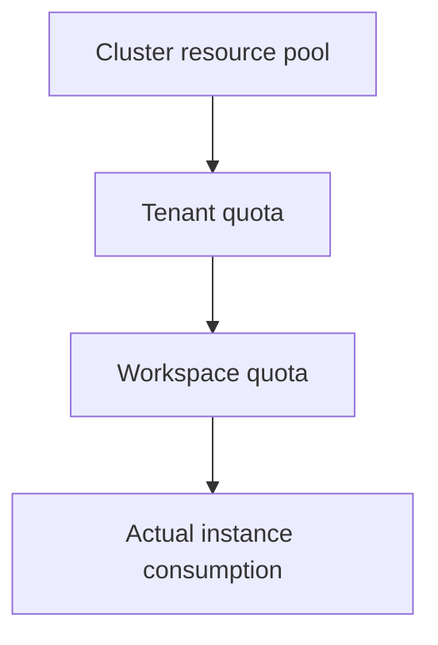

# Quota

A quota answers "**how much may I spend this period**". The platform splits cluster resources layer by layer through "resource pool → tenant → workspace", and creating an instance consumes the share that the current workspace received. Once the allowance is used up, you cannot create an instance even if the cluster still has idle machines.

:::tip Quota in one sentence
A quota is like the data allowance in a phone plan: the total is allocated from above, you should pay attention once you reach 80%, and creation fails once you hit the limit.
:::

## The quota hierarchy

If the upper layer does not give you an allocation, the lower layer cannot use it. So when instance creation fails, look at the workspace quota first rather than only checking whether the cluster has idle resources.

## Before you start
- Role: viewing quotas requires **Administrator** or **Developer**; creating a workspace quota requires a **tenant administrator**.
- Region: select a **cluster** at the top of the page first. With no cluster selected, quotas are not queried.

## View tenant quota
1. Click **Account Center** in the top navigation.
2. In the left **Account Center** group, click **Tenant** to open the tenant list.
3. Open your tenant, then click **Quota** in the left **Tenant Management** group.

This table is scoped to the currently selected cluster: accelerators, storage, CPU and memory each get a row, and the **Quota** column shows "used / total" with a progress bar underneath. The **Type** tabs (CPU / Disk / Memory) narrow it to one kind.

The page shows the allowance for the currently selected cluster. Meaning of each column:

| Column | Description |
| --- | --- |
| Type | The resource category, for example CPU, Memory, GPU, VGPU |
| Model | The accelerator card model |
| Resource Pool | Which resource pool this allowance comes from |
| Quota | "used / total" for each resource plus a progress bar; the closer to the limit, the more urgent the color |

Above the list there is also a filter bar that narrows by **Type → Model**, so you can look at just one kind of resource.

:::tip Progress bar colors
The progress bar shows the used ratio: above 80% it turns yellow, above 90% it turns red, warning you that the allowance is nearly used up.
:::

## View and adjust workspace quota
A workspace quota is the share allocated to a particular workspace, and it is the layer tenant administrators work with most often.

1. **Account Center** → **Tenant**, open your tenant, then click **Workspace** on the left.
2. Open a workspace and click the **Quota** tab to see that workspace's allowance.
3. If you are a **tenant administrator**, a **Create Quota** button appears in the top-right corner, and each row also has edit and delete actions.

### Create a workspace quota
1. Click **Create Quota**.
2. Under **Quota Config**, fill in:

   | Form item | How to fill | Notes |
   | --- | --- | --- |
   | Resource Pool | Select a resource pool | Which pool this allowance is carved out of |
   | Resource | Add item by item: **Category** → **Resource** → **Model** → **Limit** | Click **Create Resource** for each item; the same resource cannot be added twice |
   | Limit | Enter a quantity | Cannot exceed what the parent (tenant) can still allocate |

3. Click **Confirm**.

:::warning Insufficient quota causes creation failure
Seeing "the cluster still has resources" on the page does not mean the current workspace can definitely deploy. What actually takes effect is the available allowance after layer-by-layer allocation. When the allowance is insufficient, ask a tenant administrator to adjust the workspace quota.
:::

Before deleting a quota, confirm that no instance still depends on it; once deleted it cannot be brought back by undoing.

## Common resource types
| Type | Description |
| --- | --- |
| CPU | Compute cores |
| Memory | Runtime memory |
| GPU | Dedicated graphics cards |
| VGPU | Graphics cards shared by splitting video memory or compute power |
| Storage | Persistent capacity |
| Ephemeral Storage | The temporary disk of an instance |
| Disk | Disk resources |

## Tips
- Split into workspaces by team or project first, then allocate quotas, so the accounts are clearer.
- Break GPUs down by model to avoid high-end cards being filled by low-priority tasks.
- When an instance fails to be created, check the workspace quota first rather than only checking whether the cluster still has free resources.

## Related
- [Flavor](/rune/console/flavor)
- [Workspace](/rune/console/workspace)
