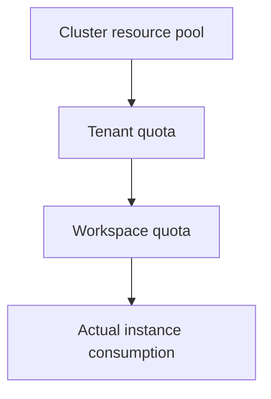

# Quota
A quota defines "how much a subject may use at most". Rune quotas flow from the cluster resource pool down to a tenant, and are then allocated by the tenant to workspaces.

## Quota Hierarchy

## Where You See Quotas

| Page | Path | Purpose |
| --- | --- | --- |
| Tenant quotas | `/rune/tenants/:tenant/quotas` | View the current tenant's quota on the specified cluster |
| Workspace quotas | `.../workspaces/:workspace/quotas` | Allocate resources at the workspace level |

## Tenant Quota Page

This page **depends on the currently selected region/cluster**: no quota query is issued when no cluster is selected.

Page capabilities (`src/pages/rune/tenant/quotas/list.tsx`):

- Uses `QuotaFilterBar` to filter by flavor dimensions; candidates come from `getTenantQuotaSelector`.
- List fields are defined by `useQuotaFields`, with four columns:

| Column | Field | Description |
| --- | --- | --- |
| Type | `type` | Resource type (CPU / GPU / vGPU / memory, etc.) |
| Model | `model` | Accelerator model (shown by `vendor`) |
| Resource Pool | `resourcePool` | Owning resource pool |
| Quota | `quota` | Usage rendering (`QuotaResourcesUsage`) |

- The page disables search and the toolbar and provides only the filter bar described above.

> ⚠️ Note: The independent columns given in the old documentation ("Cluster / Allocated / Used / Quota Limit / Usage Rate") do not fully match the current four `useQuotaFields` columns; the allocated / used / limits values are all shown inside the usage cell.

> ⚠️ Note: The exact meaning of fields such as `limits` / `allocated` / `used` in a quota record is subject to the backend contract, and the frontend does not constrain them, so it is not yet confirmed here.

## Workspace Quotas

Workspace quotas live under the workspace detail and are the layer tenant administrators operate most often. They support view, create, edit, and delete (routes `.../quotas` and `.../quotas/:quota?action=edit`).

> ⚠️ Note: The exact fields of the workspace quota form (such as the naming and validation of Requests / Limits) are not yet confirmed; refer to the actual form.

Workspace quotas come from the tenant's available allowance on that cluster, so creation fails when the parent quota is insufficient.

## Common Resource Types

| Type | Description |
| --- | --- |
| CPU | Compute cores |
| Memory | Runtime memory |
| GPU / vGPU | Graphics resources |
| NPU / DCU / MLU | Heterogeneous accelerators |
| Storage | Persistent capacity |

## Governance Advice

- Split by team or project into workspaces first, then allocate quotas.
- Break GPUs down by model to avoid high-end cards being occupied by low-priority tasks.
- When deployment fails, check the workspace quota first rather than only whether the cluster still has free resources.

> ⚠️ Note: The quota page showing "the cluster still has resources" does not mean the current workspace can necessarily deploy; what actually takes effect is the available allowance after hierarchical allocation.

## Permission Requirements

Viewing tenant quotas is open to all members; creating/editing/deleting workspace quotas is performed by tenant administrators or workspace administrators.
