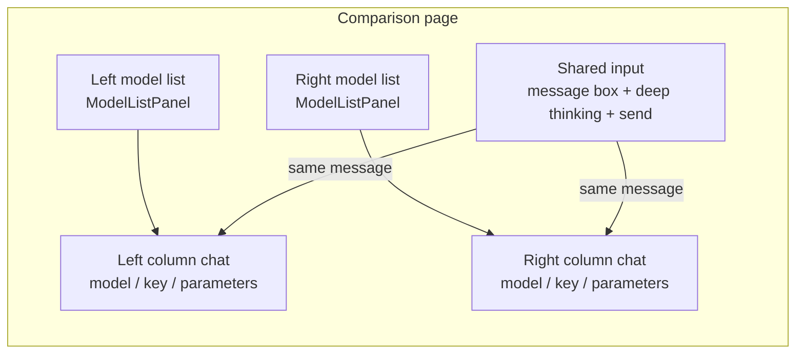

## Overview

Model Comparison (front-end route `/chatapp/contrast`) provides a **two-column** layout: one message is sent to **both** selected models at once, and the streaming output is observed in parallel. It is used for model selection, version evaluation and parameter comparison.

> ⚠️ **Note**: The real route of the comparison page is `/chatapp/contrast`. There is no `/chatapp/compare` route (`routes/paths.ts:71-85`).

## Page layout

The page consists of a model-selection area on the left, two conversation columns and a shared input area (`contrast.tsx`):



| Area | Description | Evidence |
|------|-------------|----------|
| Left model list | Fixed 320px, shown from `md` up; an upper and a lower list map to the "left model" and "right model" | `contrast.tsx:501-546` |
| Left/right columns | Each has an API key selector, the model `id`, a parameter popover and a clear-chat action; below `md` they stack vertically | `contrast.tsx:568-659` |
| Shared input | One input box + one deep-thinking toggle + send/stop | `contrast.tsx:663-676` |

## Independent vs shared configuration

| Configuration | Left | Right | Note |
|---------------|------|-------|------|
| Model | Independent | Independent | Chosen from each side's own list; may be the same or different |
| API key | Independent | Independent | Both default to the first available key of the account |
| Chat parameters | Independent | Independent | Set through each column's own parameter popover |
| Message list | Independent | Independent | Histories do not affect each other |
| Loading / error state | Independent | Independent | A timeout or error on one side does not affect the other |
| **Deep thinking** | **Shared** | **Shared** | The only shared configuration |

Both sides start with the same defaults: `temperature`=0.7, `topP`=0.8, `maxTokens`=4096, `systemPrompt`='', `stop`='' (`contrast.tsx:67-81`).

## Sending and streaming

After clicking send (or pressing Enter) the front end issues one independent SSE request per side (`contrast.tsx:134-145,381-393`):

```text
POST /airouter-data/v1/chat/completions
Authorization: Bearer {token of that side}
X-Tenant / X-Workspace / X-Channel

{
  "messages": [...],
  "stream": true,
  "model": "<model id of that side>",
  "temperature": <parameters of that side>,
  "max_tokens": <parameters of that side>,
  "top_p": <parameters of that side>,
  "reasoning_effort": "high" | "none",
  "stop": null | ["<value>"]
}
```

| Behaviour | Description |
|-----------|-------------|
| Parallel send | One message hits both sides, each maintaining its own context |
| Independent stop | Each column has its own stop button; the stop button in the shared input stops both sides |
| Independent clear | Each column's "clear chat" only clears that side |
| Deep thinking | Both sides share one toggle; when on, both submit `reasoning_effort: "high"`, otherwise `"none"` |

## Use cases

| Scenario | Approach |
|----------|----------|
| Model selection | Pick different models on each side, use the same parameters and the same set of business questions, and compare quality, speed and token cost |
| Version evaluation | Put different versions of the same model on each side and reproduce typical scenarios |
| Parameter comparison | Put the same model on both sides and change only one side's Temperature or Top P to observe the difference |

> 💡 **Tip**: Change only one variable at a time (the model or a parameter) so the source of a difference is clear.

## Comparison dimensions

| Dimension | How to observe |
|-----------|----------------|
| Reply quality | Compare accuracy, completeness and relevance on both sides |
| Response speed | Watch how fast each side's stream progresses |
| Reasoning | Enable deep thinking and compare the reasoning traces and conclusions |
| Token efficiency | Compare the token usage shown under each reply |
| Instruction following | Use the same System Prompt and compare how well it is followed |

> ⚠️ **Note**: The comparison history lives in front-end memory and is **cleared by a page refresh**. Capture or record important results promptly.
