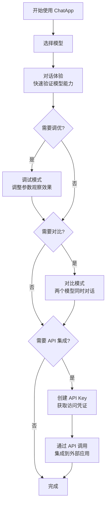
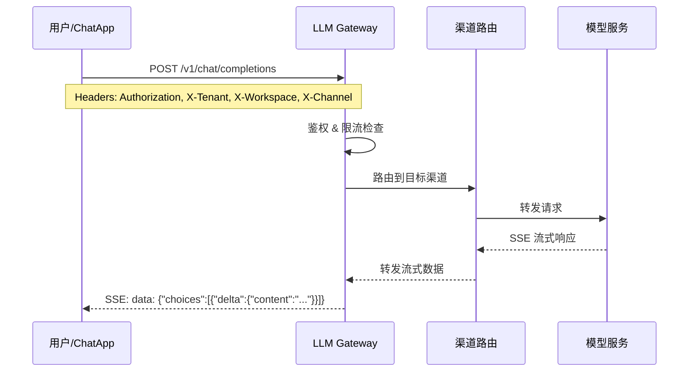

# ChatApp Overview

## Introduction

ChatApp is the **LLM Playground** (large language model playground) built into the Rune Console, providing developers and business users with a one-stop AI large model interaction experience. Through ChatApp, you can directly conduct real-time conversations, parameter debugging, and multi-model horizontal comparison with various large language models deployed on the platform, and integrate capabilities into external applications through the API Key mechanism.

The bottom layer of ChatApp is connected to the **LLM Gateway (AI Router)** service. All requests are routed and controlled through a unified OpenAI compatible API endpoint. It supports enterprise-level features such as streaming output (SSE), rate limiting, content review, and multi-channel distribution.


## Enter path

Console Homepage → Click on the **ChatApp** card, or via the top navigation bar → **ChatApp**

## Core concepts

### OpenAI compatible API

All ChatApp conversation requests are completed through the OpenAI-compatible Chat Completions endpoint:

```
POST /airouter-data/v1/chat/completions
```

The request and response formats are completely consistent with the OpenAI API, supporting both streaming (`stream: true`) and non-streaming modes. This means you can use any OpenAI SDK-compatible client to interact with platform models.

### Model Visibility

Models on the platform are divided into three categories based on visibility:

| Visibility | Description |
|--------|------|
| **Public** | Common model available to all tenants |
| **Tenant** | Models visible only within the current tenant |
| **Private** | Models visible only within a specific workspace |

### LLM Gateway Service

ChatApp routes requests through LLM Gateway, which provides the following core capabilities:

- **Channel Management**: unified access to multiple model providers
- **Rate Limit**: Limit current flow based on Token (TPM) and number of requests (RPM) dimensions
- **Content Moderation**: Policy-based request/response moderation
- **Audit Log**: Complete request link tracing

## Function module

| Module | Entry | Description |
|------|------|------|
| [AI conversation experience](./experience.md) | ChatApp → Conversation experience | Real-time conversation with the model, supporting in-depth thinking, parameter tuning and Markdown rendering |
| [Conversation debugging](./debug.md) | ChatApp → Debugging | Left and right column layout, real-time adjustment of parameters and observation of model output changes |
| [Multi-model comparison](./compare.md) | ChatApp → Comparison | Symmetrical double-column layout, sending the same message to two models at the same time for comparison |
| [API Key Management](./token.md) | ChatApp → Token Management | Create and manage ChatApp API access tokens, configure current limiting and IP whitelisting |

## Typical workflow



## Request flow structure



:::tip
All conversation parameters and model selection experience in ChatApp can be directly applied to API integration, and the parameter names and value ranges are exactly the same.
:::

:::warning
Before using ChatApp, make sure there are model channels available under the current tenant/workspace, otherwise the model list will be empty. If you need to configure channels, please contact the platform administrator to add them in [Gateway Management](../boss/gateway/channels.md) in the Boss backend.
:::

## Quick start

1. Enter ChatApp → **Conversation Experience**
2. Select an available model from the top model selector
3. Enter your question in the input box and press **Enter** to send
4. View the model’s streaming responses
5. As needed, switch to **Debug** or **Compare** mode to evaluate the model in depth
6. For API integration, go to **Token Management** to create an access key