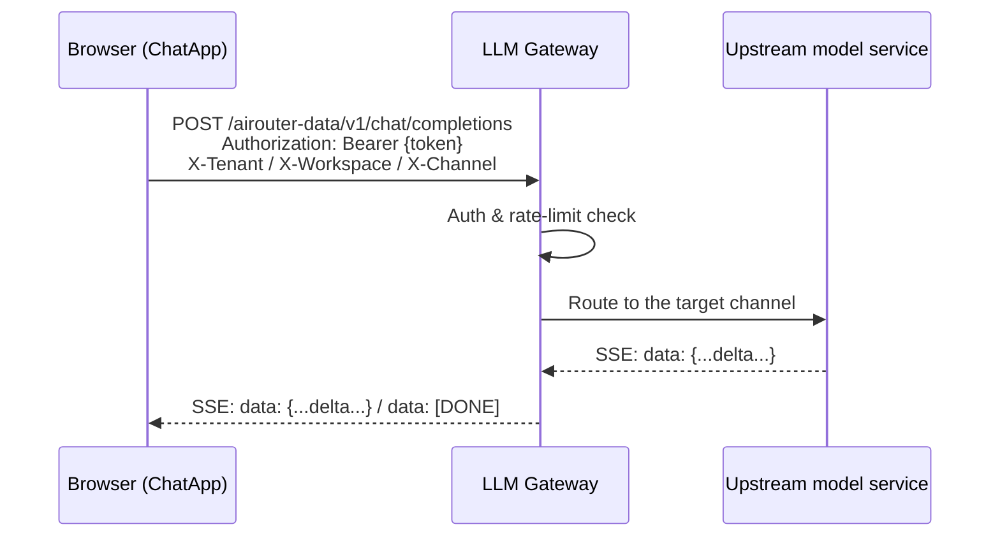

## Introduction

ChatApp is the **LLM Playground** built into Rune Console. It lets developers and business users pick a model and an API key, tune inference parameters, chat with streaming output, compare two models side by side, and integrate the same capability into external applications through an API key.

All conversation requests go through the **LLM Gateway (AI Router) data plane**, which exposes an OpenAI-compatible Chat Completions endpoint:

```text
POST {origin}/airouter-data/v1/chat/completions
```

The front-end route prefix is `/chatapp`. Switch to **ChatApp** from the top navigation bar to enter.

## Top navigation (5 items)

ChatApp has exactly 5 top-level navigation items (`src/pages/chatapp/layout.tsx:24-50`):

| Item | Route | Description |
|------|-------|-------------|
| **Marketplace** | `/chatapp/marketplace` | Browse the models visible to you, inspect model cards, channels and prices, and find the API docs and a "Go to playground" entry |
| **Experience** | `/chatapp/experience` | Single-model streaming chat with a model list, message list, parameter popover and model info panel |
| **Comparison** | `/chatapp/contrast` | Two columns that each select their own model and parameters; one message is sent to both sides |
| **My Tokens** | `/chatapp/tokens` | Create and manage ChatApp API access tokens, with RPM/TPM limits and an IP allowlist |
| **Usage** | `/chatapp/analysis` | Dashboard for request volume, tokens, cost and success rate |

> ⚠️ **Note**: ChatApp has **no standalone "Debug" page** and no `/chatapp/compare` route. "Parameter debugging" is the parameter popover at the top of the Experience page (`ChatParamsPopover`); the comparison page is served at `/chatapp/contrast` and the token list at `/chatapp/tokens`.

## Core concepts

### OpenAI-compatible API

Every conversation request uses the OpenAI-compatible Chat Completions endpoint. The request body matches OpenAI and supports both streaming (`stream: true`) and non-streaming calls. Browser requests carry these headers:

| Header | Description |
|--------|-------------|
| `Authorization: Bearer {token}` | ChatApp token (created under My Tokens) |
| `X-Tenant` | Tenant that owns the model (non-ASCII values are URL-encoded) |
| `X-Workspace` | Workspace that owns the model (same encoding) |
| `X-Channel` | Channel that serves the model (same encoding) |

> 💡 **Tip**: The console itself authenticates with the `user_session` cookie (`src/lib/axios.ts:21-28` does **not** inject `Authorization`); the Bearer + `X-*` header set above belongs to the **conversation data plane**.

### Model visibility

Models are grouped by `visibility`, shown in the UI as "Public / Tenant / Private":

| Visibility | UI label | Description |
|------------|----------|-------------|
| `public` | Public | Platform-wide model |
| `tenant` | Tenant | Visible inside the current tenant |
| `private` | Private | Visible to the current workspace/owner |

The model list is a tree ordered **visibility → channel → model** (`model-list-panel.tsx:59-110`), not a set of tabs.

### LLM Gateway capabilities

Requests are routed by the LLM Gateway, which provides channel management, RPM/TPM rate limiting, content moderation and audit logging.

## Feature modules

| Module | Documentation | Description |
|--------|---------------|-------------|
| Marketplace | [Model Marketplace](./marketplace.md) | Browse models, inspect channels and prices, copy model IDs, view API samples |
| Experience | [Model Playground](./experience.md) | Streaming chat, deep thinking, token usage display |
| Parameters | [Parameter Tuning](./debug.md) | The Experience page parameter popover: System Prompt / Top P / Temperature / Max Tokens / Stop |
| Comparison | [Model Comparison](./compare.md) | Two independently configured columns fed by one message |
| Tokens | [Token Management](./token.md) | Create/edit/delete tokens, RPM/TPM limits and IP allowlist |
| Usage | [Usage Statistics](./usage-statistics.md) | Usage dashboard, default today, auto-refresh every 30 seconds |

## Request path


```mermaid
sequenceDiagram
 participant User as Browser (ChatApp)
 participant Gateway as LLM Gateway
 participant Model as Upstream model service

 User->>Gateway: POST /airouter-data/v1/chat/completions<br/>Authorization: Bearer {token}<br/>X-Tenant / X-Workspace / X-Channel
 Gateway->>Gateway: Auth & rate-limit check
 Gateway->>Model: Route to the target channel
 Model-->>Gateway: SSE: data: {...delta...}
 Gateway-->>User: SSE: data: {...delta...} / data: [DONE]
```

## Quick start

1. Switch to **ChatApp** in the top navigation and open **Marketplace** to see which models and channels are available
2. Open **Experience**, pick a model from the left-hand list, and choose a token in the token/API key selector
3. To tune parameters, click the **parameters** icon at the top to open the popover
4. Type your question and press **Enter** to send; watch the streaming reply and the token usage
5. To compare side by side, open **Comparison** and chat with two columns at once
6. To call the model from your own application, open **My Tokens** and create an access key

> ⚠️ **Note**: If the model list is empty, no model channel is available for the current tenant/workspace. Channels are maintained by the platform administrator in **BOSS → Gateway → Model List / Model Metadata**.
