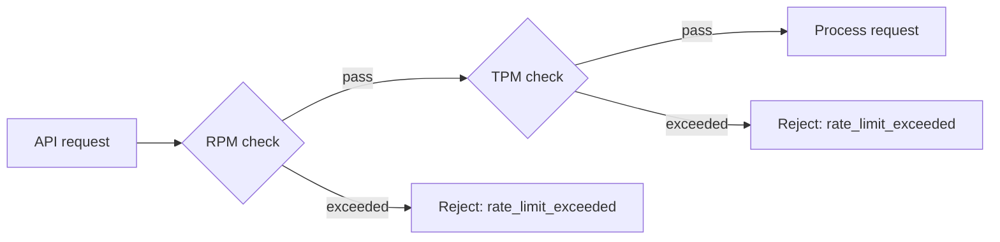

## Overview

Token Management (front-end route `/chatapp/tokens`) creates and manages **ChatApp API access tokens**. A token is the credential for the conversation data plane (`/airouter-data/v1/chat/completions`) and can carry its own RPM/TPM limits, IP allowlist and expiry policy.

> ⚠️ **Note**: ChatApp tokens and the IAM [API key](/account/iam/api-key) are two separate credential sets. ChatApp tokens are used for the conversation data plane; the IAM API key is used for platform management-plane APIs.

> ⚠️ **Note**: The real route is `/chatapp/tokens`; there is no `/chatapp/token` (`routes/paths.ts:78-84`).

## Page structure

| Tab | Route | Description |
|-----|-------|-------------|
| **API Keys** | `/chatapp/tokens` | Token list with create/edit/delete |
| **Request Logs** | `/chatapp/tokens/logs` | Call logs |

## Token fields

The token data structure (`src/types/apikey.ts`):

| Field | Type | Description |
|-------|------|-------------|
| `id` | number | Unique token identifier (system-generated) |
| `name` | string | Token name (user-defined, cannot be changed after creation) |
| `apiKey` | string | Token value |
| `account` | string | Creator account |
| `belongTo` | string | Ownership information |
| `expiresAt` | number/string | Expiry time |
| `rateLimitRPM` | number | Maximum requests per minute |
| `rateLimitTPM` | number | Maximum tokens per minute (unit K, 1K = 1000 tokens) |
| `allowedIPs` | string[] | IP allowlist |
| `createdAt` / `updatedAt` | string | Creation / update time |
| `status` | string | `active` / `expired`, computed on the front end from `expiresAt` |

## List columns

| Column | Description |
|--------|-------------|
| **Name** | Click to open the detail page |
| **API Key** | Masked (first 6 characters + `************`) with a copy button |
| **RPM** | Requests per minute; shown as "unlimited" when `0` or empty |
| **TPM(K)** | Tokens per minute in K; shown as "unlimited" when `0` or empty |
| **Allowed IPs** | Configured allowlist; empty or containing `*` means unrestricted |
| **Expires At** | Shown as "never expires" when `expiresAt` is empty or 1970 |

## Creating a token

Click the create button on `/chatapp/tokens` to open the form (`tokens/components/form.tsx`).

### Form fields and validation

| Field | Default | Validation | Note |
|-------|---------|------------|------|
| **Name** (`name`) | `''` | Required | Disabled when editing (cannot be changed) |
| **RPM** (`rateLimitRPM`) | empty | Number, 0 ~ 10000 | Empty or `0` means unlimited |
| **TPM(K)** (`rateLimitTPM`) | empty | Number, 0 ~ 100000 | Empty or `0` means unlimited |
| **Allowed IPs** (`allowedIPs`) | `'*'` | One IP or CIDR per line or comma | Defaults to `*`, meaning all IPs |
| **No expiry** (`noExpires`) | `true` | — | When turned off, an expiry time is required |
| **Expires at** (`expiresAt`) | — | Required when "No expiry" is off | |

> 💡 **Tip**: `allowedIPs` defaults to `'*'` and `noExpires` defaults to `true` (`form.tsx:132-138`).

### Handling on submit

| Input | Submitted value |
|-------|-----------------|
| RPM / TPM is `0` or empty | The field is not submitted (treated as unlimited, `form.tsx:162-172`) |
| Allowlist empty | Submits `["*"]` (`form.tsx:173-178`) |
| "No expiry" on | `expiresAt` is not submitted (`undefined`) |
| "No expiry" off | `expiresAt` is converted to Unix seconds |

### IP allowlist format

| Format | Example |
|--------|---------|
| Single IPv4 | `192.168.1.100` |
| CIDR range | `10.0.0.0/24` (mask 0~32) |
| Wildcard | `*` (all IPs) |

Validation rules: four octets of 0~255; no leading zeros (e.g. `01`); CIDR mask 0~32; multiple values may be separated by an English comma or a newline.

## Editing and deleting

- **Edit**: the name cannot be changed; RPM/TPM/allowlist/expiry can.
- **Delete**: requests using the token fail immediately afterwards and the action cannot be undone.

## Token detail

The detail page (`/chatapp/tokens/:id`) shows the configuration and a **call history**. Log fields (`tokens/request-logs.tsx`, `services/api-key.ts:200-237`):

| Field | Description |
|-------|-------------|
| `timestamp` | Request time (from `occurredAt`) |
| `model` | Model called |
| `provider` | Provider |
| `channelId` / `channelName` | Channel |
| `tenantId` / `tenantName` | Tenant |
| `workspace` | Workspace |
| `requestId` | Request trace ID |
| `latencyMillis` | Latency in milliseconds |
| `status` | `success` or `blocked` (mapped from `result`) |
| `promptTokens` / `completionTokens` / `totalTokens` | Token usage |

> 💡 **Tip**: A `blocked` record usually means the request was rate limited or blocked by content moderation.

## Rate limits

| Dimension | Field | Range | Meaning when empty |
|-----------|-------|-------|--------------------|
| RPM | `rateLimitRPM` | 0 ~ 10000 | Unlimited |
| TPM(K) | `rateLimitTPM` | 0 ~ 100000 | Unlimited |



> ⚠️ **Note**: Token-level and channel-level rate limits are independent. A channel may still reject a request even when the token is under its own limit.

## Expiry policy

- "No expiry" on: `expiresAt` is not submitted and the token stays valid indefinitely.
- "No expiry" off: a specific expiry time is set.
- Front-end status: `active` while the current time is before `expiresAt`, otherwise `expired`; expired tokens cannot be used.

## API endpoints (management plane)

| Operation | Method and path |
|-----------|-----------------|
| List (personal) | `GET /api/airouter/v1/me/tokens` |
| Create (personal) | `POST /api/airouter/v1/me/tokens` |
| Get by ID | `GET /api/airouter/v1/tokens/by-id/{id}` |
| Update by ID | `PUT /api/airouter/v1/tokens/by-id/{id}` |
| Delete by ID | `DELETE /api/airouter/v1/tokens/by-id/{id}` |
| Usage logs | `GET /api/airouter/v1/me/tokens/{token}/usage-logs` |

## Call example (data plane)

```bash
curl -X POST https://your-domain/airouter-data/v1/chat/completions \
  -H "Authorization: Bearer YOUR_CHATAPP_TOKEN" \
  -H "Content-Type: application/json" \
  -H "Accept: text/event-stream" \
  -H "X-Tenant: your-tenant" \
  -H "X-Workspace: your-workspace" \
  -H "X-Channel: your-channel" \
  -d '{
    "model": "your-model-name",
    "messages": [{"role": "user", "content": "Hello"}],
    "stream": true,
    "temperature": 0.7,
    "max_tokens": 4096,
    "top_p": 0.8,
    "reasoning_effort": "none",
    "stop": null
  }'
```

## Security recommendations

| Recommendation | Description |
|----------------|-------------|
| One token per application | Create a separate token for each application/environment instead of sharing |
| Configure the allowlist | Restrict the token to specific IPs/CIDRs (the default `*` is unrestricted) |
| Set an expiry | Avoid long-lived, never-expiring tokens unless necessary |
| Set sensible limits | Configure RPM/TPM according to real demand |
| Rotate and clean up | Rotate tokens periodically and delete the ones no longer in use |

> ⚠️ **Note**: The UI always shows the token value masked (first 6 characters + `************`), but the copy buttons on the list and detail pages copy the **full token value**. Only click copy in a trusted environment and store the value securely.
