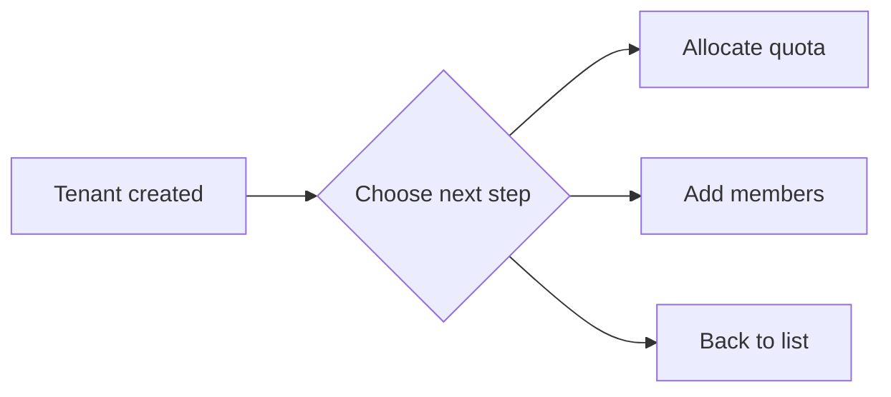

## Feature Overview

A Tenant is the **organizational isolation unit** of the platform and the base boundary for resource allocation, permission management, and billing. Each tenant has its own member system, resource quotas, and workspaces. Administrators use the BOSS tenant module to **create tenants**, **edit information**, **enable / disable**, **configure image push**, and **manage members**.

## Access Path

BOSS → Account Center → **Tenant Management**

Console route: `/iam/tenants`

## Tenant List

Column definitions: `src/pages/boss/iam/tenants/list.tsx:65-106`.

| Column | Field | Display | Description |
|--------|-------|---------|-------------|
| **Name** | `name` | Avatar + name (link) + tenant ID | Click the name to open the overview page; the grey caption below is `id` |
| **Email** | `email` | Text | Administrative contact email |
| **Members** | `userCount` | Integer | Total members |
| **Status** | `enabled` | Label (Enabled / Disabled) | Green when enabled, red when disabled |
| **Created At** | `creationTimestamp` | Formatted time | Tenant creation time |

Row actions:

| Action | Description |
|--------|-------------|
| **Enable / Disable** | Toggle with a second confirmation dialog (see below) |
| **Edit** | Navigate to `/iam/tenants/:tenant?action=edit` |

> ⚠️ Note: The tenant list has **no delete entry**. `deleteTenant` exists in `src/services/tenant.ts`, but the console UI does not expose it.

---

## Create Tenant

Console route: `/iam/tenants?action=create`.

1. Click **Create Tenant** at the top right of the list.
2. Fill in the basic information.
3. Click **Confirm** to submit (`POST /api/iam/tenants`).

Form fields and validation (`src/pages/boss/iam/tenants/components/form.tsx:49-63`):

| Field | Field name | Type | Required | Validation | Description |
|-------|-----------|------|----------|-----------|-------------|
| **Name** | `name` | Text | ✅ | Non-empty | Tenant display name |
| **Tenant ID** | `id` | IdField | ✅ | Non-empty; format checked by `validateId` | Unique identifier; **editable on create, disabled on edit** |
| **Email** | `email` | Text | ✅ | Non-empty + email format | Administrative contact email |
| **Phone** | `phone` | Text | ✅ | Non-empty + regex `\d{6,16}` | Administrative contact phone |
| **Description** | `description` | Textarea (4 rows) | — | None | Supplementary description |

`name` and `id` are rendered by the same `IdField` component (`src/business/components/id-field`): typing `name` auto-generates `id`, and you can override `id` manually in a popover; when not overridden, `id` follows `name`.

> ⚠️ Note: **Avatar upload only appears on the edit page.** The create form does not render the avatar control (`tenant && ...` at `form.tsx:156`), and neither does the image push config. Create the tenant first, then configure these on the edit page.

### Post-Creation Guide

On success the form is replaced by a result page with up to three quick actions (`src/pages/boss/iam/tenants/create.tsx:61-98`):

| Option | Condition | Target |
|--------|-----------|--------|
| **Allocate quota** | Only when at least one cluster exists | `/rune/tenants/:tenant/clusters/:cluster/quotas?action=create` (first cluster) |
| **Add members** | Always | `/iam/tenants/:tenant/members?action=create` |
| **Back to list** | Always | `/iam/tenants` |

---

## Edit Tenant

Console route: `/iam/tenants/:tenant?action=edit`.

The edit page loads both the tenant and its config (`getTenant` + `getTenantConfig`) and submits via `updateTenant` and `updateTenantConfig`.

### Basic Information

| Field | Editable | Description |
|-------|----------|-------------|
| **Avatar** | ✅ | Edit page only; croppable, single file up to 3MB (`maxSize = 3145728`) |
| **Name** (`name`) | ✅ | Rendered by IdField, editable |
| **Tenant ID** (`id`) | ❌ | Locked in edit mode; the edit button next to the ID is hidden |
| **Email** (`email`) | ✅ | Email format |
| **Phone** (`phone`) | ✅ | `\d{6,16}` |
| **Description** (`description`) | ✅ | Textarea |

> 💡 Tip: The overview page also supports inline editing of `name` / `email` / `phone`, equivalent to the edit page.

### Image Push Configuration

The edit page renders an extra "Image Push" card below the basic info (`form.tsx:223-260`, only when both tenant and tenant config are available). It maps to backend `tenantConfig.image`:

| Field | Control | Default | Description |
|-------|---------|---------|-------------|
| `allowCreateOnPush` | Switch | `true` | Whether pushing an image may auto-create an image record |
| `defaultVisibility` | Radio group | `private` | Default visibility for pushed images |

`defaultVisibility` values:

| Value | Meaning |
|-------|---------|
| `private` | Private |
| `internal` | Internal |
| `public` | Public |

On submit the config is saved via `updateTenantConfig(tenantId, { image: { allowCreateOnPush, defaultVisibility } })`.

---

## Enable / Disable Tenant

Enable/disable is implemented (`src/pages/boss/iam/tenants/list.tsx:108-134`): use the row action, which opens a **second confirmation dialog** before calling:

| Operation | API | Effect |
|-----------|-----|--------|
| **Disable** | `POST /api/iam/tenants/:id:disable` | Tenant disabled |
| **Enable** | `POST /api/iam/tenants/:id:enable` | Tenant restored |

> ⚠️ Note: The exact effect of disabling on existing tasks, sessions, and resource access is a backend policy the frontend does not surface. Not confirmed.

---

## Tenant Overview Page

Console route: `/iam/tenants/:tenant/overview`.

Layout (`src/pages/boss/iam/tenants/overview/overview.tsx`): a 3-column tenant info card on the left, and a 9-column area on the right with member stats on top and the member list below.

### Tenant Info (TenantInfo)

| Item | Inline editable | Field |
|------|-----------------|-------|
| Avatar | ✅ (upload + crop) | `avatar` |
| Tenant name | ✅ | `name` |
| Email | ✅ | `email` |
| Phone | ✅ | `phone` |
| Created At | — | `creationTimestamp` |

> ⚠️ Note: The overview info card does **not** show tenant ID, description, or enabled status. Those appear in the list column, the edit page, and tenant config respectively.

### Member Stats and Member List

- **TenantMemberStats**: member-count cards by role; roles are `admin` / `member` / `developer` (`TenantRole`, `src/types/tenant.ts:18-22`), aggregated client-side.
- **TenantMembers**: the embedded table shows only three columns — Member (`userInfo.name`, falls back to `user`), Email (`userInfo.email`), Role (`role`, translated) — plus a "view more" link to the members page.

---

## Tenant Member Management

Console route: `/iam/tenants/:tenant/members`.

| Column | Field | Description |
|--------|-------|-------------|
| **Member** | `name` | Avatar + user identifier |
| **Email** | `userInfo.email` | — |
| **Role** | `role` | Translated role label |
| **Joined At** | `creationTimestamp` | Formatted time |

Row actions: edit role (`/iam/tenants/:tenant/members/:member?action=edit`) and remove member (with a confirmation dialog; multi-select batch delete supported).

### Add Member

Click **Add Member**, pick a user and assign a role (`src/pages/boss/iam/tenants/members/components/form.tsx`); submit calls `PUT /api/iam/tenants/:tenant/members/:user`.

| Field | Field name | Required | Description |
|-------|-----------|----------|-------------|
| **User** | `user` | ✅ | Async user selector with search; disabled when editing |
| **Role** | `role` | ✅ | Options come from `GET /api/iam/tenants/:tenant/roles`, **returned dynamically by the backend**; not hardcoded in the frontend |

> ⚠️ Note: Role candidates are decided by the tenant roles endpoint, so this page does not enumerate fixed role names. Whether removing the last administrator is blocked is backend behavior with no frontend check. Not confirmed.

## API Reference

| Operation | Method and path |
|-----------|-----------------|
| List / get tenants | `GET /api/iam/tenants`, `GET /api/iam/tenants/:id` |
| Create / update / delete tenant | `POST /api/iam/tenants`, `PUT /api/iam/tenants/:id`, `DELETE /api/iam/tenants/:id` (not exposed in UI) |
| Enable / disable | `POST /api/iam/tenants/:id:enable` / `POST /api/iam/tenants/:id:disable` |
| Upload avatar | `POST /api/iam/tenants/:id/avatar` (multipart) |
| List members / roles | `GET /api/iam/tenants/:tenant/members`, `GET /api/iam/tenants/:tenant/roles` |
| Add/update / remove member | `PUT /api/iam/tenants/:tenant/members/:user`, `DELETE /api/iam/tenants/:tenant/members/:user` |

## Best Practices

- **Organize tenants by org structure**: one tenant per department or team.
- **Set quotas reasonably and designate at least two administrators** per tenant.
- **Be careful with image push visibility**: `private` is safer by default; adjust `defaultVisibility` when sharing is needed.
