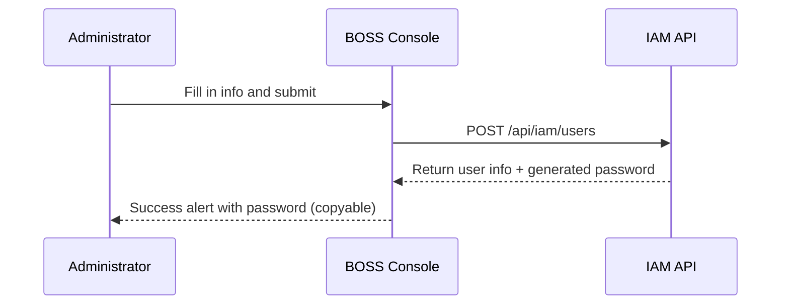

## Feature Overview

User Management is one of the core modules in the BOSS Account Center. Administrators can manage the full lifecycle of platform users: **create**, **edit**, **reset password**, and **delete**. A user is the base unit of the identity system, identified by a unique username and associated with a display name, email, and phone number.

## Access Path

BOSS → Account Center → **User Management**

Console route: `/iam/users`

The list supports toolbar keyword search, pagination, and multi-select batch delete.

## User List

Column definitions: `src/pages/boss/iam/users/list.tsx:72-113`.

| Column | Field | Display | Description |
|--------|-------|---------|-------------|
| **Username** | `name` | Avatar + name (link) + `displayName` | Click the name to open the user detail page |
| **Email** | `email` | Email-formatted text | Contact email |
| **Phone** | `phone` | Phone-formatted text | Contact phone |
| **MFA** | `mfa.enabled` | Text "Yes / No" | Whether multi-factor authentication is enabled |
| **Created At** | `creationTimestamp` | Formatted time | Account creation time |

Row actions:

| Action | Description |
|--------|-------------|
| **Edit** | Navigate to `/iam/users/:id/edit` |
| **Reset Password** | Opens a confirmation dialog; the server generates a new password |
| **Delete** | Confirmation dialog (`confirmOnDelete`); batch delete is available with multi-select |

> ⚠️ Note: User management has **no** enable/disable switch and no separate "Status" column. To disable an account, delete the user or remove them from tenants.

### Search

The toolbar search box writes to the URL `search` parameter, which is forwarded to `GET /api/iam/users`. Which fields are matched is decided by the backend; the frontend only forwards the keyword.

> ⚠️ Note: The fields matched by search (username / email / display name) are not declared in the frontend. Not confirmed.

---

## Create User

Console route: `/iam/users/new`.

1. Click **Create User** at the top right of the list.
2. Fill in the fields below.
3. Click **Confirm** to submit (`POST /api/iam/users`).

Form fields and validation (`src/pages/boss/iam/users/components/form.tsx:44-52`, `114-134`):

| Field | Field name | Type | Required | Validation | Description |
|-------|-----------|------|----------|-----------|-------------|
| **Username** | `name` | Text | ✅ | Non-empty | Unique login identifier; not editable after creation |
| **Display Name** | `displayName` | Text | — | None | Display name |
| **Email** | `email` | Text | ✅ | Non-empty + email format | Contact email |
| **Phone** | `phone` | Text | ✅ | Non-empty + regex `\d{6,16}` | Contact phone |

### Automatic Password Generation

> 💡 Tip: You do **not** fill in a password when creating a user. The server generates it, and on success the form shows a success alert containing the username, the plaintext password, and a **copy button** (`ClipboardButton`), see `form.tsx:99-112`.

After the password is shown: copy it and send it to the user over a secure channel, and remind them to change it after first login.

### Bulk Creation

Bulk creation and import of users are not supported. Multi-select batch delete is supported; for bulk creation, script against the API.

---

## Edit User

Console route: `/iam/users/:id/edit`.

| Field | Editable | Description |
|-------|----------|-------------|
| **Username** (`name`) | ❌ | Disabled in the form, with a lock icon |
| **Display Name** (`displayName`) | ✅ | — |
| **Email** (`email`) | ✅ | Must match email format |
| **Phone** (`phone`) | ✅ | Must match `\d{6,16}` |

Submit calls `PUT /api/iam/users/:name`.

---

## Reset Password

1. Open the row action menu and click **Reset Password**.
2. A confirmation dialog appears; on confirm, `POST /api/iam/users/:name/password` is called.
3. The new password is shown in the dialog with a **copy button**.

> ⚠️ Note: This is destructive; the old password becomes invalid immediately. Whether existing sessions are terminated is a backend policy the frontend does not surface. Not confirmed.

---

## Delete User

1. Click **Delete** on the row (or select multiple rows to batch delete).
2. A confirmation dialog shows the target user.
3. On confirm, `DELETE /api/iam/users/:name` is called.

> ⚠️ Note: Deletion is irreversible. Side effects (tenant memberships, ownership of created models / datasets / API keys) are backend behavior the frontend does not surface. Not confirmed.

---

## MFA Status

The **MFA** column reads `mfa.enabled` and shows "Yes / No" text.

> 💡 Tip: MFA is managed by users in their Console personal security settings. BOSS only displays it; administrators cannot toggle it.

## API Reference

| Operation | Method and path |
|-----------|-----------------|
| List users | `GET /api/iam/users` |
| Get user | `GET /api/iam/users/:name` |
| Create user | `POST /api/iam/users` |
| Update user | `PUT /api/iam/users/:name` |
| Delete user | `DELETE /api/iam/users/:name` |
| Reset password | `POST /api/iam/users/:name/password` |
| User tenants | `GET /api/iam/users/:name/tenants` |
| User search (for selectors) | `GET /api/iam/user-search` |

## Best Practices

- Use **employee IDs** or **email prefixes** as usernames; prefer lowercase letters, digits and hyphens.
- Regularly review the user list and delete departed accounts.
- Deliver passwords over secure channels; encourage MFA.
- Avoid shared accounts.

## Permission Requirements

> ⚠️ Note: The console source defines no fine-grained permission checks. "System Administrator" is a product-level convention; the exact permission points are not confirmed in code.
