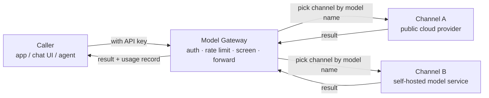

# Model Gateway

The Model Gateway (also called the AI Gateway) is the **single entry point** for every model call on the platform. Requests from applications, chat interfaces and agents all arrive here first. The gateway confirms identity, checks rate limits and screens the content, then forwards the request to the real model provider behind it and carries the result back to the caller.

As platform administrator, this is where you manage three things in one place: where requests go out, how they are priced, and who holds a key that can call them. After reading this page you will know what each menu does and which page to start configuring from.

:::tip Think of the gateway as a company switchboard
Outside calls never reach every employee's desk phone directly; they dial the switchboard first. The switchboard checks who you are and whether you are allowed through, decides which department to transfer you to, and then connects the call.

The Model Gateway is the switchboard of the model world: callers know only one address, so it does not matter to them which provider or route you use behind it.
:::

## How one model call travels

1. The caller sends a request carrying an **API key** (its door pass), and the request lands on the gateway first.
2. The gateway does three things: verifies the key (who you are), checks rate limits (whether you may keep going) and screens the content (whether it is allowed).
3. Based on the **model name** in the request, the gateway picks a usable **channel**.
4. The channel forwards the request to the model provider it is connected to — a public cloud provider such as OpenAI or Qwen, or a self-hosted model service on the platform.
5. The provider returns its result. The gateway records the usage along the way (how many tokens, what the price works out to, how long it took) and returns the result to the caller.

Every provider behind the gateway is represented on the platform as a **channel**. Nearly all the setup work you do later revolves around channels.

## Two entrances, don't mix them up

- **The management entrance**: all the configuration you do on the admin pages (creating channels, changing prices, issuing keys) goes through here, and saving takes effect immediately.
- **The calling entrance**: the address callers actually use when they request a model. It is a different entrance from the admin pages, so your page-level changes never force callers to change their address.

## The menu groups at a glance

The **Model Gateway** menu on the left of the BOSS console is split into five groups. Here is what each page is for.

| Group | Page | What this page solves for you | Details |
| --- | --- | --- | --- |
| Model Gateway | Dashboard | Request volume, success rate, cost and gateway health | [Dashboard](/boss/gateway/operations) |
| Model Services | Channel Management | Connect model providers and decide where requests go out | [Channel Management](/boss/gateway/channels) |
| Model Services | Model Configuration | Maintain each model's card and price | [Model Configuration](/boss/gateway/model-metadata) |
| User Management | Token Management | Issue and manage API keys | [Token Management](/boss/gateway/api-keys) |
| User Management | Call Logs | Inspect the details of every call | [Call Logs](/boss/gateway/audit) |
| Security Services | Sensitive Word Management | Maintain the word list used for screening | [Content Moderation](/boss/gateway/moderation) |
| Security Services | Policy Management | Define what happens when something is matched | [Content Moderation](/boss/gateway/moderation) |
| Security Services | Hit Records | Review content that was blocked or rewritten | [Hit Records](/boss/gateway/sensitive-hits) |
| Platform Settings | Gateway Configuration | Global switches and runtime parameters | [Gateway Configuration](/boss/gateway/config) |
| Platform Settings | Currency Configuration | Which currency prices are displayed in | [Currency Configuration](/boss/gateway/currency-settings) |

## Before you start

- This menu belongs to the platform administration (BOSS) console and is visible only to platform administrator accounts.
- A sensible order to learn it in: create a **channel** to reach the upstream provider → set prices in **Model Configuration** → issue an **API key** to the caller → then use the **Dashboard** and **Call Logs** to check the result.

## Core concepts

| Term | Plain explanation |
| --- | --- |
| Channel | One model provider the gateway is connected to; requests leave through it |
| Model metadata | A model's "business card": its name, how long its context is, how it is priced |
| API key | A door pass issued to a tenant or application, carried with every request |
| Rate limit | A speed cap set for a caller (requests and tokens per minute) |
| Content moderation | The security check at the door, inspecting content going in and out |
| Audit log | The security camera footage: who called what, and when |

:::warning The gateway only measures and prices
The AI Gateway counts how many tokens each call used and converts that into a cost using the model price (a cost snapshot). It does **not** offer top-ups, deductions or online payment — a billing number and a money transfer are two different things.
:::

## Related

- [Channel Management](/boss/gateway/channels)
- [Model Configuration](/boss/gateway/model-metadata)
- [Gateway Configuration](/boss/gateway/config)
