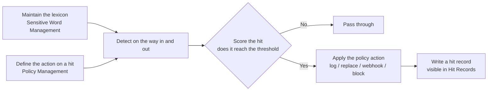

# Content Moderation

Content moderation is the gateway's **security check**: it inspects user input as a request arrives and model output as it returns. When sensitive content is found it acts according to the rules you define — record it, replace the words with asterisks, or block the request outright.

By the end you will have set up the whole chain: maintain the word list first, then define policies for "how high a score triggers what action", and finally verify the effect in Hit Records.

:::tip Moderation is like an airport scanner
A scanner needs two things: a **list of prohibited items** (the lexicon) and a set of **handling rules** (the policies) — whether a find is confiscated, logged, or waved through. The list and the rules are maintained separately, so changing the list never means re-entering the rules, and vice versa.
:::

## What the whole chain looks like

1. **The list** (Sensitive Word Management): which words are sensitive and how sensitive each one is (a score of 1–10).
2. **The rules** (Policy Management): "when the score meets this condition, do this".
3. **The results** (Hit Records): every hit, and how it was handled at the time.

## Before you start

- Permission: you need a platform administrator account (one that can enter the BOSS console).
- Make sure the master switch is on: go to **Model Gateway → Platform Settings → Gateway Configuration** and check that **Enable Content Moderation** is on. With it off, every policy pauses (the configuration is not lost).

## Where the three pages are

| Page | Location | Purpose |
| --- | --- | --- |
| Sensitive Word Management | Model Gateway → Security Services → Sensitive Word Management | Maintain the word list |
| Policy Management | Model Gateway → Security Services → Policy Management | Define what happens on a hit |
| Hit Records | Model Gateway → Security Services → Hit Records | Review the results |

## Step 1: maintain the word list

### Get there and see the overview

1. Click **Model Gateway** in the top navigation bar.
2. Expand **Security Services** and click **Sensitive Word Management**.

Four statistic cards sit at the top of the page: **Total Terms**, **Enabled** (with an enabled ratio), **New This Month** and **Hits in 7 Days**.

The top of the page holds four stat cards (total words, enabled, added this month, hits in the last 7 days), then the search box with category tabs (**All / Politics / Terrorism / Livelihood …**), then four filter dropdowns for **Category / Risk level / Tag / Updated**. The **Word**, **Category** and **Tag** columns are blurred — this page explains how those columns work, and the actual terms do not belong in public documentation.

### What the list shows

| Column | Meaning |
| --- | --- |
| Term | The word itself |
| Enabled Status | A green check means enabled, a grey cross means paused |
| Risk Score | High (≥ 8) / Medium (≥ 5) / Low, coloured automatically from the score |
| Category | Which category the word belongs to; there can be several |
| Tags | Your own tags; there can be several |
| Hits | How many times it has been hit in total |
| Updated At | When it was last changed |

The filters are: **Keyword Search** at the top, **Category** quick buttons and dropdown, **Risk Level**, **Tag**, and **Updated At** (Updated At / Today / Last 7 days / Last 30 days).

### Create a sensitive word

1. Click **Create Sensitive Word** in the top-right corner.
2. Fill in the form:

   | Form field | How to fill it | Notes |
   | --- | --- | --- |
   | Term | The word to detect | Required; **cannot be changed after creation** |
   | Score | For example `5` | Required, `1`–`10`, default `5`; higher means more sensitive |
   | Category | Pick from the presets or type your own | Several allowed; press Enter to add |
   | Part of Speech | For example a noun | Optional |
   | Tags | Pick from the preset tags or type your own | Several allowed, for your own grouping |

3. Click **Confirm**.

Both the Category and Tag boxes offer a set of presets you can click, and you can always type your own values.

:::info Matching uses the word list, not regular expressions
Detection matches **entries** in the lexicon one by one. Categories and tags exist only so you can organize things; they play no part in matching, and there is nowhere in the interface to write a regular expression.
:::

### Batch import and export

- **Batch Import**: opens an import dialog; click **Select File** and upload a JSON file. On success it reports "Parsed N entries" — then click the import button to submit. The file may be up to 2MB and must contain a JSON array.
- **Batch Export**: confirm and all entries are downloaded as one JSON file, useful for backup or migration.

### Batch actions

After selecting entries, an action bar appears above the list with **Batch Enable**, **Batch Disable** and **Batch Delete**.

:::warning Batch delete cannot be undone
Deleting entries removes them from detection immediately and cannot be reversed. It is a good idea to run **Batch Export** for a backup first.
:::

## Step 2: decide what happens on a hit (Policy Management)

Each row is one rule: **Trigger condition** is a score threshold (`≥ 50` in the screenshot), **Action** is what happens on a hit ("Block the request" here), and a smaller **Priority** number matches first. The toggle in the first column flips it on or off.

### Get there and read the list

1. Click **Model Gateway** in the top navigation bar.
2. Expand **Security Services** and click **Policy Management**.

The list shows each policy's name and description, its **Trigger Condition** (shown like `≥ 50`), its action, its priority, its status and when it was last updated. You can search by name or description above, and filter by status.

### Create a policy

1. Click **Create Policy** in the top-right corner.
2. Fill in the form:

   | Form field | How to fill it | Notes |
   | --- | --- | --- |
   | Policy Name | For example "Block high scores" | Required |
   | Description | One sentence | Optional |
   | Comparison Operator | Defaults to **Greater or Equal (≥)** | Required; see the table below |
   | Threshold | Defaults to `50` | Required, `0`–`100` |
   | Action | Defaults to **Block** | Required; see the table below |
   | Priority | Defaults to `1` | `1`–`10`, used to order policies when several match at once |
   | Enabled | On by default | When off, the policy does not apply |

3. If you choose **Replace** or **Webhook** as the action, the matching configuration block opens below (see below).
4. Click **Confirm**.

**Comparison Operator** has exactly four options:

| Option | Meaning |
| --- | --- |
| Greater or Equal (≥) | Fires when the score reaches or exceeds the threshold |
| Greater Than (>) | Fires when the score exceeds the threshold |
| Less or Equal (≤) | Fires when the score is not above the threshold |
| Less Than (<) | Fires when the score is below the threshold |

**Action** has four options:

| Option | What happens on a hit |
| --- | --- |
| Log | Content passes normally and a single record is left in Hit Records |
| Replace | The matched words are replaced with mask characters and the request continues, for example `***` |
| Webhook | The content is sent to an external moderation service that decides |
| Block | The request is rejected and an error is returned |

:::info Start with Log
For a first setup, use a low-risk action such as **Log** for a while, watch whether the hit records are accurate, and only then move to Replace or Block.
:::

### Replace configuration

| Setting | Default | Notes |
| --- | --- | --- |
| Mask Character | `*` | The character used for replacement |
| Mask Mode | Character Repeat | Character Repeat (each character is replaced, e.g. `word` → `****`) / Fixed Length / Single Character (the whole word becomes one character) |

### Webhook configuration

| Setting | Default | Notes |
| --- | --- | --- |
| Request URL | Empty | Required; the address of the external service |
| HTTP Method | `POST` | POST or GET |
| Timeout (seconds) | `5` | Request timeout |
| Custom Headers | Empty | Fill in and click **Create Header** to add; headers can be removed |
| JSON Path | Empty | Extracts the decision value from the external service's response |
| Pass Values | Empty | Response values treated as a pass |
| Block Values | Empty | Response values treated as a block |
| Default Action | Block | The action taken when the response is in neither list (Block or Pass) |
| Message Path | Empty | Extracts the message shown to the caller from the response |

### Everyday policy actions

The actions menu at the end of each row offers **Enable / Disable**, **Edit** and **Delete**.

:::warning Deleting a policy requires typing its name
To delete a policy you must **type the policy name** in the confirmation dialog. A deleted policy cannot be restored.
:::

:::info How priority works
Priority is a value from `1` to `10` that decides which policy runs first when several match at once. The page's own explanation is "Lower number = higher priority. High threshold rules should have higher priority."
:::

## Where to see the hits

Every hit is recorded on the **Hit Records** page, including the matched words, the risk level and how it was handled. See [Hit Records](/boss/gateway/sensitive-hits) for the full description.

## When changes take effect

Lexicon and policy changes are pushed to the gateway as soon as you save. No restart is needed, and they usually apply within a few seconds.

## Confirm it worked

After configuring one entry and one policy of "score ≥ 5 → Log", send a test request containing that word and then open the **Hit Records** page. If the hit appears in the list, the whole chain is working.

## FAQ

| Symptom | Likely cause | What to do |
| --- | --- | --- |
| Hit Records stays empty | The master switch is off, the entries are not enabled, or the time range is too narrow | Check **Enable Content Moderation** in Gateway Configuration, confirm the entries are enabled, and widen the time range |
| Words in the content turned into asterisks | The policy action is **Replace** | Expected; change the action to **Block** if you want rejection instead |
| Requests are rejected outright | The policy action is **Block** | Check whether the threshold is too low, or switch the action to Log or Replace |
| The sensitive word cannot be edited | Entries are immutable once created | Create the entry you need and delete the old one |
| Cannot find anywhere to use a regular expression | Detection matches lexicon entries | Add each string you want caught to the lexicon individually |

## Related

- [Hit Records](/boss/gateway/sensitive-hits): see what was matched
- [Gateway Configuration](/boss/gateway/config): the master switch for content moderation
- [Call Logs](/boss/gateway/audit): all calls, including those that were not moderated
