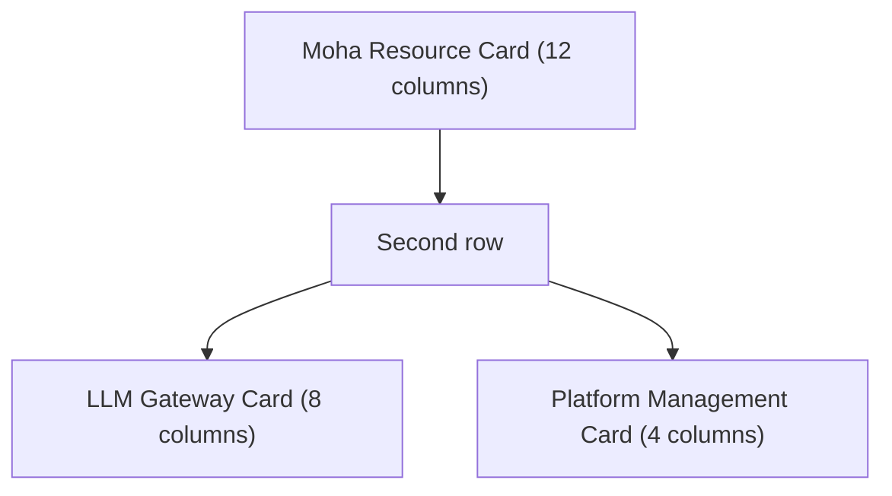

## Feature Overview

The BOSS Dashboard is the **landing page** administrators see when entering the admin portal. It presents key operational data through three cards:

| Card | Component | Grid width | Core content |
|------|-----------|------------|--------------|
| Moha Resource Card | `MohaCard` | 12 columns (own row) | Model / dataset / Space / image counts, storage usage, visibility distribution, trending resources |
| LLM Gateway Card | `GatewayCard` | 8 columns | Requests / average latency / total tokens / error rate, 24h trend, Top 5 models |
| Platform Management Card | `ManagementCard` | 4 columns | Tenant / cluster / user counts, platform snapshot, attention items |

The grid sizes are defined in `src/pages/boss/home/dashboard.tsx:26-38`.

> 💡 Tip: All three cards fetch from real backend endpoints (via `useCacheFetch`). There is no mock or sample data. When an endpoint fails, the card shows a skeleton or a warning instead of fake numbers.

## Access Path

BOSS → Home / Dashboard

Console routes `/` (index) and `/dashboard` render the same page (`src/routes/sections/boss.tsx:223-224`).

## Page Layout

The three cards use a responsive grid: the Moha card spans all 12 columns, while the gateway card takes 8 columns and the management card takes 4.

---

## Moha Resource Card

Data comes from `getMohaDashboard` (`src/services/moha`), using the `assetStatistics`, `distribution` and `trendingNow` fields.

### Asset Totals

The left side shows four counters, with storage usage in the header:

| Metric | Field | Description |
|--------|-------|-------------|
| **Models** | `assetStatistics.models` | Total model repositories |
| **Datasets** | `assetStatistics.datasets` | Total datasets |
| **Spaces** | `assetStatistics.spaces` | Total workspaces |
| **Images** | `assetStatistics.images` | Total images |
| **Storage** | `assetStatistics.storage` | Formatted with `fData` |

### Visibility Distribution

A three-segment bar with a percentage caption on the right:

| Field | Meaning |
|-------|---------|
| `distribution.public` | Public |
| `distribution.internal` | Internal |
| `distribution.private` | Private |

Percentages are computed against the sum of the three; when the total is 0, a "no data" state is shown. Note there are **three** segments (public / internal / private), not two.

### Trending Now

The right side lists trending resources (`trendingNow`):

| Item | Field |
|------|-------|
| Name | `alias` (preferred) or `name`; tooltip shows `organization/name` |
| Type label | `type`: `model` / `dataset` / `space` / `image` |
| Size | `size` (formatted with `fData`, may be empty) |
| Downloads | `downloads` |

An empty state is shown when the list is empty.

---

## LLM Gateway Card

Data comes from `getUsageDashboard` (`src/services/usage`) with parameters `interval: 'hour'`, `seriesLimit: 24`, `topN: 5`.

### Four Core KPIs

| KPI | Field | Change-rate field | Trend |
|-----|-------|-------------------|-------|
| **Requests** | `summary.requestCount` | `requestCountChangeRate` | Up is positive |
| **Average latency** | `summary.averageLatencyMillis` | `averageLatencyChangeRate` | Down is positive |
| **Total tokens** | `summary.totalTokens` | `totalTokensChangeRate` | Up is positive |
| **Error rate** | `summary.errorRate` | `errorRateChangeRate` | Down is positive |

Trend rules (`getTrendDisplay`):

- An absolute rate < 0.0001 is treated as `flat` and shown as `0%`
- Metrics where lower is better (latency, error rate) pass `lowerIsBetter = true`
- Improvement is green, degradation is red; increases are prefixed `+`, decreases `-`

### Traffic Trend Chart

An area chart using `timeseries` with **two series**:

- Requests `requestCount`
- Tokens `totalTokens`

X-axis labels are formatted by `interval`: `hour` → `HH:mm`, `day` → `MM-DD`. An empty state is shown when there is no data.

### Top 5 Models

The right side lists `topModels` (up to 5) by request count:

| Item | Field |
|------|-------|
| Model name | `displayName` |
| Requests | `requestCount` |
| Share progress bar | `requestCount / summary.requestCount` |
| Extra info | Shortened `totalTokens` and `requestCount` |

### Error State

On failure the card renders `Alert severity="error"` with the error message and shows no metrics.

---

## Platform Management Card

Data comes from three list endpoints: `listTenants`, `listUsers`, `listClusters` (`src/services/tenant`, `src/services/user`, `src/services/cloud`) with `{ page: 1, size: 1000 }`.

### Platform Counts

Three totals at the top of the card:

| Metric | Source |
|--------|--------|
| **Tenants** | Tenant list `total` |
| **Clusters** | Cluster list `total` |
| **Users** | User list `total` |

### Platform Snapshot

Once a list is fully loaded (`total <= items.length`), these snapshot items appear; an item is omitted when its data source fails:

| Snapshot item | Condition |
|---------------|-----------|
| **Enabled tenants** | `tenant.enabled === true` |
| **Connected clusters** | `cluster.status.connected === true`, else `status.phase === 'connected'` |
| **Published clusters** | `cluster.published === true` |
| **MFA-enabled users** | `user.mfa?.enabled === true` |

### Attention Items

The bottom section lists only items with a count greater than 0; each shows a name summary and a "Detail" link:

| Attention item | Target |
|----------------|--------|
| Disabled tenants (`!tenant.enabled`) | `/iam/tenants` |
| Disconnected clusters (`!isClusterConnected`) | `/rune/clusters` |
| Unpublished clusters (`!cluster.published`) | `/rune/clusters` |

When evaluation is possible and there are no attention items, a green "all clear" block is shown.

### Data Source Failure

If any source fails, a warning banner lists the unavailable sources (tenant / user / cluster).

> ⚠️ Note: This card does **not** contain CPU / memory / capacity health thresholds, nor any to-do list for approvals, quota warnings, or expired API keys — none of these exist in the console source. The real attention items are the table above.

---

## Data Refresh

- All three cards use `useCacheFetch`, fetching on demand and caching client-side.
- The page exposes no manual refresh button or refresh interval; the Moha and gateway cards fetch independently, while the management card fetches tenants / users / clusters in one pass.

## FAQ

### Is the dashboard data real-time?

Card data comes from real endpoints, not mocks. Data is fetched and cached when the page loads; the page itself does not poll or offer a custom refresh interval.

### Can the cards be customized?

The layout and content of the three cards are fixed; there is no drag-and-drop or add/remove component. Cluster-level custom monitoring lives on the separate cluster dynamic dashboard page (`/rune/clusters/:cluster/dynamic-dashboard`), not here.

### How do I judge platform health?

Watch these signals:

1. The management card shows **no attention items** ("all clear")
2. Gateway **error rate is 0 or near 0**
3. Gateway **average latency** is in a reasonable range

> ⚠️ Note: The dashboard only summarizes counts and cannot cover every detail. Use the corresponding modules for in-depth checks.
